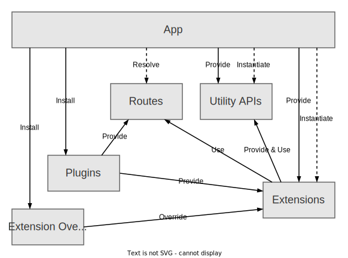

:::info
The new frontend system is in alpha and is only supported by a small number of plugins. If you want to use the new
plugin system, you must migrate your entire Backstage application or start a new application from scratch. We do not yet
recommend migrating any apps to the new system.
:::

# Building Blocks

This section introduces the high-level building blocks upon which the new frontend system is built. Some of this is still
under development.

Whether you are setting up your own backstage instance, developing plugins, or extending plugins with new features, it
will be important to understand these concepts.

The diagram below provides an overview of the different building blocks and the other blocks that each of them interacts with.

# App

A Backstage App is a single instance of Backstage that you create and use as the root of your React application. It
does not have any direct functionality in and of itself, but is simply responsible for wiring together App Features.

## App Feature

An App Feature is either an App Plugin or an App Module.

### Plugin

App Plugins provide functionality to your Backstage app. Each piece of functionality requires the use of a Plugin Extension.
Plugins can be completely standalone extend existing plugins and augment their features. Plugins can also communicate
with each other by sharing Utility APIs. Additionally, plugins can expose URL routes that other plugins can use to create
links within the frontend interface.

### Plugin Extension

Plugin Extensions are the required building blocks for any visual or non-visual functionality of a plugin. There are both
built-in Plugin Extensions provided by the app itself as well as extensions provided by plugins. Each Plugin Extension is
attached to a parent with which it shares data and can have any number of children of its own. It is up to the app to
wire together all extensions into a single tree known as the app extension tree. It is from this structure that the
entire app can then be instantiated and rendered.

### Plugin Extension Override

In addition to the built-in Plugin Extensions and extensions provided by plugins, it is also possible to install
extension overrides. This is a collection of extensions with high priority that can replace existing extensions.
They can for example be used to override an individual extension provided by a plugin, or install a completely new
extension, such as a new app theme.

### Module

The definition for an App Module is not yet defined.

## Utility API

Utility APIs provide functionality that makes it easier to build plugins, make it possible for plugins to share
functionality with other plugins, as well as serve as a customization point for integrators to change the behaviour of
the app. Each Utility API is defined by a TypeScript interface as well as a reference used to access the implementations.
The implementations of Utility APIs are defined by extensions that are provided and can be overridden the same as any other
extension.

## Route

The Backstage routing system adds a layer of indirection that makes it possible for plugins to route to each other's
extensions without explicit knowledge of what URL paths the extensions are rendered at or if they even exist at all. It
makes it possible for plugins to share routes with each other and dynamically generate concrete links at runtime. It is
the responsibility of the app to resolve these links to actual URLs, but it is also possible for integrators to define
their own route bindings that decide how the links should be resolved. The routing system also lets plugins define
internal routes, aiding in the linking to different content in the same plugin.

## Package Structure

TODO
