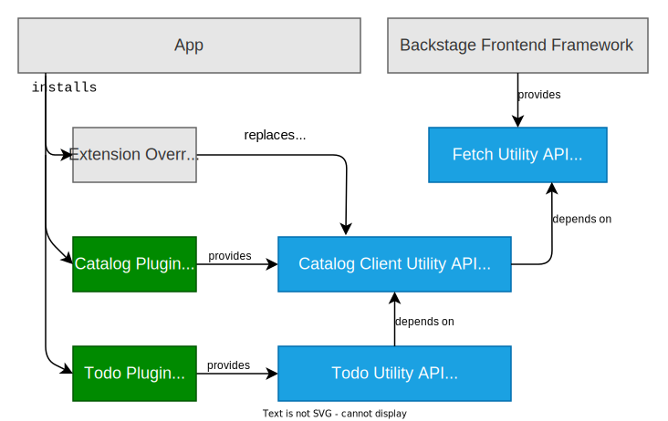

> **NOTE: The new frontend system is in alpha and is only supported by a small number of plugins.**

## Overview

Utility APIs are pieces of standalone functionality, interfaces that can be requested by plugins to use. They are defined by a TypeScript interface as well as a reference (an "API ref") used to access its implementation. They can be provided both by plugins and the core framework, and are themselves [extensions](../architecture/03-extensions.md) that can have inputs, be replaced, and be declaratively configured in your app-config.

A common example of a utility API is a client interface to interact with the backend part of a plugin, such as the catalog client. Any frontend plugin can then request an implementation of that interface to make requests through.

The following diagram shows a hypothetical application, which depends on two plugins and also provides some extra overrides. Note that both the plugins and the core framework provide utility APIs, and that they depend on each other. The app also chooses to use its overrides mechanism to supply a replacement implementation of one API, which takes precedence over the default one. Thus, all consumers of that API will be sure to get that new implementation provided to them.

## Extension structure

All utility APIs implement the `createApiExtension.factoryDataRef` output data type, and must attach exclusively to the `core` extension's `apis` input no matter who provided them. These defaults are provided out of the box by the `createApiExtension` framework function.

Since utility APIs are extensions, they can also have inputs in advanced use cases. This is occasionally useful for complex APIs that can themselves be extended with additional programmatic functionality by adopters.

## Links

- The [Utility APIs section](../utility-apis/01-index.md) of the plugin docs
- The legacy docs on [utility APIs](../../api/utility-apis.md)
