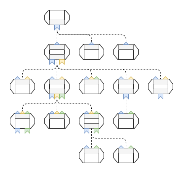

:::info
The new frontend system is in alpha and is only supported by a small number of plugins. If you want to use the new
plugin system, you must migrate your entire Backstage application or start a new application from scratch. We do not yet
recommend migrating any apps to the new system.
:::

## The App Instance

The app instance is the main entry point for creating a frontend app. It doesn't do much on its own, but is instead responsible for wiring things together that have been provided as features from other parts of the system.

Below is a simple example of how to create and render an app instance:

```ts
import ReactDOM from 'react-dom/client';
import { createApp } from '@backstage/frontend-defaults';

// Create your app instance
const app = createApp({
  // Features such as plugins can be installed explicitly, but we will explore other options later on
  features: [catalogPlugin],
});

// This creates a React element that renders the entire app
const root = app.createRoot();

// Just like any other React we need a root element. No server side rendering is used.
const rootEl = document.getElementById('root')!;

ReactDOM.createRoot(rootEl).render(app);
```

We call `createApp` to create a new app instance, which is responsible for wiring together all of the features that we provide to the app. It also provides a set of built-in [Extensions](./20-extensions.md) that help build out the foundations of the app, as well as defaults for many other systems such as [Utility API](./33-utility-apis.md) implementations, components, icons, themes, and how to load configuration. No real work is done at the point of creating the app though, it's all deferred to the rendering of the element returned from `app.createRoot()`.

It is possible to explicitly install features when creating the app, although typically these will instead be discovered automatically which we'll explore later on. Nevertheless these features are what build out the actual functionality of the app by providing [Extensions](./20-extensions.md). These extensions are wired together by the app into a tree structure known as the app extension tree. Each node in this tree receives data from its child nodes, and passes along data to its parent. The following diagram illustrates the shape of a small app extension tree.



Each node in this tree is an extension with a parent node and children. The colored shapes represent extension data inputs and output, where each color is one unique type of data. You can see that there are both extensions that output data that is ignored by the parent, as well as extensions that accept inputs but do not have any children. There are a couple of different tools at your disposal when creating and extension that lets you define different requirements for your inputs and output, which we will cover in greater details in the [Extensions](./20-extensions.md) section.

A common type of data that is shared between extensions is React elements and components. These can in turn be rendered by each other in their own React components, which ends up forming a parallel tree of React components that is similar in shape to that of the app extension tree. At the top of the app extension tree is a built-in root extension that among other things outputs a React element. This element also ends up being the root of the parallel React tree, and is rendered by the React element returned by `app.createRoot()`.

## Feature Discovery

App feature discovery lets you automatically discover and install features provided by dependencies in your app. In practice, it means that you don't need to manually `import` features in code, but they are instead installed as soon as you add them as a dependency in your `package.json`.

Because feature discovery needs to interact with the compilation process, it is only available when using the `@backstage/cli` to build your app. It is hooked into the WebPack compilation process by scanning your app package for compatible dependencies, which are then made part of the app compilation bundle.

Since the `@backstage/cli` is a more stable component than the new frontend system, feature discovery is currently marked as an experimental feature of the CLI and needs to be enabled manually. To enable it, add the following configuration to your `app-config.yaml`:

```yaml
app:
  experimental:
    packages: all
```

This will cause all dependencies in your app package to be installed automatically. If this is not desired, you can use include or exclude filters to narrow down the set of packages:

```yaml
app:
  experimental:
    packages:
      # Only the following packages will be included
      include:
        - '@backstage/plugin-catalog'
        - '@backstage/plugin-scaffolder'
---
app:
  experimental:
    packages:
      # All but the following package will be included
      exclude:
        - '@backstage/plugin-catalog'
```

Note that you do not need to manually exclude packages that you also import explicitly in code, since plugin instances are deduplicated by the app. You will never end up with duplicate plugin installations except if they are in fact two different plugin instances with different IDs.
