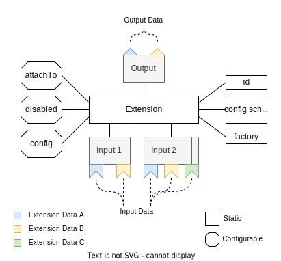

> **NOTE: The new frontend system is in alpha and is only supported by a small number of plugins.**

As mentioned in the [previous section](./10-app.md), Backstage apps are built up from a tree of extensions. This section will go into more detail about what extensions are, how to create and use them, and how to create your own extensibility patterns.

## Extension Structure

Each extensions has a number of different properties that define how it behaves and how it interacts with other extensions and the rest of the app. Some of these properties are fixed, while others can be customized by integrators. The diagram below illustrates the structure of an extension.



### ID

The ID of an extension is used to uniquely identity it, and it should ideally be unique across the entire Backstage ecosystem. For each frontend app instance there can only be a single extension for any given ID. Installing multiple extensions with the same ID will either result in an error or one of the extensions will override the others. The ID is also used to reference the extensions from other extensions, in configuration, and in other places such as developer tools and analytics.

When creating an extension you do not provide the ID directly. Instead, you indirectly or directly provide the kind, namespace, and name parts that make up the ID. The kind is always provided by the [extension blueprint](./23-extension-blueprints.md), the only exception is if you use [`createExtension`](#creating-an-extensions) directly. Any extension that is provided by a plugin will by default have its namespace set to the plugin ID, so you generally only need to provide an explicit namespace if you want to override an existing extension. The name is also optional, and primarily used to distinguish between multiple extensions of the same kind and namespace. If a plugin doesn't need to distinguish between different extensions of the same kind, the name can be omitted.

The extension ID will be constructed using the pattern `[<kind>:][<namespace>][/][<name>]`, where the separating `/` is only present if both a namespace and name are defined.

### Output

The output of an extension is the data that it provides to its parent extension, and ultimately its contribution to the app. The output itself comes in the form of a collection of arbitrary values, anything that can be represented as a TypeScript type. However, each individual output value must be associated with a shared reference known as an extension data reference. You must also use these same references to be able to access individual output values of an extension.

### Inputs

The inputs of an extension define the data that it received from its children. Each extension can have multiple different inputs identified by an input name. These inputs each have their own set of data that they expect, which is defined as a collection of extension data references. An extension will only have access to the data that it has explicitly requested from each input.

### Attachment point

The attachment point of an extension decides where in the app extension tree it will be located. It is defined by the ID of the parent extension, as well as the name of the input to attach to. Through the attachment point the extension will share its own output as inputs to the parent extension. An extension can only be attached to an input that matches its own output, it is an error to try to attach an extension to an input the requires data that the extension does not provide in its output.

The attachment point is one of the configurable properties of an extension, and can be overridden by integrators. In doing so, care must be taken to make sure that one doesn't attach an extension to an incompatible input. Extensions can also only be attached to a single input and parent at a time. This means that the app extension tree can not contain any cycles, as the extension ancestry will either be terminated at the root, or be detached from it.

### Disabled

Each extension in the app can be disabled, meaning it will not be instantiated and its parent will effectively not see it in its inputs. When creating an extension you can also specify whether extensions should be disabled by default. This makes it possible to for example install multiple extensions in an app, but only choose to enable one or a few of them depending on the environment.

The ordering of extensions is sometimes very important, as it may for example affect in which order they show up in the UI. When an extension is toggled from disabled to enabled through configuration it resets the ordering of the extension, pushing it to the end of the list. It is generally recommended to leave extensions as disabled by default if their order is important, allowing for the order in which their are enabled in the configuration to determine their order in the app.

### Configuration & configuration schema

Each extension can define a configuration schema that describes the configuration that it accepts. This schema is used to validate the configuration provided by integrators, but also to fill in default configuration values. The configuration itself is provided by integrators in order to customize the extension. It is not possible to provide a default configuration of an extension, this must instead be done through defaults in the configuration schema. This allows for a simpler configuration logic where multiple configurations of the same extension completely replace each other rather than being merged.

### Factory

The extension factory is the implementation of the extension itself. It is a function that is provided with any inputs and configuration that the extension received, and must produce the output that it defined. When an app instance starts up it will call the factory function of each extension that is part of the app, starting at leaf nodes and working its way up to the root of the app extension tree. The factory will only be called for active extensions, which is an extension that is not disabled and has an active parent.

Extension factories should be lean and not do any heavy lifting or async work, as they are called during the initialization of the app. For example, if you need to do an expensive computation to generate your output, then prefer outputting a callback that does the computation instead. This allows the parent extension to defer the computation for later so that you avoid blocking the app startup.

## Creating an extension

Extensions are created using the `createExtension` function from `@backstage/frontend-plugin-api`. At minimum you need to provide an ID, attachment point, output definition, and a factory function. The following example shows the creation of a minimal extension:

```tsx
const extension = createExtension({
  name: 'my-extension',
  // This is the attachment point, `id` is the ID of the parent extension,
  // while `input` is the name of the input to attach to.
  attachTo: { id: 'my-parent', input: 'content' },
  // The output option defines the allowed and required outputs of the extension factory.
  output: [coreExtensionData.reactElement],
  // This factory is called to instantiate the extensions and produce its output.
  factory() {
    return [coreExtensionData.reactElement(<div>Hello World</div>)];
  },
});
```

Note that while the `createExtension` function is public API and used in many places, it is not typically what you use when building plugins and features. Instead there are many [extension blueprints](./23-extension-blueprints.md) exported by both the core APIs and plugins that make it easier to create extensions for more specific usages.

## Extension data

Communication between extensions happens in one direction, from one child extension through the attachment point to its parent. The child extension outputs data which is then passed as inputs to the parent extension. This data is called Extension Data, where the shape of each individual piece of data is described by an Extension Data Reference. These references are created separately from the extensions themselves, and can be shared across multiple different kinds of extensions. Each reference consists of an ID and a TypeScript type that the data needs to conform to, and represents one type of data that can be shared between extensions.

### Extension data references

To create a new extension data reference to represent a type of shared extension data you use the `createExtensionDataRef` function. When defining a new reference you need to provide an ID and a TypeScript type, for example:

```ts
export const reactElementExtensionDataRef =
  createExtensionDataRef<React.JSX.Element>().with({
    id: 'my-plugin.reactElement',
  });
```

The `ExtensionDataRef` can then be used to describe an output property of the extension. This will enforce typing on the return value of the extension factory:

```tsx
const extension = createExtension({
  // ...
  output: [reactElementExtensionDataRef],
  factory() {
    return [reactElementExtensionDataRef(<div>Hello World</div>)];
  },
});
```

### Extension data uniqueness

Note that you are **not** allowed to repeat the same data reference in the outputs, or return multiple values for the same reference. Multiple outputs for the same reference will conflict with each other and cause an error. If you want to output multiple values of the same TypeScript type you should create separate references for each value. That in turn means that overly generic extension data references are a bad idea, for example a generic "string" type. Instead create separate references for each type of data that you want to share.

```tsx
const extension = createExtension({
  // ...
  output: [
    // ❌ Bad example - duplicate output declaration
    reactElementExtensionDataRef,
    reactElementExtensionDataRef,
  ],
  factory() {
    return [
      // ❌ Bad example - duplicate output values
      reactElementExtensionDataRef(<div>Hello</div>),
      reactElementExtensionDataRef(<div>World</div>),
    ];
  },
});
```

### Core extension data

We provide default `coreExtensionData`, which provides commonly used `ExtensionDataRef`s - e.g. for `React.JSX.Element` and `RouteRef`. They can be used when creating your own extension. For example, the React Element extension data that we defined above is already provided as `coreExtensionData.reactElement`.

For a full list and explanations of all types of core extension data, see the [core extension data reference](../building-plugins/04-built-in-data-refs.md).

### Optional extension data

By default all extension data is required, meaning that the extension factory must provide a value for each output. However, it is possible to make extension data optional by calling the `.optional()` method. This makes it optional for the factory function to return a value as part of its output. When calling the `.optional()` method you create a new copy of the extension data reference, it does not mutate the existing reference.

```tsx
const extension = createExtension({
  // ...
  output: [coreExtensionData.reactElement.optional()],
  factory() {
    return Math.random() > 0.5
      ? [coreExtensionData.reactElement(<div>Hello World</div>)]
      : [];
  },
});
```

## Extension Inputs

The Extension Data can be passed up to other extensions through their extension inputs. Similar to the outputs seen before, let's create an example of an extension with a extension input:

```tsx
const navigationExtension = createExtension({
  // ...
  inputs: {
    // [1]: Input
    logo: createExtensionInput([coreExtensionData.reactElement], {
      singleton: true,
      optional: true,
    }),
  },
  factory({ inputs }) {
    return {
      element: (
        <nav>
          {inputs.logo?.get(coreExtensionData.reactElement) ?? (
            <span>Backstage</span>
          )}
        </nav>
      ),
    };
  },
  // ...
});
```

The input (see [1] above) is an object that we create using `createExtensionInput`. The first argument is the set of extension data that we accept via this input, and works just like the `output` option. The second argument is optional, and it allows us to put constraints on the extensions that are attached to our input. If the `singleton: true` option is set, only a single extension can be attached at a time, and unless the `optional: true` option is set it will also be required that there is exactly one attached extension.

So how can we now attach the output to the parent extension's input? If we think about a navigation component, like the Sidebar in Backstage, there might be plugins that want to attach a link to their plugin to this navigation component. In this case the plugin only needs to know the extension `id` and the name of the extension `input` to attach the extension `output` returned by the `factory` to the specified extension:

```tsx
const navigationItemExtension = createExtension({
  // ...
  attachTo: { id: 'app/nav', input: 'items' },
  output: [coreExtensionData.reactElement],
  factory() {
    return [coreExtensionData.reactElement(<Link to="/home">Home</Link>)];
  },
});

const navigationExtension = createExtension({
  // ...
  // [2]: Extension `id` will be `app/nav` following the extension naming pattern
  namespace: 'app',
  name: 'nav',
  output: [coreExtensionData.reactElement],
  inputs: {
    items: createExtensionInput([coreExtensionData.reactElement]),
  },
  factory({ inputs }) {
    return [
      coreExtensionData.reactElement(
        <nav>
          <ul>
            {inputs.items.map(item => {
              return <li>{item.get(coreExtensionData.reactElement)}</li>;
            })}
          </ul>
        </nav>,
      ),
    ];
  },
  // ...
});
```

In this case the extension input `items` is an array, where each individual item is an extension that attached itself to the extension inputs of this `id`.

In addition to being able to access data passed through the input, you also have access to the underlying app `node`. This can be useful if you for example want to get the ID of the attached extension. However, avoid using the `node` unless needed, it is generally better to stick to only consuming the provided data. If we are looking at the `factory` function from the example above we could access the `node` like the following:

```tsx
  // ...
  factory({ inputs }) {
    return [
      coreExtensionData.reactElement(
        <nav>
          <ul>
            {inputs.items.map((item) => {
              const _node: AppNode = item.node;
              return <li>{item.get(coreExtensionData.reactElement)}</li>;
            })}
          </ul>
        </nav>
      ),
    ];
  },
```

## Extension configuration

With the `app-config.yaml` there is already the option to pass configuration to plugins or the app to e.g. define the `baseURL` of your app. For extensions this concept would be limiting as an extension can be independent of the plugin & initiated several times. Therefore we created a possibility to configure each extension individually through config. The extension config schema is created using the [`zod`](https://zod.dev/) library, which in addition to TypeScript type checking also provides runtime validation and coercion. If we continue with the example of the `navigationExtension` and now want it to contain a configurable title, we could make it available like the following:

```tsx
const navigationExtension = createExtension({
  // ...
  namespace: 'app',
  name: 'nav',
  // [3]: Extension `id` will be `app/nav` following the extension naming pattern
  config: {
    schema: {
      title: z => z.string().default('Sidebar Title'),
    },
  },
  factory({ config }) {
    return [
      coreExtensionData.reactElement(
        <nav>
          <span>{config.title}</span>
          <ul>{/* ... */}</ul>
        </nav>,
      ),
    ];
  },
  // ...
});
```

To now change the text of the title from "Sidebar Title" to "Backstage" we can look at the `id` of the extension & add the following to the `app-config.yaml`:

```yaml
app:
  # ...
  extensions:
    # ...
    - app/nav:
        config:
          title: 'Backstage'
```

## Extension factory as a generator function

In all examples so far we have defined the extension factory as a regular function that returns its output in an array. However, the only requirement is that the factory function returns any iterable of extension data values. This means that you can also define the factory function as a generator function, which allows you to yield values one by one. This is particularly useful if you want to conditionally output values.

For example, this is how we could define an extension where its output depends on the configuration:

```tsx
const exampleExtension = createExtension({
  // ...
  config: {
    schema: {
      disableIcon: z.boolean().default(false),
    },
  },
  output: [coreExtensionData.reactElement, iconDataRef.optional()],
  *factory({ config }) {
    yield coreExtensionData.reactElement(<div>Hello World</div>);

    if (!config.disableIcon) {
      yield iconDataRef(<ExampleIcon />);
    }
  },
});
```

## Extension boundary

The `ExtensionBoundary` wraps extensions with several React contexts for different purposes

### Suspense

Most React elements rendered by extensions should be wrapped in the extension boundary. With `Suspense` the extension can than load resources asynchronously with having a loading fallback. It also allows to lazy load the whole extension similar to how plugins are currently lazy loaded in Backstage.

### Error boundary

Similar to plugins the `ErrorBoundary` for extension allows to pass in a fallback component in case there is an uncaught error inside of the component. With this the error can be isolated & it would prevent the rest of the plugin to crash.

### Analytics

Analytics information are provided through the `AnalyticsContext`, which will give `extensionId` & `pluginId` as context to analytics event fired inside of the extension. Additionally `RouteTracker` will capture an analytics event for routable extension to inform which extension metadata gets associated with a navigation event when the route navigated to is a gathered `mountPoint`. Whether an extension is routable is inferred from its outputs, but you can also explicitly control this behavior by passing the `routable` prop to `ExtensionBoundary`.

The `ExtensionBoundary` can be used like the following in an extension:

```tsx
const routableExtension = createExtension({
  // ...
  factory({ config, inputs, node }) {
    return [
      coreExtensionData.path(config.path),
      coreExtensionData.routeRef(myRouteRef),
      coreExtensionData.reactElement(
        <ExtensionBoundary node={node}>
          <MyExtensionComponent />
        </ExtensionBoundary>,
      ),
    ];
  },
});
```

## Multiple attachment points

For some cases it can be useful to attach extensions to multiple parents. An example of this are Scaffolder field extensions or TechDocs addons that are consumed by multiple extensions. Specifying multiple attachments is done by providing an array of attachment points to the `attachTo` property of the extension. Keep in mind that this increases the complexity of your extension tree and should only be done when necessary. The following example shows how to attach our example extension to multiple parents:

```tsx
const extension = createExtension({
  name: 'my-extension',
  attachTo: [
    { id: 'my-first-parent', input: 'content' },
    { id: 'my-second-parent', input: 'children' }, // The input names do not need to match
  ],
  output: [coreExtensionData.reactElement],
  factory() {
    return [coreExtensionData.reactElement(<div>Hello World</div>)];
  },
});
```
