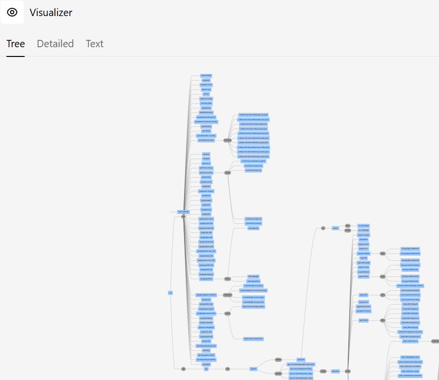
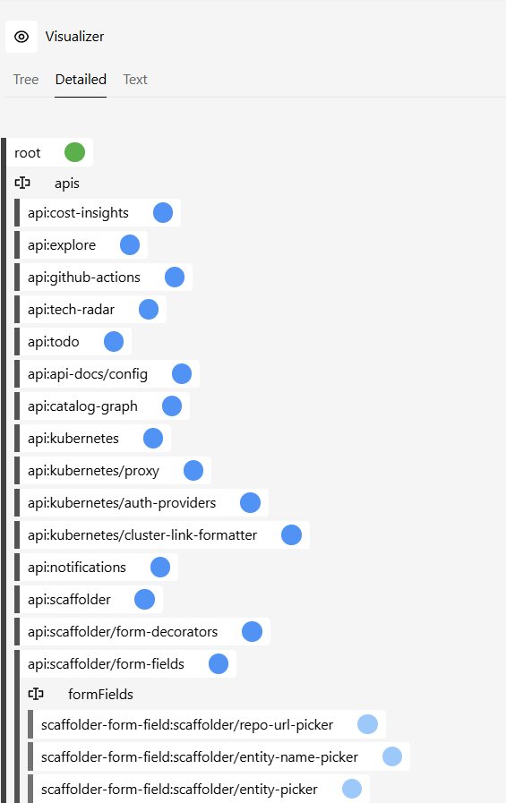

## Overview

This section describes how to install the `app-visualizer` plugin in the frontend system. It also describes which views are available. It can be used during normal usage of the frontend system or during migration.

### Visualizer Plugin

The `app-visualizer` plugin can help with troubleshooting. It provides a visual overview of your app's extension tree, making it easy to verify that plugins are installed correctly, see how extensions are wired together, and identify issues during migration.

:::note

The plugin is available starting with Backstage v1.22.0.

:::

#### Installation

This plugin could already be installed; check `packages/app/package.json` under `dependencies`.

Install the plugin in your app package:

```bash
yarn --cwd packages/app add @backstage/plugin-app-visualizer
```

When integrated into your app, the plugin provides the `/visualizer` route. Depending on your app setup, it may also appear in the sidebar as a **Visualizer** entry.

#### Available Views

The `app-visualizer` provides three views, each accessible via tabs at the top of the page:

- **Tree** — Displays the full extension tree as an interactive hierarchy. Each node represents an extension, showing its ID, the plugin it belongs to, and whether it is enabled or disabled. This is the most useful view during migration, as it lets you verify which plugins are being automatically detected and which legacy extensions have been converted. Expand nodes to see child extensions and their configuration.

- **Detailed** — Shows a list of all extensions with additional metadata. Use this view to inspect individual extension properties, configuration, and attachment points. It is helpful for debugging configuration overrides and understanding how extensions are resolved.

- **Text** — Renders the extension tree as plain text. This is useful for copying and pasting into GitHub issues or Discord when asking for help, since it provides a compact, readable snapshot of your app's structure.

An example of the tree view:


An example of the detailed view:

