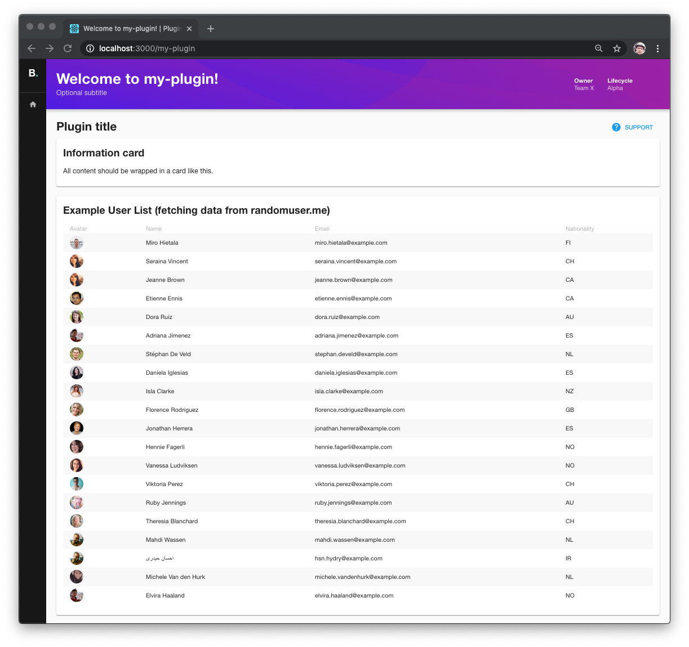

# Plugin Development in Backstage

Backstage plugins provide features to a Backstage App.

Each plugin is treated as a self-contained web app and can include almost any type of content.
Plugins all use a common set of platform APIs and reusable UI components.
Plugins can fetch data from external sources using the regular browser APIs or by depending on
external modules to do the work.

<!-- MOVED TO create-a-plugin.md ## Creating a new plugin
On your command line, invoke the `backstage-cli` to create a new plugin:
```bash
yarn create-plugin
```


This will create a new Backstage Plugin based on the ID that was provided. It will be built and
added to the Backstage App automatically.

*If `yarn start` is already running you should be able to see the default page for your new
plugin directly by navigating to `http://localhost:3000/my-plugin`.*

 -->

## Developing guidelines

- Consider writing plugins in `TypeScript`.
- Plan the directory structure of your plugin so that it becomes easy to manage.
- Prefer using the Backstage components, otherwise go with [Material-UI](https://material-ui.com/).
- Check out the shared Backstage APIs before building a new one.

## Plugin concepts / API

### Routing

Each plugin is responsible for registering its components to corresponding routes in the app.

The app will call the `createPlugin` method on each plugin, passing in a `router` object with a set
of methods on it.

```jsx
import { createPlugin, createRouteRef } from '@backstage/core';
import ExampleComponent from './components/ExampleComponent';

export const rootRouteRef = createRouteRef({
  path: '/new-plugin',
  title: 'New plugin',
});

export const plugin = createPlugin({
  id: 'new-plugin',
  register({ router }) {
    router.addRoute(rootRouteRef, ExampleComponent);
  },
});
```

#### `router` API

```typescript
addRoute(
  target: RouteRef,
  Component: ComponentType<any>,
  options?: RouteOptions,
): void;

/**
 * @deprecated See the `addRoute` method
 */
registerRoute(
  path: RoutePath,
  Component: ComponentType<any>,
  options?: RouteOptions,
): void;
```
