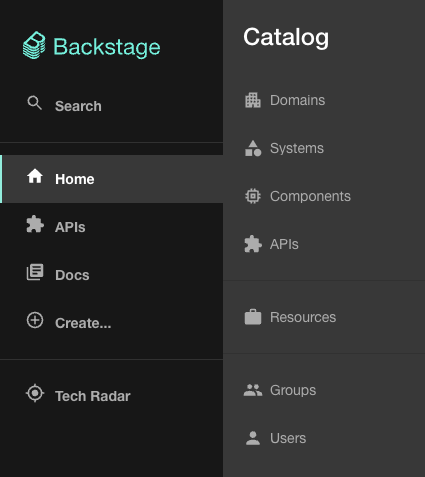

Backstage ships with a default theme with a light and dark mode variant. The themes are provided as a part of the [`@backstage/theme`](https://www.npmjs.com/package/@backstage/theme) package, which also includes utilities for customizing the default theme, or creating completely new themes.

## Creating a Custom Theme

The easiest way to create a new theme is to use the `createUnifiedTheme` function exported by the [`@backstage/theme`](https://www.npmjs.com/package/@backstage/theme) package. You can use it to override some basic parameters of the default theme such as the color palette and font.

For example, you can create a new theme based on the default light theme like this:

```ts title="packages/app/src/theme/myTheme.ts"
import {
  createBaseThemeOptions,
  createUnifiedTheme,
  palettes,
} from '@backstage/theme';

export const myTheme = createUnifiedTheme({
  ...createBaseThemeOptions({
    palette: palettes.light,
  }),
  fontFamily: 'Comic Sans MS',
  defaultPageTheme: 'home',
});
```

:::note Note

we recommend creating a `theme` folder in `packages/app/src` to place your theme file to keep things nicely organized.

:::

You can also create a theme from scratch that matches the `BackstageTheme` type exported by [`@backstage/theme`](https://www.npmjs.com/package/@backstage/theme). See the
[Material UI docs on theming](https://material-ui.com/customization/theming/) for more information about how that can be done.

## Using your Custom Theme

To add a custom theme to your Backstage app, you pass it as configuration to `createApp`.

For example, adding the theme that we created in the previous section can be done like this:

```tsx title="packages/app/src/App.tsx"
import { createApp } from '@backstage/app-defaults';
import { ThemeProvider } from '@material-ui/core/styles';
import CssBaseline from '@material-ui/core/CssBaseline';
import LightIcon from '@material-ui/icons/WbSunny';

const app = createApp({
  apis: ...,
  plugins: ...,
  themes: [{
    id: 'my-theme',
    title: 'My Custom Theme',
    variant: 'light',
    icon: <LightIcon />,
    Provider: ({ children }) => (
      <UnifiedThemeProvider theme={myTheme} children={children} />
    ),
  }]
})
```

Note that your list of custom themes overrides the default themes. If you still want to use the default themes, they are exported as `themes.light` and `themes.dark` from [`@backstage/theme`](https://www.npmjs.com/package/@backstage/theme).

## Example of a custom theme

```ts title="packages/app/src/theme/myTheme.ts"
import {
  createBaseThemeOptions,
  createUnifiedTheme,
  genPageTheme,
  palettes,
  shapes,
} from '@backstage/theme';

export const myTheme = createUnifiedTheme({
  ...createBaseThemeOptions({
    palette: {
      ...palettes.light,
      primary: {
        main: '#343b58',
      },
      secondary: {
        main: '#565a6e',
      },
      error: {
        main: '#8c4351',
      },
      warning: {
        main: '#8f5e15',
      },
      info: {
        main: '#34548a',
      },
      success: {
        main: '#485e30',
      },
      background: {
        default: '#d5d6db',
        paper: '#d5d6db',
      },
      banner: {
        info: '#34548a',
        error: '#8c4351',
        text: '#343b58',
        link: '#565a6e',
      },
      errorBackground: '#8c4351',
      warningBackground: '#8f5e15',
      infoBackground: '#343b58',
      navigation: {
        background: '#343b58',
        indicator: '#8f5e15',
        color: '#d5d6db',
        selectedColor: '#ffffff',
      },
    },
  }),
  defaultPageTheme: 'home',
  fontFamily: 'Comic Sans MS',
  /* below drives the header colors */
  pageTheme: {
    home: genPageTheme({ colors: ['#8c4351', '#343b58'], shape: shapes.wave }),
    documentation: genPageTheme({
      colors: ['#8c4351', '#343b58'],
      shape: shapes.wave2,
    }),
    tool: genPageTheme({ colors: ['#8c4351', '#343b58'], shape: shapes.round }),
    service: genPageTheme({
      colors: ['#8c4351', '#343b58'],
      shape: shapes.wave,
    }),
    website: genPageTheme({
      colors: ['#8c4351', '#343b58'],
      shape: shapes.wave,
    }),
    library: genPageTheme({
      colors: ['#8c4351', '#343b58'],
      shape: shapes.wave,
    }),
    other: genPageTheme({ colors: ['#8c4351', '#343b58'], shape: shapes.wave }),
    app: genPageTheme({ colors: ['#8c4351', '#343b58'], shape: shapes.wave }),
    apis: genPageTheme({ colors: ['#8c4351', '#343b58'], shape: shapes.wave }),
  },
});
```

For a more complete example of a custom theme including Backstage and Material UI component overrides, see the [Aperture theme](https://github.com/backstage/demo/blob/master/packages/app/src/theme/aperture.ts) from the [Backstage demo site](https://demo.backstage.io).

## Custom Typography

When creating a custom theme you can also customize various aspects of the default typography, here's an example using simplified theme:

```ts title="packages/app/src/theme/myTheme.ts"
import {
  createBaseThemeOptions,
  createUnifiedTheme,
  palettes,
} from '@backstage/theme';

export const myTheme = createUnifiedTheme({
  ...createBaseThemeOptions({
    palette: palettes.light,
    typography: {
      htmlFontSize: 16,
      fontFamily: 'Arial, sans-serif',
      h1: {
        fontSize: 54,
        fontWeight: 700,
        marginBottom: 10,
      },
      h2: {
        fontSize: 40,
        fontWeight: 700,
        marginBottom: 8,
      },
      h3: {
        fontSize: 32,
        fontWeight: 700,
        marginBottom: 6,
      },
      h4: {
        fontWeight: 700,
        fontSize: 28,
        marginBottom: 6,
      },
      h5: {
        fontWeight: 700,
        fontSize: 24,
        marginBottom: 4,
      },
      h6: {
        fontWeight: 700,
        fontSize: 20,
        marginBottom: 2,
      },
    },
    defaultPageTheme: 'home',
  }),
});
```

If you wanted to only override a sub-set of the typography setting, for example just `h1` then you would do this:

```ts title="packages/app/src/theme/myTheme.ts"
import {
  createBaseThemeOptions,
  createUnifiedTheme,
  defaultTypography,
  palettes,
} from '@backstage/theme';

export const myTheme = createUnifiedTheme({
  ...createBaseThemeOptions({
    palette: palettes.light,
    typography: {
      ...defaultTypography,
      htmlFontSize: 16,
      fontFamily: 'Roboto, sans-serif',
      h1: {
        fontSize: 72,
        fontWeight: 700,
        marginBottom: 10,
      },
    },
    defaultPageTheme: 'home',
  }),
});
```

## Custom Fonts

To add custom fonts, you first need to store the font so that it can be imported. We suggest creating the `assets/fonts` directory in your front-end application `src` folder.

You can then declare the font style following the `@font-face` syntax from [Material UI Typography](https://mui.com/material-ui/customization/typography/).

After that you can then utilize the `styleOverrides` of `MuiCssBaseline` under components to add a font to the `@font-face` array.

```ts title="packages/app/src/theme/myTheme.ts"
import MyCustomFont from '../assets/fonts/My-Custom-Font.woff2';

const myCustomFont = {
  fontFamily: 'My-Custom-Font',
  fontStyle: 'normal',
  fontDisplay: 'swap',
  fontWeight: 300,
  src: `
    local('My-Custom-Font'),
    url(${MyCustomFont}) format('woff2'),
  `,
};

export const myTheme = createUnifiedTheme({
  fontFamily: 'My-Custom-Font',
  palette: palettes.light,
  components: {
    MuiCssBaseline: {
      styleOverrides: {
        '@font-face': [myCustomFont],
      },
    },
  },
});
```

If you want to utilize different or multiple fonts, then you can set the top level `fontFamily` to what you want for your body, and then override `fontFamily` in `typography` to control fonts for various headings.

```ts title="packages/app/src/theme/myTheme.ts"
import MyCustomFont from '../assets/fonts/My-Custom-Font.woff2';
import myAwesomeFont from '../assets/fonts/My-Awesome-Font.woff2';

const myCustomFont = {
  fontFamily: 'My-Custom-Font',
  fontStyle: 'normal',
  fontDisplay: 'swap',
  fontWeight: 300,
  src: `
    local('My-Custom-Font'),
    url(${MyCustomFont}) format('woff2'),
  `,
};

const myAwesomeFont = {
  fontFamily: 'My-Awesome-Font',
  fontStyle: 'normal',
  fontDisplay: 'swap',
  fontWeight: 300,
  src: `
    local('My-Awesome-Font'),
    url(${myAwesomeFont}) format('woff2'),
  `,
};

export const myTheme = createUnifiedTheme({
  fontFamily: 'My-Custom-Font',
  components: {
    MuiCssBaseline: {
      styleOverrides: {
        '@font-face': [myCustomFont, myAwesomeFont],
      },
    },
  },
  ...createBaseThemeOptions({
    palette: palettes.light,
    typography: {
      ...defaultTypography,
      htmlFontSize: 16,
      fontFamily: 'My-Custom-Font',
      h1: {
        fontSize: 72,
        fontWeight: 700,
        marginBottom: 10,
        fontFamily: 'My-Awesome-Font',
      },
    },
    defaultPageTheme: 'home',
  }),
});
```

## Overriding Backstage and Material UI components styles

When creating a custom theme you would be applying different values to component's CSS rules that use the theme object. For example, a Backstage component's styles might look like this:

```tsx
const useStyles = makeStyles<BackstageTheme>(
  theme => ({
    header: {
      padding: theme.spacing(3),
      boxShadow: '0 0 8px 3px rgba(20, 20, 20, 0.3)',
      backgroundImage: theme.page.backgroundImage,
    },
  }),
  { name: 'BackstageHeader' },
);
```

Notice how the `padding` is getting its value from `theme.spacing`, that means that setting a value for spacing in your custom theme would affect this component padding property and the same goes for `backgroundImage` which uses `theme.page.backgroundImage`. However, the `boxShadow` property doesn't reference any value from the theme, that means that creating a custom theme wouldn't be enough to alter the `box-shadow` property or to add css rules that aren't already defined like a margin. For these cases you should also create an override.

Here's how you would do that:

```ts title="packages/app/src/theme/myTheme.ts"
import {
  createBaseThemeOptions,
  createUnifiedTheme,
  palettes,
} from '@backstage/theme';

export const myTheme = createUnifiedTheme({
  ...createBaseThemeOptions({
    palette: palettes.light,
  }),
  fontFamily: 'Comic Sans MS',
  defaultPageTheme: 'home',
  components: {
    BackstageHeader: {
      styleOverrides: {
        header: ({ theme }) => ({
          width: 'auto',
          margin: '20px',
          boxShadow: 'none',
          borderBottom: `4px solid ${theme.palette.primary.main}`,
        }),
      },
    },
  },
});
```

## Custom Logo

In addition to a custom theme, you can also customize the logo displayed at the far top left of the site.

In your frontend app, locate `src/components/Root/` folder. You'll find two components:

- `LogoFull.tsx` - A larger logo used when the Sidebar navigation is opened.
- `LogoIcon.tsx` - A smaller logo used when the Sidebar navigation is closed.

To replace the images, you can simply replace the relevant code in those components with raw SVG definitions.

You can also use another web image format such as PNG by importing it. To do this, place your new image into a new subdirectory such as `src/components/Root/logo/my-company-logo.png`, and then add this code:

```tsx
import MyCustomLogoFull from './logo/my-company-logo.png';

const LogoFull = () => {
  return ;
};
```

## Icons

So far you've seen how to create your own theme and add your own logo, in the following sections you'll be shown how to override the existing icons and how to add more icons

### Custom Icons

You can also customize the Project's _default_ icons.

You can change the following [icons](https://github.com/backstage/backstage/blob/master/packages/app-defaults/src/defaults/icons.tsx).

#### Requirements

- Files in `.svg` format
- React components created for the icons

#### Create React Component

In your front-end application, locate the `src` folder. We suggest creating the `assets/icons` directory and `CustomIcons.tsx` file.

```tsx title="customIcons.tsx"
import { SvgIcon, SvgIconProps } from '@material-ui/core';

import React from 'react';

export const ExampleIcon = (props: SvgIconProps) => (
  <SvgIcon {...props} viewBox="0 0 24 24">
    <path
      fill="currentColor"
      width="1em"
      height="1em"
      display="inline-block"
      d="M11.6335 10.8398C11.6335 11.6563 12.065 12.9922 13.0863 12.9922C14.1075 12.9922 14.539 11.6563 14.539 10.8398C14.539 10.0234 14.1075 8.6875 13.0863 8.6875C12.065 8.6875 11.6335 10.0234 11.6335 10.8398V10.8398ZM2.38419e-07 8.86719C2.38419e-07 10.1133 0.126667 11.4336 0.692709 12.5781C2.19292 15.5703 6.3175 15.5 9.27042 15.5C12.2708 15.5 16.6408 15.6055 18.2004 12.5781C18.7783 11.4453 19 10.1133 19 8.86719C19 7.23047 18.4498 5.68359 17.3573 4.42969C17.5631 3.8125 17.6621 3.16406 17.6621 2.52344C17.6621 1.68359 17.4681 1.26172 17.0842 0.5C15.291 0.5 14.1431 0.851562 12.7775 1.90625C11.6296 1.63672 10.45 1.51562 9.26646 1.51562C8.19771 1.51562 7.12104 1.62891 6.08396 1.875C4.73813 0.832031 3.59021 0.5 1.81687 0.5C1.42896 1.26172 1.23896 1.68359 1.23896 2.52344C1.23896 3.16406 1.34188 3.80078 1.54375 4.40625C0.455209 5.67188 2.38419e-07 7.23047 2.38419e-07 8.86719V8.86719ZM2.54521 10.8398C2.54521 9.125 3.60208 7.61328 5.45458 7.61328C6.20271 7.61328 6.91917 7.74609 7.67125 7.84766C8.26104 7.9375 8.85083 7.97266 9.45646 7.97266C10.0581 7.97266 10.6479 7.9375 11.2417 7.84766C11.9819 7.74609 12.7063 7.61328 13.4583 7.61328C15.3108 7.61328 16.3677 9.125 16.3677 10.8398C16.3677 14.2695 13.1852 14.7969 10.4144 14.7969H8.50646C5.72375 14.7969 2.54521 14.2734 2.54521 10.8398V10.8398ZM5.81479 8.6875C6.83604 8.6875 7.2675 10.0234 7.2675 10.8398C7.2675 11.6563 6.83604 12.9922 5.81479 12.9922C4.79354 12.9922 4.36208 11.6563 4.36208 10.8398C4.36208 10.0234 4.79354 8.6875 5.81479 8.6875Z"
    />
  </SvgIcon>
);
```

#### Using the custom icon

Supply your custom icon in `packages/app/src/App.tsx`

```tsx title="packages/app/src/App.tsx"
/* highlight-add-next-line */
import { ExampleIcon } from './assets/customIcons'


const app = createApp({
  apis,
  components: {
    {/* ... */}
  },
  themes: [
    {/* ... */}
  ],
  /* highlight-add-start */
  icons: {
    github: ExampleIcon,
  },
  /* highlight-add-end */
  bindRoutes({ bind }) {
    {/* ... */}
  }
})
```

### Adding Icons

You can add more icons, if the [default icons](https://github.com/backstage/backstage/blob/master/packages/app-defaults/src/defaults/icons.tsx) do not fit your needs, so that they can be used in other places like for Links in your entities. For this example we'll be using icons from[Material UI](https://v4.mui.com/components/material-icons/) and specifically the `AlarmIcon`. Here's how to do that:

1. First you will want to open your `App.tsx` in `/packages/app/src`
2. Then you want to import your icon, add this to the rest of your imports: `import AlarmIcon from '@material-ui/icons/Alarm';`
3. Next you want to add the icon like this to your `createApp`:

   ```tsx title="packages/app/src/App.tsx"
   const app = createApp({
     apis: ...,
     plugins: ...,
     /* highlight-add-start */
     icons: {
       alert: AlarmIcon,
     },
   /* highlight-add-end */
     themes: ...,
     components: ...,
   });
   ```

4. Now we can reference `alert` for our icon in our entity links like this:

   ```yaml
   apiVersion: backstage.io/v1alpha1
   kind: Component
   metadata:
     name: artist-lookup
     description: Artist Lookup
     links:
       - url: https://example.com/alert
         title: Alerts
         icon: alert
   ```

   And this is the result:

   

   Another way you can use these icons is from the `AppContext` like this:

   ```ts
   import { useApp } from '@backstage/core-plugin-api';

   const app = useApp();
   const alertIcon = app.getSystemIcon('alert');
   ```

   You might want to use this method if you have an icon you want to use in several locations.

:::note Note

If the icon is not available as one of the default icons or one you've added then it will fall back to Material UI's `LanguageIcon`

:::

## Custom Sidebar

As you've seen there are many ways that you can customize your Backstage app. The following section will show you how you can customize the sidebar.

### Sidebar Sub-menu

For this example we'll show you how you can expand the sidebar with a sub-menu:

1. Open the `Root.tsx` file located in `packages/app/src/components/Root` as this is where the sidebar code lives
2. Then we want to add the following import for `useApp`:

   ```tsx title="packages/app/src/components/Root/Root.tsx"
   import { useApp } from '@backstage/core-plugin-api';
   ```

3. Then update the `@backstage/core-components` import like this:

   ```tsx title="packages/app/src/components/Root/Root.tsx"
   import {
     Sidebar,
     sidebarConfig,
     SidebarDivider,
     SidebarGroup,
     SidebarItem,
     SidebarPage,
     SidebarScrollWrapper,
     SidebarSpace,
     useSidebarOpenState,
     Link,
     /* highlight-add-start */
     GroupIcon,
     SidebarSubmenu,
     SidebarSubmenuItem,
     /* highlight-add-end */
   } from '@backstage/core-components';
   ```

4. Finally replace `<SidebarItem icon={HomeIcon} to="catalog" text="Home" />` with this:

   ```tsx title="packages/app/src/components/Root/Root.tsx"
   <SidebarItem icon={HomeIcon} to="catalog" text="Home">
     <SidebarSubmenu title="Catalog">
       <SidebarSubmenuItem
         title="Domains"
         to="catalog?filters[kind]=domain"
         icon={useApp().getSystemIcon('kind:domain')}
       />
       <SidebarSubmenuItem
         title="Systems"
         to="catalog?filters[kind]=system"
         icon={useApp().getSystemIcon('kind:system')}
       />
       <SidebarSubmenuItem
         title="Components"
         to="catalog?filters[kind]=component"
         icon={useApp().getSystemIcon('kind:component')}
       />
       <SidebarSubmenuItem
         title="APIs"
         to="catalog?filters[kind]=api"
         icon={useApp().getSystemIcon('kind:api')}
       />
       <SidebarDivider />
       <SidebarSubmenuItem
         title="Resources"
         to="catalog?filters[kind]=resource"
         icon={useApp().getSystemIcon('kind:resource')}
       />
       <SidebarDivider />
       <SidebarSubmenuItem
         title="Groups"
         to="catalog?filters[kind]=group"
         icon={useApp().getSystemIcon('kind:group')}
       />
       <SidebarSubmenuItem
         title="Users"
         to="catalog?filters[kind]=user"
         icon={useApp().getSystemIcon('kind:user')}
       />
     </SidebarSubmenu>
   </SidebarItem>
   ```

When you startup your Backstage app and hover over the Home option on the sidebar you'll now see a nice sub-menu appear with links to the various Kinds in your Catalog. It would look like this:



You can see more ways to use this in the [Storybook Sidebar examples](https://backstage.io/storybook/?path=/story/layout-sidebar--sample-scalable-sidebar)

## Custom Homepage

In addition to a custom theme, a custom logo, you can also customize the
homepage of your app. Read the full guide on the [next page](homepage.md).

## Migrating to Material UI v5

We now support Material UI v5 in Backstage. Check out our [migration guide](../tutorials/migrate-to-mui5.md) to get started.
