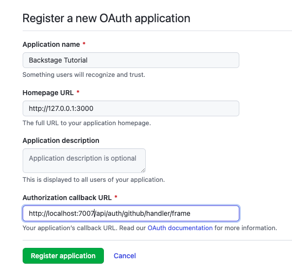
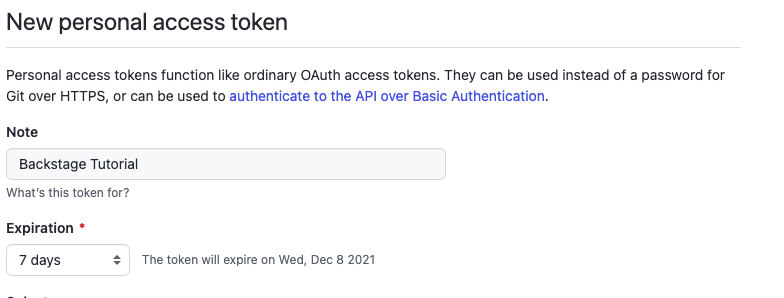
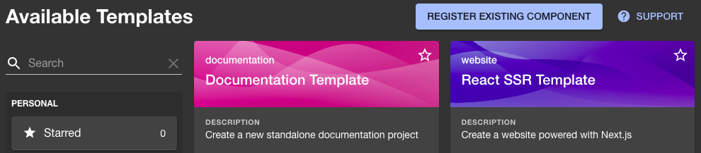
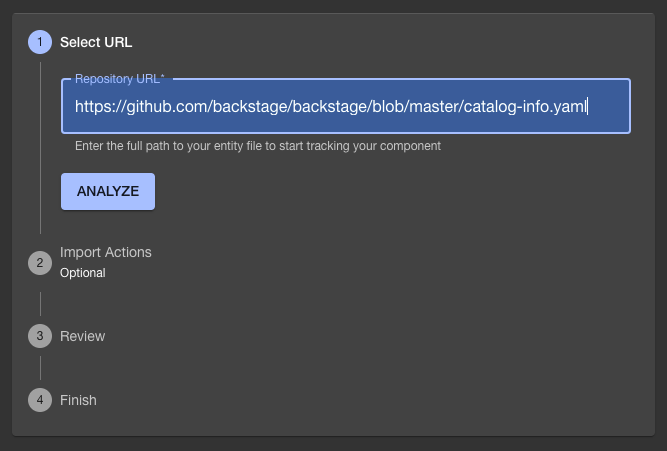
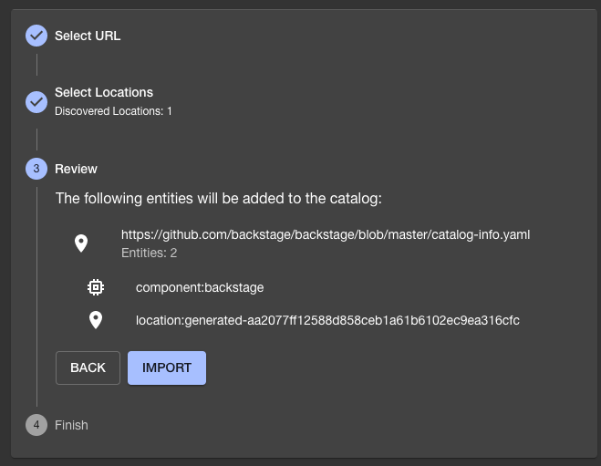
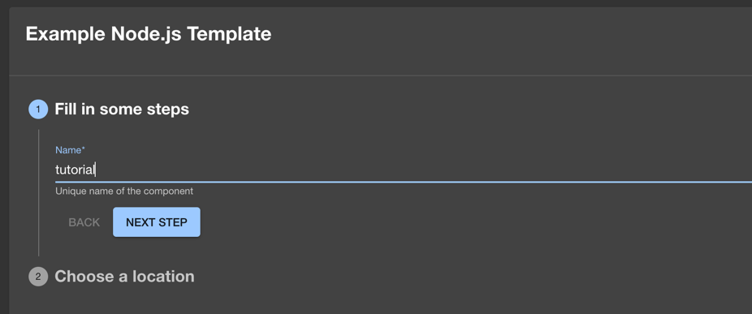
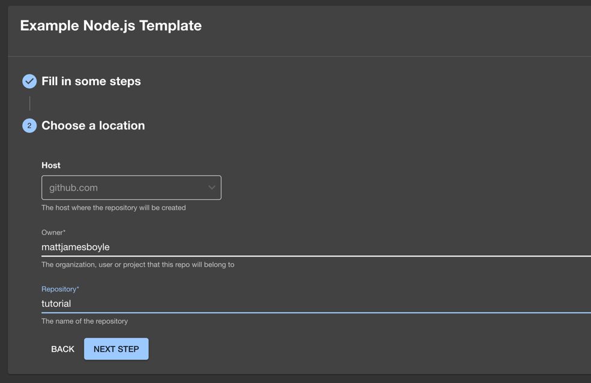

This is part two of the Getting Started documentation of Backstage. The steps in
this tutorial assume you've installed Backstage app from the npm repository,
like in the [Getting Started guide](./index.md) and want to configure Backstage.

At the end of this tutorial, you can expect:

- Backstage to use a PostgreSQL database
- You'll authenticate using one of the auth providers
- The Backstage GitHub integration to be configured
- You're able to use Software Templates

### Prerequisites

- Access to a Linux-based operating system, such as Linux, MacOS or
  [Windows Subsystem for Linux](https://docs.microsoft.com/en-us/windows/wsl/)
- An account with elevated rights to install prerequisites on your operating
  system
- If the database is not hosted on the same server as the Backstage app, the
  PostgreSQL port needs to be accessible (the default is 5432 or 5433)

### Install and configure PostgreSQL

These instructions can be skipped if you already have a PostgreSQL server
installed and created a schema and user. The example below is for Linux, but
luckily there are detailed instructions on how to
[install PostgreSQL](https://www.postgresql.org/download/) to help you get
started.

```shell
sudo apt-get install postgresql
```

Test if your database is working:

```shell
sudo -u postgres psql
```

You should see a very welcoming message, like:

```shell
psql (12.9 (Ubuntu 12.9-0ubuntu0.20.04.1))
Type "help" for help.

postgres=#
```

For this tutorial we're going to use the existing postgres user. The next step
is to set the password for this user:

```shell
postgres=# ALTER USER postgres PASSWORD 'secret';
```

That's enough database administration to get started. Type `\q`, followed by
pressing the enter key. Then again type `exit` and press enter. Next, you need
to install and configure the client.

Stop Backstage, and go to the root directory of your freshly installed Backstage
App. Use the following commands to start the PostgreSQL client installation:

```bash
# From your Backstage root directory
yarn --cwd packages/backend add pg
```

Use your favorite editor to open `app-config.yaml` and add your PostgreSQL
configuration in the root directory of your Backstage app using the credentials
from the previous steps.

```yaml title="app-config.yaml"
backend:
  database:
    # highlight-remove-start
    client: better-sqlite3
    connection: ':memory:'
    # highlight-remove-end
    # highlight-add-start
    # config options: https://node-postgres.com/apis/client
    client: pg
    connection:
      host: ${POSTGRES_HOST}
      port: ${POSTGRES_PORT}
      user: ${POSTGRES_USER}
      password: ${POSTGRES_PASSWORD}
      # https://node-postgres.com/features/ssl
      # ssl:
      #   host is only needed if the connection name differs from the certificate name.
      #   This is for example the case with CloudSQL.
      #   host: servername in the certificate
      #   ca:
      #     $file: <file-path>/server.pem
      #   key:
      #     $file: <file-path>/client.key
      #   cert:
      #     $file: <file-path>/client-cert.pem
      # highlight-add-end
```

You'll use the connection details from the previous step. You can either set the
`POSTGRES_` environment variables prior to launching Backstage, or remove the
`${...}` values and set actual values in this configuration file.

The default port for PostgreSQL is `5432` or `5433`, and the host name could be
`127.0.0.1` if installed locally. A word of caution: In general, using
connection details in a configuration file is not recommended.

Start the Backstage app:

```shell
yarn dev
```

After Backstage is completely started you'll notice the catalog is populated
with the information, still coming from the configuration files. If you add a
new component, or register an existing one it will be saved in the database.
Later in this tutorial you'll add a service, and you can test if it's persistent
as advertised.

If you want to read more about the database configuration, here are some helpful
links:

- [Configuring Plugin Databases](../tutorials/configuring-plugin-databases.md#privileges)
- [Read more about Knex](http://knexjs.org/), which is the library we use for
  the database backend

### Setting up authentication

There are multiple authentication providers available for you to use with
Backstage, feel free to follow
[the instructions for adding authentication](../auth/index.md).

For this tutorial we choose to use GitHub, a free service most of you might be
familiar with. For other options, see
[the auth provider documentation](../auth/github/provider.md#create-an-oauth-app-on-github).

Go to
[https://github.com/settings/applications/new](https://github.com/settings/applications/new)
to create your OAuth App. The `Homepage URL` should point to Backstage's
frontend, in our tutorial it would be `http://localhost:3000`. The
`Authorization callback URL` will point to the auth backend, which will most
likely be `http://localhost:7007/api/auth/github/handler/frame`.



Take note of the `Client ID` and the `Client Secret`. Open `app-config.yaml`,
and add your `clientId` and `clientSecret` to this file. It should end up
looking like this:

```yaml title="app-config.yaml"
auth:
  # see https://backstage.io/docs/auth/ to learn about auth providers
  environment: development
  providers:
    github:
      development:
        clientId: YOUR CLIENT ID
        clientSecret: YOUR CLIENT SECRET
```

### Add sign-in option to the frontend

Backstage will re-read the configuration. If there's no errors, that's great! We
can continue with the last part of the configuration. The next step is needed to
change the sign-in page, this you actually need to add in the source code.

Open `packages/app/src/App.tsx` and below the last `import` line, add:

```typescript title="packages/app/src/App.tsx"
import { githubAuthApiRef } from '@backstage/core-plugin-api';
import { SignInPage } from '@backstage/core-components';
```

Search for `const app = createApp({` in this file, and below `apis,` add:

```tsx title="packages/app/src/App.tsx"
components: {
  SignInPage: props => (
    <SignInPage
      {...props}
      auto
      provider={{
        id: 'github-auth-provider',
        title: 'GitHub',
        message: 'Sign in using GitHub',
        apiRef: githubAuthApiRef,
      }}
    />
  ),
},
```

> Note: The default Backstage app comes with a guest Sign In Resolver. This resolver makes all users share a single "guest" identity and is only intended as a minimum requirement to quickly get up and running. You can read more about how [Sign In Resolvers](../auth/identity-resolver.md#sign-in-resolvers) play a role in creating a [Backstage User Identity](../auth/identity-resolver.md#backstage-user-identity) for logged in users.

Restart Backstage from the terminal, by stopping it with `Control-C`, and starting it with `yarn dev` . You should be welcomed by a login prompt!

> Note: Sometimes the frontend starts before the backend resulting in errors on the sign in page. Wait for the backend to start and then reload Backstage to proceed.

To learn more about Authentication in Backstage, here are some docs you
could read:

- [Authentication in Backstage](../auth/index.md)
- [Using organizational data from GitHub](../integrations/github/org.md)

### Setting up a GitHub Integration

The GitHub integration supports loading catalog entities from GitHub or GitHub
Enterprise. Entities can be added to static catalog configuration, registered
with the catalog-import plugin, or discovered from a GitHub organization. Users
and Groups can also be loaded from an organization. While using [GitHub Apps](../integrations/github/github-apps.md)
might be the best way to set up integrations, for this tutorial you'll use a
Personal Access Token.

Create your Personal Access Token by opening
[the GitHub token creation page](https://github.com/settings/tokens/new). Use a
name to identify this token and put it in the notes field. Choose a number of
days for expiration. If you have a hard time picking a number, we suggest to go
for 7 days, it's a lucky number.



Set the scope to your likings. For this tutorial, selecting `repo` and `workflow` is required as the scaffolding job in this guide configures a GitHub actions workflow for the newly created project.

For this tutorial, we will be writing the token to `app-config.local.yaml`. This file might not exist for you, so if it doesn't go ahead and create it alongside the `app-config.yaml` at the root of the project.
This file should also be excluded in `.gitignore`, to avoid accidental committing of this file.

In your `app-config.local.yaml` go ahead and add the following:

```yaml title="app-config.local.yaml"
integrations:
  github:
    - host: github.com
      token: ghp_urtokendeinfewinfiwebfweb # this should be the token from GitHub
```

That's settled. This information will be leveraged by other plugins.

If you're looking for a more production way to manage this secret, then you can do the following with the token being stored in an environment variable called `GITHUB_TOKEN`.

```yaml title="app-config.local.yaml"
integrations:
  github:
    - host: github.com
      token: ${GITHUB_TOKEN} # this will use the environment variable GITHUB_TOKEN
```

> Note: If you've updated the configuration for your integration, it's likely that the backend will need a restart to apply these changes. To do this, stop the running instance in your terminal with `Control-C`, then start it again with `yarn dev`. Once the backend has restarted, retry the operation.

Some helpful links, for if you want to learn more about:

- [Other available integrations](../integrations/index.md)
- [Using GitHub Apps instead of a Personal Access Token](../integrations/github/github-apps.md#docsNav)

### Explore what we've done so far

## Login to Backstage and check profile

Open your Backstage frontend. You should see your login screen if you're not
logged in yet. As soon as you've logged in, go to Settings, you'll see your
profile. Hopefully you'll recognize the profile picture and name on your screen,
otherwise something went terribly wrong.

## Register an existing component

- Register a new component, by going to `create` and choose
  `Register existing component`

  <!-- todo: Needs zoomable plugin -->

  

- As URL use `https://github.com/backstage/backstage/blob/master/catalog-info.yaml`.
  This is used in our [demo site](https://demo.backstage.io) catalog.

  

- Hit `Analyze` and review the changes. Apply them if correct.

  

- You should receive a message that your entities have been added.
- If you go back to `Home`, you should be able to find `backstage`. You should be
  able to click it and see the details

## Create a new component using a software template

> Note: if you're running Backstage with Node 20 or later, you'll need to pass the flag `--no-node-snapshot` to Node in order to
> use the templates feature.
> One way to do this is to specify the `NODE_OPTIONS` environment variable before starting Backstage:
> `export NODE_OPTIONS=--no-node-snapshot`

- Go to `create` and choose to create a website with the `Example Node.js Template`
- Type in a name, let's use `tutorial` and click `Next Step`



- You should see the following screen:



- For host, it should default to github.com
- As owner, type your GitHub username
- For the repository name, type `tutorial`. Go to the next step

- Review the details of this new service, and press `Create` if you want to
  deploy it like this.
- You can follow along with the progress, and as soon as every step is
  finished, you can take a look at your new service

Achievement unlocked. You've set up an installation of the core Backstage App,
made it persistent, and configured it so you are now able to use software
templates.

Let us know how your experience was: [on discord](https://discord.gg/backstage-687207715902193673),
file issues for any
[feature](https://github.com/backstage/backstage/issues/new?labels=help+wanted&template=feature_template.md)
or
[plugin suggestions](https://github.com/backstage/backstage/issues/new?labels=plugin&template=plugin_template.md&title=%5BPlugin%5D+THE+PLUGIN+NAME),
or
[bugs](https://github.com/backstage/backstage/issues/new?labels=bug&template=bug_template.md)
you have, and feel free to
[contribute](https://github.com/backstage/backstage/blob/master/CONTRIBUTING.md)!
