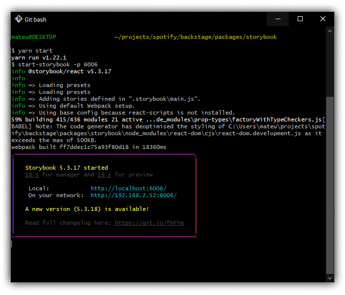
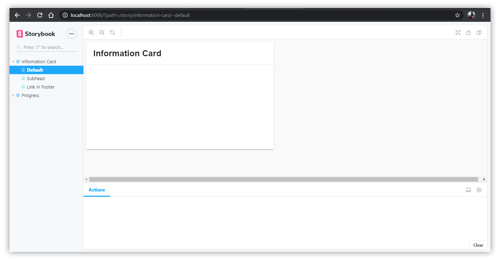

# Contributing to Storybook

## Creating a new Story

> A Story basically represents a single visual state of a component.

To create a new story, create a new file located alongside the component you want to document on Storybook.

See below an example of the structure:

```
core
└── src
    └── components
        └── Progress
            ├── Progress.tsx
            └── Progress.stories.tsx
```

## Running locally

Go to `packages/storybook`, run `yarn install` and install the dependencies, then run the following on your command line: `yarn start`



_You should see a log like the image above._

If `yarn start` is running, go to your browser and navigate to `http://localhost:6006/`. You should be able to navigate and see the Storybook page.



[Back to Getting Started](README.md)
