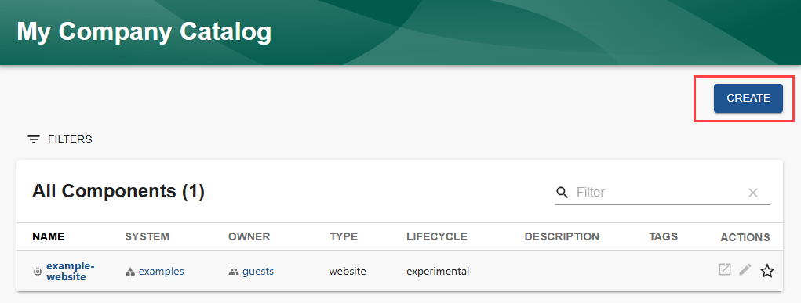
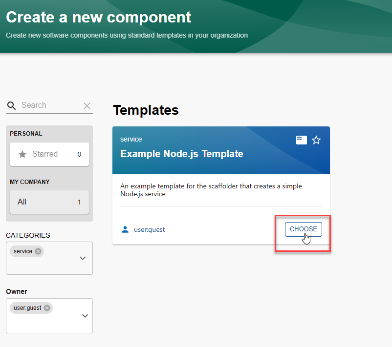
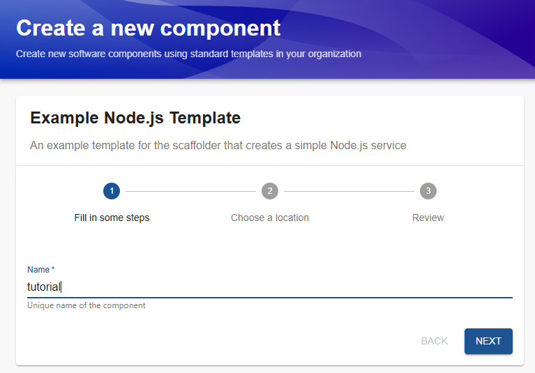
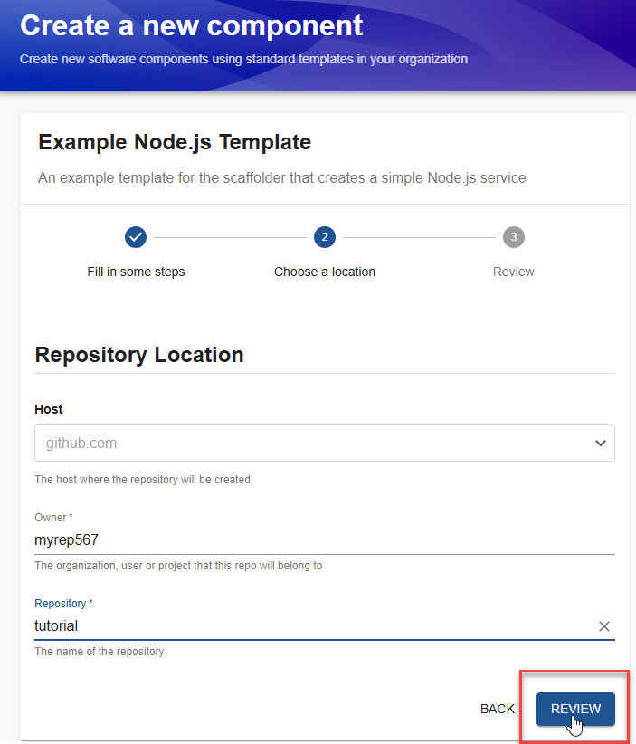
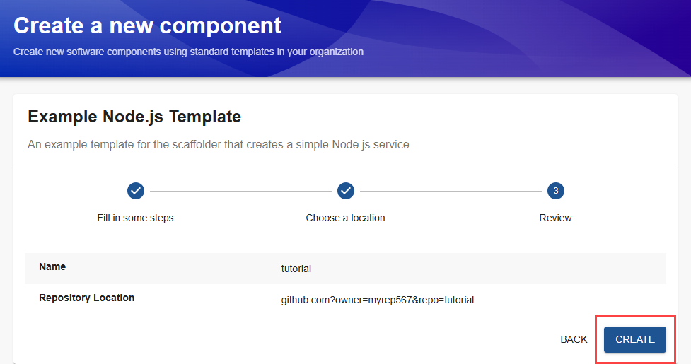
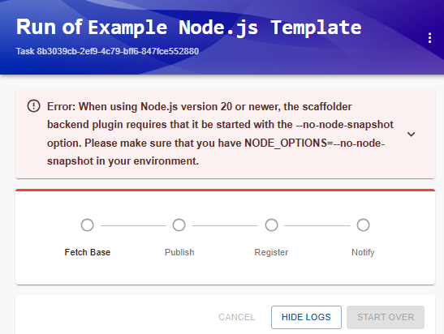
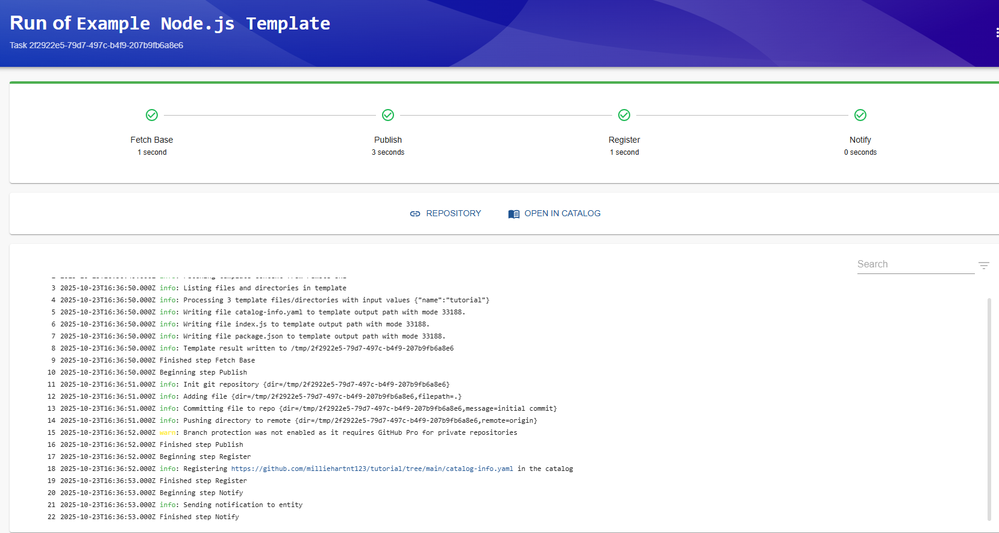
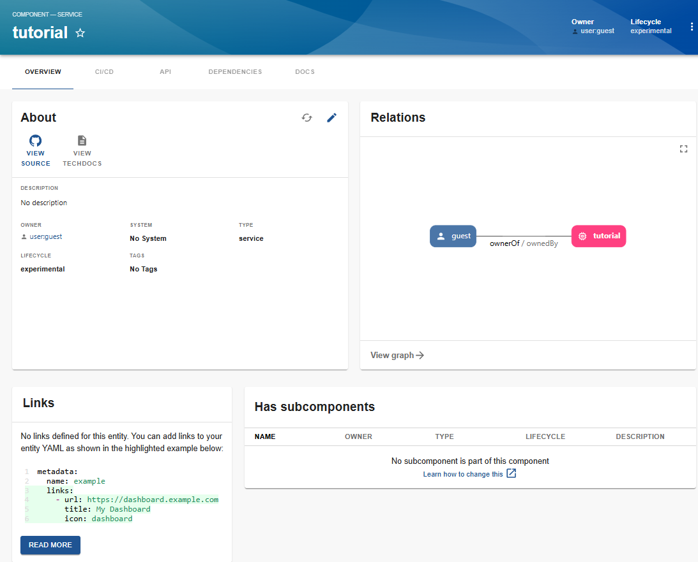
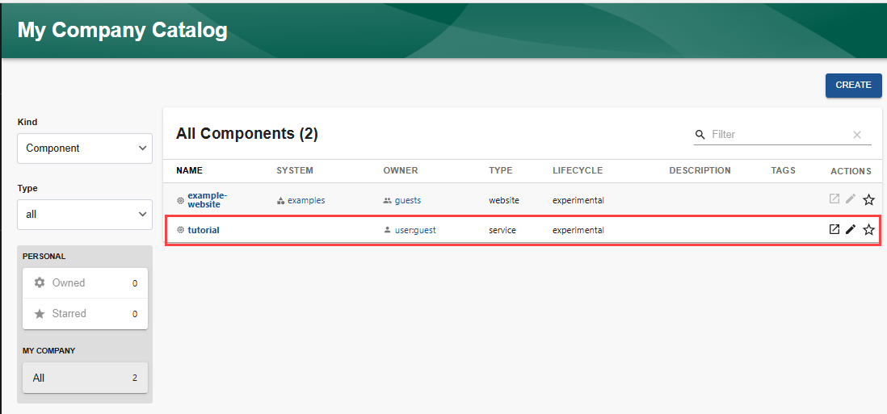

Audience: Developers

## Overview

Components in the Software Catalog are created using a software template. Templates load skeletons of code, which can include some variables, and incorporate your company's best practices. The templates are published to a location, such as GitHub or GitLab.

The standalone Backstage application includes the `Example Node.js Template`, which is an example template for the scaffolder that creates and registers a simple Node.js service. You can also [create your own templates](../features/software-templates/adding-templates.md).

## Prerequisites

For this example, the default Node.js template will be used. The template creates a repository in GitHub and adds the necessary files to it so that the component is integrated into the Software Catalog. Because you are creating a repository, you must first create an integration between Backstage and GitHub.

- You should have already [installed a standalone app](../getting-started/index.md).

- Register the [GitHub Scaffolder Action module](../features/software-templates/builtin-actions.md#installing-action-modules).

- [Set up a GitHub Integration](../getting-started/config/authentication.md#setting-up-a-github-integration) with Backstage, using a GitHub Personal Access Token.

## Creating the component

To create the component:

1. Select `Create`.

   

2. Select `Service` in the `CATEGORIES` dropdown list.
3. Select the `Owner`. For this example, you can select `guest`.
4. Select `Choose` in the `Example Node.js Template`.

   

5. For this example, enter `tutorial` for the `Name` of the service. and select `NEXT`.

   

6. Enter your GitHub user name as the `Owner`.
7. Enter `tutorial` for the `Repository` and select `REVIEW`.
   
8. Review the information and select `CREATE`.

   

If you see an error message, similar to the following,

    

Perform the following steps:

1. Close the Backstage app.
2. Enter `CTRL-C` in the terminal window to stop the Backstage frontend and backend.
3. In the terminal window, enter:

   ```
   export NODE_OPTIONS=--no-node-snapshot
   ```

4. Enter `yarn start` to restart the Backstage application.
5. Repeat steps to create the component.

Otherwise, you can follow along with the progress, and as soon as every step is finished, you can take a look at your new service in either the repository or the Catalog.



Selecting `REPOSITORY` displays the files in the main branch of the new `tutorial` repository. When you created the new `tutorial` component, three files were created in the repository:

- **catalog-info.yaml** - Describes the entity for the Software Catalog. [Descriptor Format of Catalog Entities](../features/software-catalog/descriptor-format.md) provides additional information.

  ```
   apiVersion: backstage.io/v1alpha1
   kind: Component
   metadata:
     name: "tutorial"
   spec:
     type: service
     owner: user:guest
     lifecycle: experimental
  ```

- **index.js** -

  ```
  console.log('Hello from tutorial!');
  ```

- **package.json** -

  ```
    {
      "name": "tutorial",
      "private": true,
      "dependencies": {}
    }
  ```

Selecting `OPEN IN CATALOG` displays details of the new component, such as its relationships, links, and subcomponents.



Selecting `Home` in the sidebar, displays the new `tutorial` component in the Catalog.


