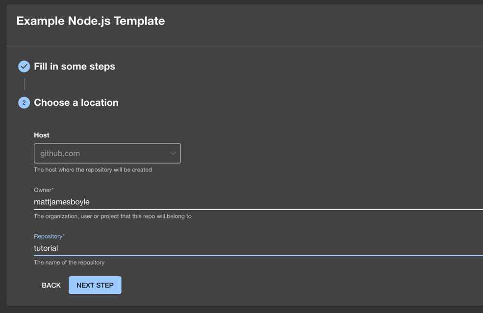

Audience: Developers

## Summary

This guide will walk you through how to use Software Templates to create new components with baked in best practices.

## Prerequisites

:::note

If you're running Backstage with Node 20 or later, you'll need to pass the flag `--no-node-snapshot` to Node in order to use the templates feature. One way to do this is to specify the `NODE_OPTIONS` environment variable before starting Backstage: `export NODE_OPTIONS=--no-node-snapshot`

:::

You should already have [a standalone app](./index.md).

You will also need to register the [GitHub Scaffolder Action module](../features/software-templates/builtin-actions.md#installing-action-modules) before moving forward.

## Creating your component

- Go to `create` and choose to create a website with the `Example Node.js Template`
- Type in a name, let's use `tutorial` and click `Next Step`

- You should see the following screen:

- For host, it should default to github.com
- As owner, type your GitHub username
- For the repository name, type `tutorial`. Go to the next step

- Review the details of this new service, and press `Create` if you want to
  deploy it like this.
- You can follow along with the progress, and as soon as every step is
  finished, you can take a look at your new service
