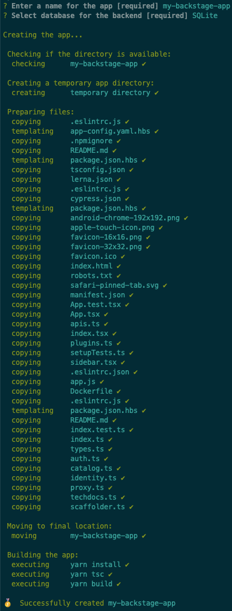

To get set up quickly with your own Backstage project you can create a Backstage
App.

A Backstage App is a monorepo setup with `lerna` that includes everything you
need to run Backstage in your own environment.

If you intend to develop a plugin or contribute to the Backstage project, you
may want to [Run Backstage Locally](./running-backstage-locally.md) instead.

## Create an app

To create a Backstage app, you will need to have
[Node.js](https://nodejs.org/en/download/) Active LTS Release installed
(currently v14).

Backstage provides a utility for creating new apps. It guides you through the
initial setup of selecting the name of the app and a database for the backend.
The database options are either SQLite or PostgreSQL, where the latter requires
you to set up a separate database instance. If in doubt, choose SQLite, but
don't worry about the choice, it's easy to change later! Here is a
[tutorial](../tutorials/switching-sqlite-postgres.md) for it.

The easiest way to run the create app package is with `npx`:

```bash
npx @backstage/create-app
```

This will create a new Backstage App inside the current folder. The name of the
app-folder is the name that was provided when prompted.

<p align='center'>
  
</p>

Inside that directory, it will generate all the files and folder structure
needed for you to run your app.

### General folder structure

Below is a simplified layout of the files and folders generated when creating an
app.

```
app
├── app-config.yaml
├── catalog-info.yaml
├── lerna.json
├── package.json
└── packages
    ├── app
    └── backend
```

- **app-config.yaml**: Main configuration file for the app. See
  [Configuration](https://backstage.io/docs/conf/) for more information.
- **catalog-info.yaml**: Catalog Entities descriptors. See
  [Descriptor Format of Catalog Entities](https://backstage.io/docs/features/software-catalog/descriptor-format)
  to get started.
- **lerna.json**: Contains information about workspaces and other lerna
  configuration needed for the monorepo setup.
- **package.json**: Root package.json for the project. _Note: Be sure that you
  don't add any npm dependencies here as they probably should be installed in
  the intended workspace rather than in the root._
- **packages/**: Lerna leaf packages or "workspaces". Everything here is going
  to be a separate package, managed by lerna.
- **packages/app/**: An fully functioning Backstage frontend app, that acts as a
  good starting point for you to get to know Backstage.
- **packages/backend/**: We include a backend that helps power features such as
  [Authentication](https://backstage.io/docs/auth/),
  [Software Catalog](https://backstage.io/docs/features/software-catalog/software-catalog-overview),
  [Software Templates](https://backstage.io/docs/features/software-templates/software-templates-index)
  and [TechDocs](https://backstage.io/docs/features/techdocs/techdocs-overview)
  amongst other things.

### Troubleshooting

The create app command doesn't always work as expected, this is a collection of
some of the commonly encountered issues and solutions.

#### Couldn't find any versions for "file-saver"

You may encounter the following error message:

```text
Couldn't find any versions for "file-saver" that matches "eligrey-FileSaver.js-1.3.8.tar.gz-art-external"
```

This is likely because you have a globally configured npm proxy, which breaks
the installation of the `material-table` dependency. This is a known issue and
being worked on in `material-table`, but for now you can work around it using
the following:

```bash
NPM_CONFIG_REGISTRY=https://registry.npmjs.org npx @backstage/create-app
```

#### Can't find Python executable "python"

The install process may also fail if no Python installation is available. Python
is commonly available in most systems already, but if it isn't you can head for
example [here](https://www.python.org/downloads/) to install it.

#### Could not execute command yarn install

Install yarn on your system with `npm install --global yarn` or for more details
refer to the
[prerequisites](https://backstage.io/docs/getting-started/running-backstage-locally#prerequisites)

## Run the app

When the installation is complete you can open the app folder and start the app.

```bash
cd my-backstage-app
yarn dev
```

The `yarn dev` command will run both the frontend and backend as separate
processes (named `[0]` and `[1]`) in the same window. When the command finishes
running, it should open up a browser window displaying your app. If not, you can
open a browser and directly navigate to the frontend at `http://localhost:3000`.

Now you're free to hack away on your own Backstage installation!

As you get more experienced with the app, in future you can run just the
frontend with `yarn start` in one window, and the backend with
`yarn start-backend` in a different window.
