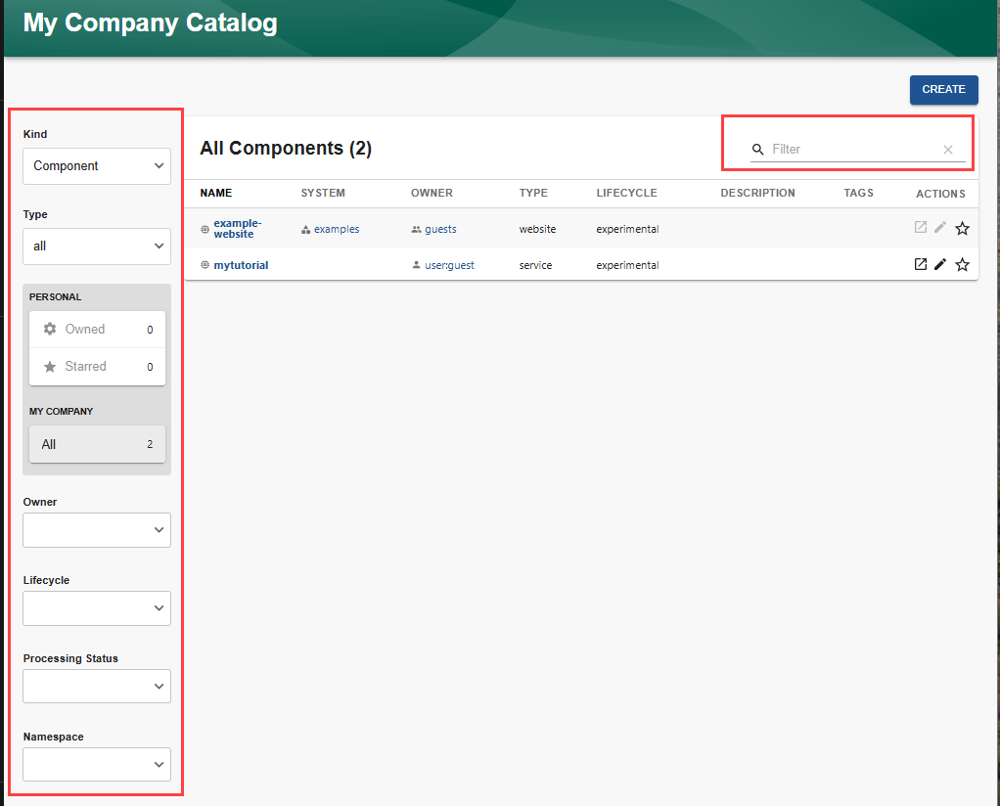
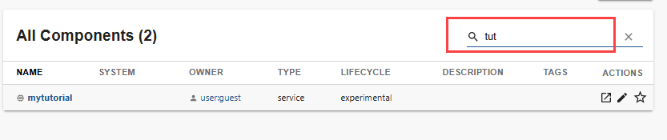

Audience: All

## Overview

The Catalog can be filtered by any combination of owner, kind, type, lifecycle, processing status, namespace, and name. [Customize Filters](../features/software-catalog/catalog-customization.md#customize-filters) provides information on how to modify the available filter criteria.

The [Technical Overview](../overview/technical-overview.md#software-catalog-system-model) provides a description of the types of entities displayed in the Catalog.

## Filtering the Catalog

You can filter the Catalog using a combination of the following:

- **Filter by name**

  Enter one or more consecutive letters into the `Filter` field. As you type the letters, the entities whose names do not contain that string will be filtered out of the displayed list.

  

- **Filter by kind**

  Use the `Kind` dropdown list to select which kind of entity to show in the list:
  - API

  - Component

  - Group

  - Location

  - System

  - Template

  - User

- **Filter by Type**

  Use the `Type` dropdown list to select which type of entity to show in the list. The selections available in the dropdown list depend on the kind of entity selected in the `Kind` list, and the types of entity you have registered for that kind.

- **Filter by Owner**

  Use the `Owner` dropdown to filter the Catalog list by who owns the entity.

- **Filter by Lifecycle**

  Use the `Lifecycle` dropdown to filter the Catalog list by lifecycle.

- **Filter by Processing Status**

  Use the `Processing Status` dropdown to restrict the displayed list to only include those entities which are [orphaned](../features/software-catalog/life-of-an-entity.md#orphaning) or [in error](../features/software-catalog/life-of-an-entity.md#errors).

- **Filter by Namespace**

  Use the `Namespace` dropdown to filter the catalog list by namespace associated with the entity.

