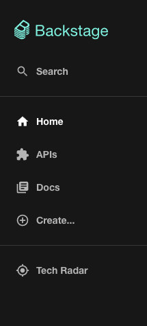
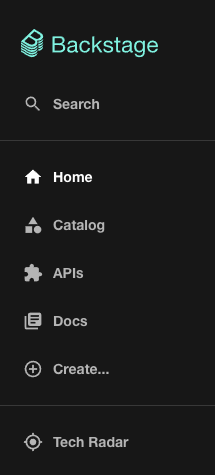
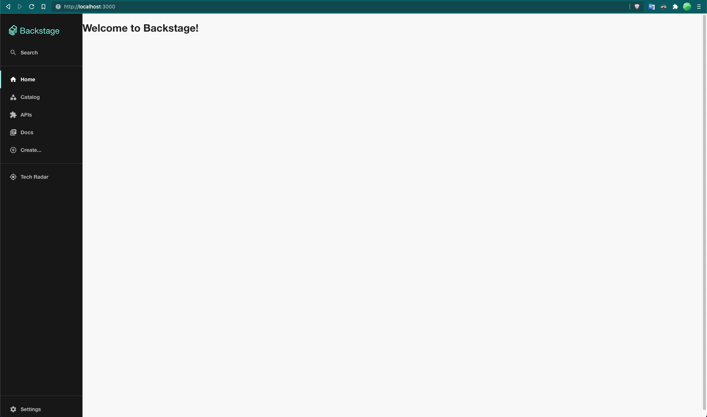

## Homepage

Having a good Backstage homepage can significantly improve the discoverability of the platform. You want your users to find all the things they need right from the homepage and never have to remember direct URLs in Backstage. The [Home plugin](https://github.com/backstage/backstage/tree/master/plugins/home) introduces a system for composing a homepage for Backstage in order to surface relevant info and provide convenient shortcuts for common tasks. It's designed with composability in mind with an open ecosystem that allows anyone to contribute with any component, to be included in any homepage.

For App Integrators, the system is designed to be composable to give total freedom in designing a Homepage that suits the needs of the organization. From the perspective of a Component Developer who wishes to contribute with building blocks to be included in Homepages, there's a convenient interface for bundling the different parts and exporting them with both error boundary and lazy loading handled under the surface.

At the end of this tutorial, you can expect:

- Your Backstage app to have a dedicated homepage instead of Software Catalog.
- Understand the composability of homepage and how to start customizing it for your own organization.

### Prerequisites

Before we begin, make sure

- You have created your own standalone Backstage app using [`@backstage/create-app`](index.md#create-your-backstage-app) and not using a fork of the [backstage](https://github.com/backstage/backstage) repository.
- You do not have an existing homepage, and by default you are redirected to Software Catalog when you open Backstage.

Now, let's get started by installing the home plugin and creating a simple homepage for your Backstage app.

### Setup homepage

#### 1. Install the plugin

```bash
# From your Backstage root directory
yarn --cwd packages/app add @backstage/plugin-home
```

#### 2. Create a new HomePage component

Inside your `packages/app` directory, create a new file where our new homepage component is going to live. Create `packages/app/src/components/home/HomePage.tsx` with the following initial code

```tsx
import React from 'react';

export const HomePage = () => (
  /* We will shortly compose a pretty homepage here. */
  <h1>Welcome to Backstage!</h1>
);
```

#### 3. Update router for the root `/` route

If you don't have a homepage already, most likely you have a redirect setup to use the Catalog homepage as a homepage.

Inside your `packages/app/src/App.tsx`, look for

```tsx title="packages/app/src/App.tsx"
const routes = (
  <FlatRoutes>
    <Navigate key="/" to="catalog" />
    {/* ... */}
  </FlatRoutes>
);
```

Let's replace the `<Navigate>` line and use the new component we created in the previous step as the new homepage.

```tsx title="packages/app/src/App.tsx"
/* highlight-add-start */
import { HomepageCompositionRoot } from '@backstage/plugin-home';
import { HomePage } from './components/home/HomePage';
/* highlight-add-end */

const routes = (
  <FlatRoutes>
    {/* highlight-remove-next-line */}
    <Navigate key="/" to="catalog" />
    {/* highlight-add-start */}
    <Route path="/" element={<HomepageCompositionRoot />}>
      <HomePage />
    </Route>
    {/* highlight-add-end */}
    {/* ... */}
  </FlatRoutes>
);
```

#### 4. Update sidebar items

Let's update the route for "Home" in the Backstage sidebar to point to the new homepage. We'll also add a Sidebar item to quickly open Catalog.

| Before                                                                            | After                                                                       |
| --------------------------------------------------------------------------------- | --------------------------------------------------------------------------- |
|  |  |

The code for the Backstage sidebar is most likely inside your [`packages/app/src/components/Root/Root.tsx`](https://github.com/backstage/backstage/blob/master/packages/app/src/components/Root/Root.tsx).

Let's make the following changes

```tsx title="packages/app/src/components/Root/Root.tsx"
/* highlight-add-next-line */
import CategoryIcon from '@material-ui/icons/Category';

export const Root = ({ children }: PropsWithChildren<{}>) => (
  <SidebarPage>
    <Sidebar>
      <SidebarLogo />
      {/* ... */}
      <SidebarGroup label="Menu" icon={<MenuIcon />}>
        {/* Global nav, not org-specific */}
        {/* highlight-remove-next-line */}
        <SidebarItem icon={HomeIcon} to="catalog" text="Home" />
        {/* highlight-add-start */}
        <SidebarItem icon={HomeIcon} to="/" text="Home" />
        <SidebarItem icon={CategoryIcon} to="catalog" text="Catalog" />
        {/* highlight-add-end */}
        <SidebarItem icon={ExtensionIcon} to="api-docs" text="APIs" />
        <SidebarItem icon={LibraryBooks} to="docs" text="Docs" />
        <SidebarItem icon={LayersIcon} to="explore" text="Explore" />
        <SidebarItem icon={CreateComponentIcon} to="create" text="Create..." />
        {/* End global nav */}
        <SidebarDivider />
        {/* ... */}
      </SidebarGroup>
    </Sidebar>
  </SidebarPage>
);
```

That's it! You should now have _(although slightly boring)_ a homepage!

<!-- todo: Needs zoomable plugin -->



In the next steps, we will make it interesting and useful!

### Use the default template

There is a default homepage template ([storybook link](https://backstage.io/storybook/?path=/story/plugins-home-templates--default-template)) which we will use to set up our homepage. Checkout the [blog post announcement](https://backstage.io/blog/2022/01/25/backstage-homepage-templates) about the Backstage homepage templates for more information.

<!-- TODO for later: detailed instructions for using one of these templates. -->

### Composing your homepage

Composing a homepage is no different from creating a regular React Component,
i.e. the App Integrator is free to include whatever content they like. However,
there are components developed with the homepage in mind. If you are looking
for components to use when composing your homepage, you can take a look at the
[collection of Homepage components](https://backstage.io/storybook?path=/story/plugins-home-components)
in storybook. If you don't find a component that suits your needs but want to
contribute, check the
[Contributing documentation](https://github.com/backstage/backstage/blob/master/plugins/home/README.md#contributing).

> If you want to use one of the available homepage templates you can find the
> [templates](https://backstage.io/storybook/?path=/story/plugins-home-templates)
> in the storybook under the "Home" plugin. And if you would like to contribute
> a template, please see the
> [Contributing documentation](https://github.com/backstage/backstage/blob/master/plugins/home/README.md#contributing)

```tsx
import React from 'react';
import Grid from '@material-ui/core/Grid';
import { HomePageCompanyLogo } from '@backstage/plugin-home';

export const homePage = (
  <Grid container spacing={3}>
    <Grid item xs={12} md={4}>
      <HomePageCompanyLogo />
    </Grid>
  </Grid>
);
```
