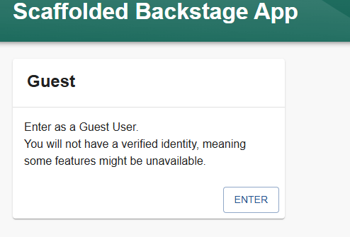

Audience: Developers and Admins

:::note Note
It is not required, although recommended to have a basic understanding of [Yarn](https://www.pluralsight.com/guides/yarn-a-package-manager-for-node-js) and [npm](https://docs.npmjs.com/about-npm) before starting this guide.
:::

## Overview

This guide walks through how to create your own Backstage customizable app. This is the first step in evaluating, developing on, or demoing Backstage.

By the end of this guide, you will have a standalone Backstage installation running locally with an in-memory `SQLite` database and demo content. To be clear, this is not a production-ready installation, and it does not contain information specific to your organization until you set up integrations with your specific data sources!

:::note Contributors

If you are planning to contribute a new feature or bug fix to the Backstage project, we advise you to follow the [Contributors](https://github.com/backstage/backstage/blob/master/CONTRIBUTING.md#get-started) guide instead to do a repository-based installation.

:::

The instructions make use of `npx`. `npx` is a tool that comes preinstalled with Node.js and lets you run commands straight from `npm` or other registries.

This command creates a new directory with a Backstage app inside. The wizard will ask you for the name of the app. This name will be created as a subdirectory in your current working directory.

Inside that directory, it will generate all the files and folder structure
needed for you to run your app.

### General folder structure

Below is a simplified layout of the files and folders generated when creating an app.

```
app
├── app-config.yaml
├── catalog-info.yaml
├── package.json
└── packages
    ├── app
    └── backend
```

- **app-config.yaml**: Main configuration file for the app. See
  [Configuration](https://backstage.io/docs/conf/) for more information.
- **catalog-info.yaml**: Catalog Entities descriptors. See
  [Descriptor Format of Catalog Entities](https://backstage.io/docs/features/software-catalog/descriptor-format)
  to get started.
- **package.json**: Root package.json for the project. _Note: Be sure that you
  don't add any npm dependencies here as they probably should be installed in
  the intended workspace rather than in the root._
- **packages/**: Yarn workspaces, everything here is going
  to be a separate package, managed by Yarn.
- **packages/app/**: A fully functioning Backstage frontend app that acts as a
  good starting point for you to get to know Backstage.
- **packages/backend/**: We include a backend that helps power features such as
  [Authentication](https://backstage.io/docs/auth/),
  [Software Catalog](https://backstage.io/docs/features/software-catalog/),
  [Software Templates](https://backstage.io/docs/features/software-templates/)
  and [TechDocs](https://backstage.io/docs/features/techdocs/)
  amongst other things.

## Prerequisites

This guide also assumes a basic understanding of working on a Linux based operating system and have some experience with the terminal, specifically, these commands: `npm`, `yarn`.

- Access to a Unix-based operating system, such as Linux, macOS or
  [Windows Subsystem for Linux](https://docs.microsoft.com/en-us/windows/wsl/)
- A GNU-like build environment available at the command line.
  For example, on Debian/Ubuntu you will want to have the `make` and `build-essential` packages installed.
  On macOS, you will want to run `xcode-select --install` to get the XCode command line build tooling in place.
- An account with elevated rights to install the dependencies
- `curl` or `wget` installed
- Node.js [Active LTS Release](../overview/versioning-policy.md#nodejs-releases) installed using one of these
  methods:
  - Using `nvm` (recommended)
    - [Installing nvm](https://github.com/nvm-sh/nvm#install--update-script)
    - [Install and change Node version with nvm](https://nodejs.org/en/download/package-manager/#nvm)
    - Node 20 is a good starting point, this can be installed using `nvm install lts/iron`
  - [Binary Download](https://nodejs.org/en/download/)
  - [Package manager](https://nodejs.org/en/download/package-manager/)
  - [Using NodeSource packages](https://github.com/nodesource/distributions/blob/master/README.md)
- If you are creating your Backstage app in a virtual machine, you must have the`isolated-vm` module installed. Install the `isolated-vm` module, following their [requirements section](https://github.com/laverdet/isolated-vm#requirements).
- `yarn` [Installation](https://yarnpkg.com/getting-started/install)
  - Backstage currently uses Yarn 4.4.1, once you've ran `corepack enable` you'll want to then run `yarn set version 4.4.1`
- `docker` [installation](https://docs.docker.com/engine/install/)
- `git` [installation](https://github.com/git-guides/install-git)
- If the system is not directly accessible over your network the following ports
  need to be opened: 3000, 7007. This is quite uncommon, unless you're installing in a container, VM or remote system.

## Creating and running a Backstage application

This may take a few minutes to fully install everything. Don't stress if the loading seems to be spinning nonstop, there's a lot going on in the background.

To create the application:

1. Type the following command to install the Backstage application.

```bash
     npx @backstage/create-app@latest
```

2. If this is the first time that you are installing a Backstage application on this device, the following question is displayed. Enter `y` and select `Enter` to proceed with the installation.

```
     Need to install the following packages:
     @backstage/create-app@0.7.4
     ok to proceed? (y)
```

3. Enter the name for your application and select `Enter`. This is the root directory of your application. In this example, the name is set to `my-backstage-app`.

   

:::tip Install fails wth isolated_vm error

If the `yarn install` command fails, and you see an error in the logs similar to the following:

```
Error: Cannot find module './out/isolated_vm'
```

then perform the following steps:

1. Install the `isolated-vm` module, following their [requirements section](https://github.com/laverdet/isolated-vm#requirements).
2. Run `yarn install` manually again.

:::

Your Backstage app is fully installed and ready to be run! Now that the installation is complete, you can go to the application directory and start the app using the `yarn start` command. The `yarn start` command will run both the frontend and backend as separate processes (named `[0]` and `[1]`) in the same window.

To run the application:
 1. Change to the root directory of your Backstage app. This is the same as the name of your application that you provided during the installation. In this example, it is `my-backstage-app`.
    
     ```bash
     cd my-backstage-app # your app name
     ```
     
2. Start the Backstage application.

   ```bash
   yarn start
   ```   


3. Your new Backstage application includes a Guest User. Select `ENTER` to login to the application and display the UI.
  

  Here again, there's a small wait for the frontend to start up. Once the frontend is built, your browser window should automatically open.

  You can start exploring the demo immediately.

:::tip Browser window didn't open with yarn start

When you see the message `[0] webpack compiled successfully`, you can navigate directly to `http://localhost:3000` to see your Backstage app.

:::


## Next steps

Choose the correct next steps for your user role, if you're likely to be deploying and managing a Backstage instance for your organization, look through the [Admin](#admin) section. If you're likely to be developing on/for Backstage, take a look through the [Developer](#developer) section.

### Admin

- Deploying to production

  - [Setting up authentication](./config/authentication.md)
  - [Configuring a database](./config/database.md)
  - [Deploying with Docker](../deployment/docker.md)
  - [Deploying with Kubernetes](../deployment/k8s.md)

- Configuring Backstage

  - [Adding plugins](./configure-app-with-plugins.md)
  - [Customizing Your App's UI](../conf/user-interface/index.md)
  - [Populating the homepage](./homepage.md)

### Developer

- Using your Backstage instance
  - [Logging into Backstage](./logging-in.md)
  - [Register a component](./register-a-component.md)
  - [Create a new component](./create-a-component.md)

Share your experiences, comments, or suggestions with us:
[on discord](https://discord.gg/backstage-687207715902193673), file issues for any
[feature](https://github.com/backstage/backstage/issues/new?labels=help+wanted&template=feature_template.md)
or
[plugin suggestions](https://github.com/backstage/community-plugins/issues/new/choose),
or
[bugs](https://github.com/backstage/backstage/issues/new?labels=bug&template=bug_template.md)
you have, and feel free to
[contribute](https://github.com/backstage/backstage/blob/master/CONTRIBUTING.md)!
