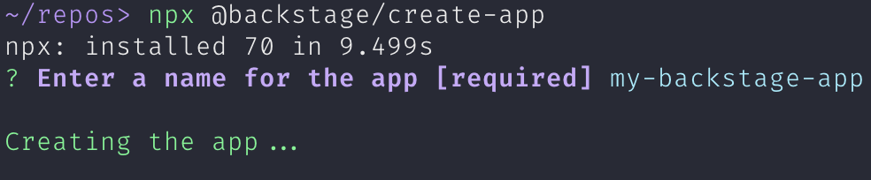
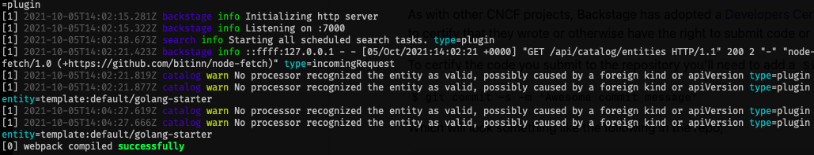
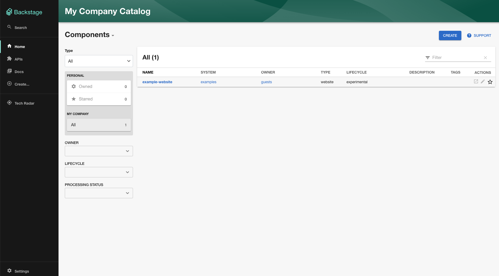

For most Backstage installations, installing the standalone app will bring
you the best and most streamlined experience. In this guide you will:

- Deploy Backstage Standalone with npm packages
- Run Backstage Standalone with a SQLite in-memory database and demo content

This guide assumes a basic understanding of working on a Linux based operating
system using tools like apt-get, npm, yarn, curl. Docker knowledge is also
helpful for making the best use of your Backstage installation.

If you are planning to contribute plugins or the project in general, we advise
you to use the [Getting Started for Contributers](https://backstage.io/docs/getting-started/running-backstage-locally) guide to
do a repository-based installation.

### Prerequisites

- Access to a linux based operating system
- An account with elevated rights (eg. via sudo)
- `curl` or `wget` installed
- Node.js Active LTS Release installed (currently v14) using one of these methods:
  - Using `nvm` (recommended)
    - [Installing nvm](https://github.com/nvm-sh/nvm#install--update-script)
    - [Install and change Node version with nvm](https://nodejs.org/en/download/package-manager/#nvm)
  - [Binary Download](https://nodejs.org/en/download/)
  - [Package manager](https://nodejs.org/en/download/package-manager/)
  - [Using NodeSource packages](https://github.com/nodesource/distributions/blob/master/README.md)
- `yarn` [Installation](https://classic.yarnpkg.com/en/docs/install)
- `docker` [installation](https://docs.docker.com/engine/install/)
- `git` [installation](https://github.com/git-guides/install-git)
- If the system is not directly accessible over your network, the following
  ports need to be opened: 3000, 7000

### Create your Backstage App

To install the Backstage Standalone app, we make use of `npx`, a tool to run Node executables
straight from the registry. Running the command below will install Backstage. The wizard will
create a subdirectory inside your current working directory.

```bash
npx @backstage/create-app
```

The wizard will ask you

- The name of the app, which will also be the name of the directory
- The database type to use for the backend. For this guide, you'll be using the SQLite option.

<p align='center'>
  
</p>

### Run the Backstage app

When the installation is complete you can go to the application directory and start the app. The `yarn dev` command will run both the frontend and backend as separate processes (named `[0]` and `[1]`) in the same window.

```bash
cd my-backstage-app
yarn dev
```

<p align='center'>
  
</p>

It might take a little while, but as soon as the message `[0] webpack compiled successfully` appears, you can open a browser and directly navigate to
your freshly installed Backstage portal at `http://localhost:3000`. You can start exploring the demo immediately.

<p align='center'>
  
</p>

Congratulations! That should be it. Let us know how it went:
[on discord](https://discord.gg/EBHEGzX), file issues for any
[feature](https://github.com/backstage/backstage/issues/new?labels=help+wanted&template=feature_template.md)
or
[plugin suggestions](https://github.com/backstage/backstage/issues/new?labels=plugin&template=plugin_template.md&title=%5BPlugin%5D+THE+PLUGIN+NAME),
or [bugs](https://github.com/backstage/backstage/issues/new?labels=bug&template=bug_template.md)
you have, and feel free to [contribute](https://github.com/backstage/backstage/blob/master/CONTRIBUTING.md)!

The most common next steps are to configure Backstage, add a plugin and moving to a more persistend database:

- [Setting up Authentication](https://github.com/backstage/backstage/tree/master/plugins/auth-backend#github)
- [Switching from SQLite to PostgresQL](https://backstage.io/docs/tutorials/switching-sqlite-postgres)
- [Adding a plugin](https://backstage.io/docs/getting-started/configure-app-with-plugins)
