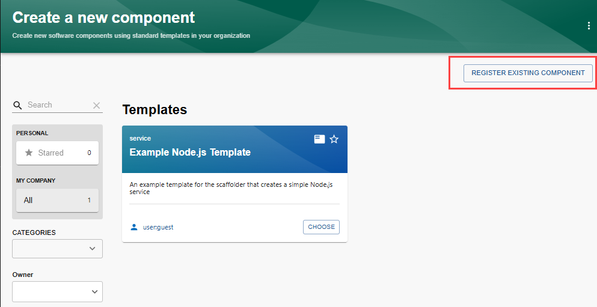
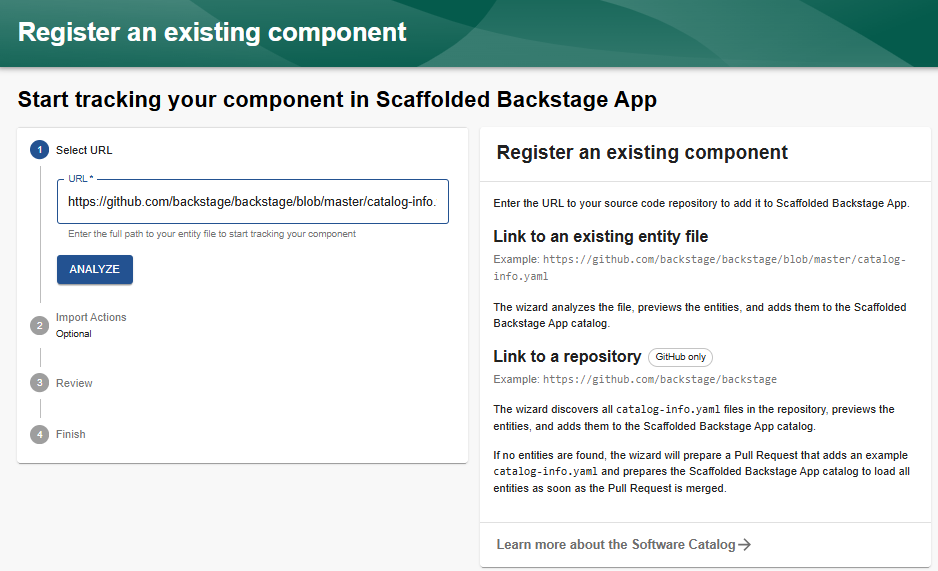
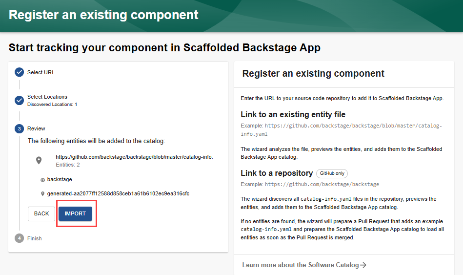
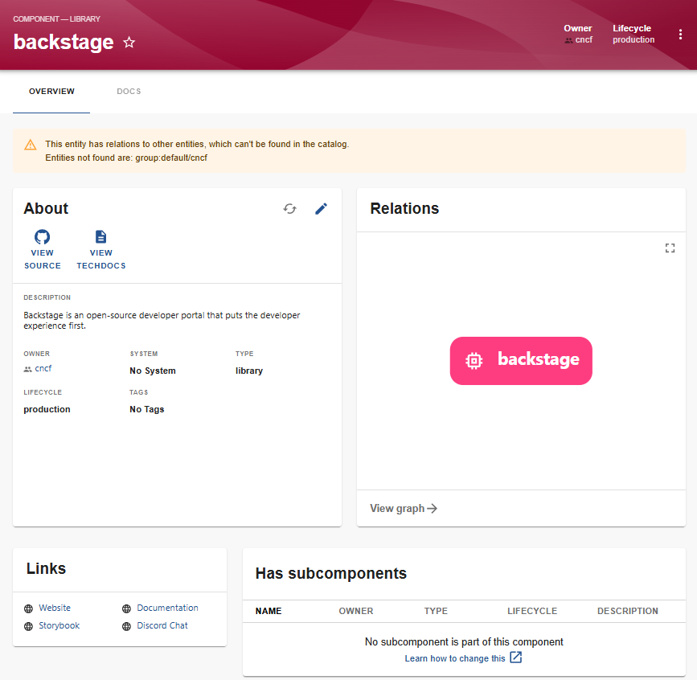
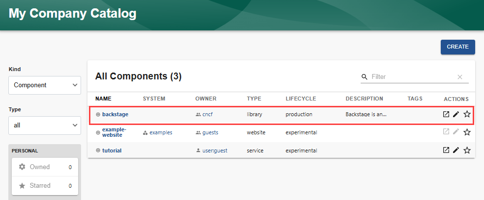

Audience: Developers

:::note Note
Entity files are stored in YAML format, if you are not familiar with YAML, you can learn more about it [here](https://yaml.org).

[Descriptor Format of Catalog Entities](../features/software-catalog/descriptor-format.md) provides additional information on the format of the YAML entity files.
:::

## Overview

This guide will walk you through how to pull Backstage data from other locations manually. There are integrations that will automatically do this for you.

When registering a component, you can:

- Link to an existing entity file: The file is analyzed to determine which entities are defined, and the entities are added to the Scaffolded Backstage App Catalog. For example, `https://github.com/backstage/backstage/blob/master/catalog-info.yaml`.

- Link to a repository: All `catalog-info.yaml` files are discovered in the repository and their defined entities are added to the Scaffolded Backstage App Catalog. For example, `https://github.com/backstage/backstage`.

  :::note Note
  If no entities are found, a Pull Request is created that adds an example `catalog-info.yaml` file to the repository. When the Pull Request is merged, the Scaffolded Backstage App Catalog loads all of the defined entities.

  :::

## Prerequisites

- You should have already [installed a standalone app](../getting-started/index.md).

## Registering a component

To manually register a component in the Software Catalog:

1. Select `Create`.
2. Select `REGISTER EXISTING COMPONENT`.

   

3. Fill out the template.

   The standalone Backstage application includes one template. For this example, enter the repository URL to the entity file, `https://github.com/backstage/backstage/blob/master/catalog-info.yaml`. This is used in the Backstage [demo site](https://demo.backstage.io) catalog.

   

4. Select `ANALYZE`.
5. If the changes from `ANALYZE` are correct, select `IMPORT`.

    

   If your entity was successfully imported, the details will be displayed.

    

6. Select `Home` to view your new entity in the Software Catalog.

    
