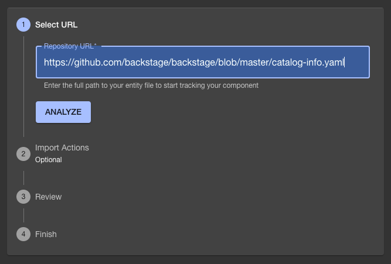
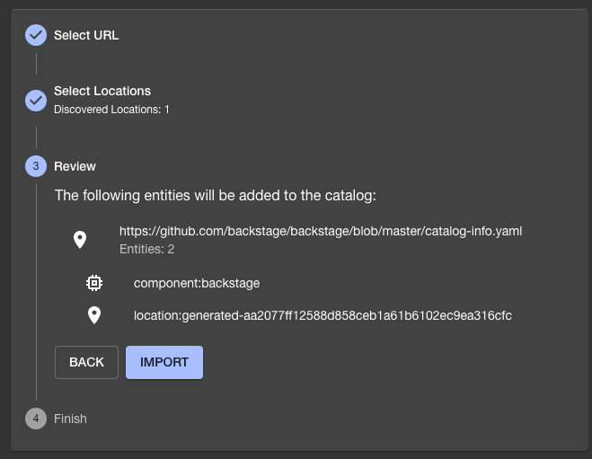

Audience: Developers

## Summary

This guide will walk you through how to pull Backstage data from other locations manually. There are integrations that will automatically do this for you.

## Prerequisites

You should have already [have a standalone app](./index.md).

## 1. Finding our template

Register a new component, by going to `create` and choose `Register existing component`

  <!-- todo: Needs zoomable plugin -->

## 2. Filling out the template

For repository URL, use `https://github.com/backstage/backstage/blob/master/catalog-info.yaml`. This is used in our [demo site](https://demo.backstage.io) catalog.

Hit `Analyze` and review the changes.

## 3. Import the entity

If the changes from `Analyze` are correct, click `Apply`.

You should receive a message that your entities have been added.

If you go back to `Home`, you should be able to find `backstage`. You can click it and see the details for this new entity.
