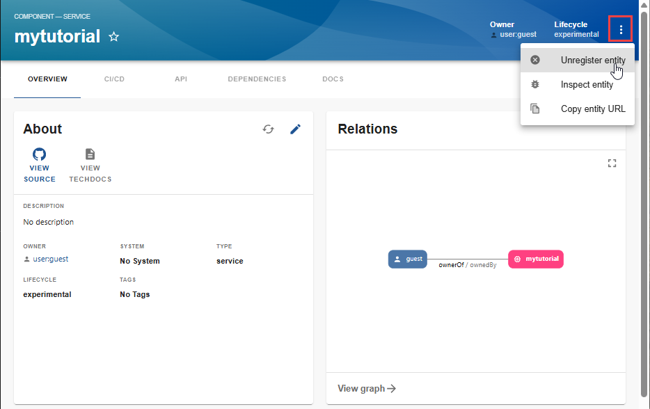
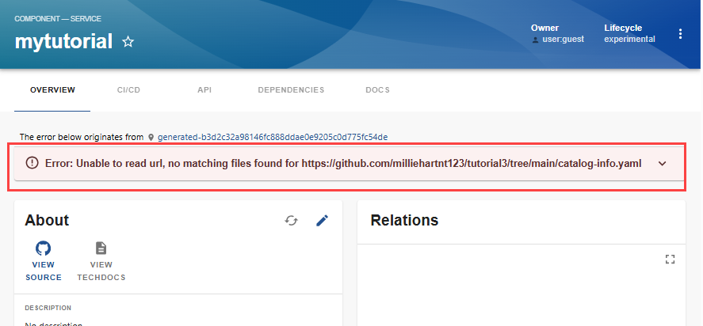
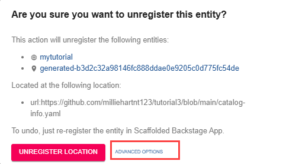
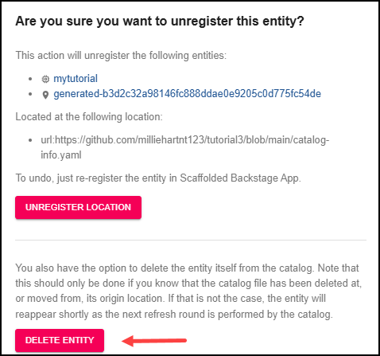

Audience: Developers

## Overview

URLs to YAML files that you registered either using the `Create` button or by adding to your app-config file are both handled by entity providers.

[Implicit deletion](../features/software-catalog/life-of-an-entity.md#implicit-deletion) occurs when an entity provider issues a deletion of an entity. That entity, as well as the entire tree of entities processed out of it are considered for immediate deletion.

However, you are also able to manually unregister an entity from the catalog or perform a direct, [explicit deletion](../features/software-catalog/life-of-an-entity.md#explicit-deletion) of individual entities. 

## Unregistering an entity

You can unregister an entity so it will not be displayed in the Catalog but still keep its `catalog-info.yaml` file in the repository. This provides the ability to register the entity with the Catalog again in the future.

To unregister an entity:

1. In the Catalog, select the entity you want to unregister. In this example, `mytutorial` is being unregistered.

2. Select the three dots.

3. Select `Unregister entity` in the dropdown menu.

   

4. Select `UNREGISTER LOCATION`. The entity is removed from the Catalog.

   

## Deleting an entity

You can also delete an entity from the catalog. However, this requires that you also delete the `catalog-info.yaml` entity definition file associated with the entity.

To delete an entity:

1. Delete the following entity definition files for the entity in the repository:

   - catalog-info.yaml
   - index.js
   - package.json

2. In the Backstage App Catalog view, select the entity being deleted. In this example, `mytutorial` is being deleted.

   Since you have deleted the entity definition files, an error is displayed that states the `catalog-info.yaml` file cannot be found.

   

3. Select the three dots.
4. Select `Unregister entity` in the dropdown menu.

   

5. Select `ADVANCED OPTIONS`.

   

6. Select `DELETE ENTITY`.

   

A confirmation message that the entity has been successfully deleted is briefly displayed. The entity is no longer displayed in the Catalog.
