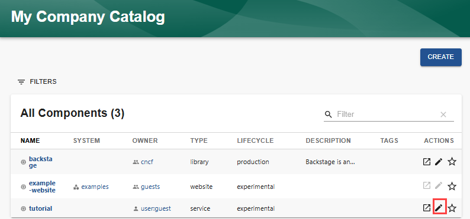
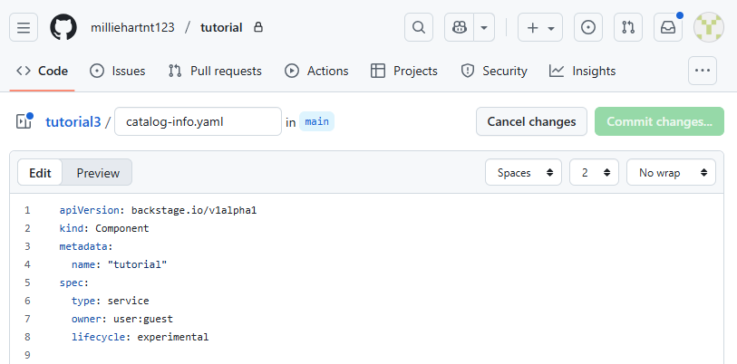
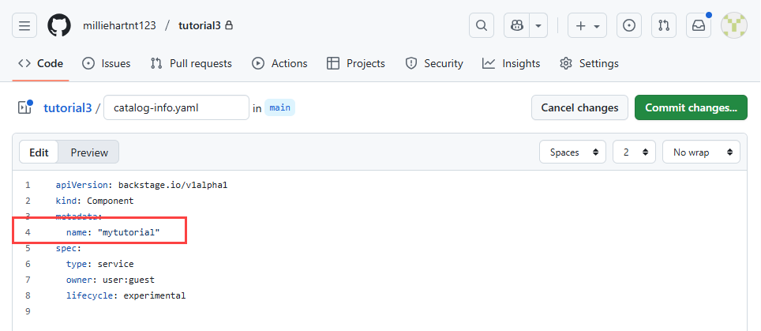
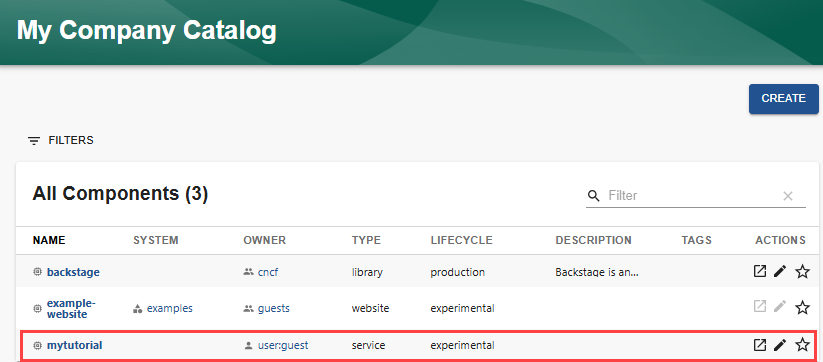

Audience: Developers

## Overview

Components in the Software Catalog are created using a software template. The template generates a `catalog-info.yaml` file in either GitHub or GitLab that defines the entity. To update the component, you must edit its corresponding `catalog-info.yaml` entity definition file.

## Updating the component

To update a component using the Backstage UI:

1. Select the "Edit" icon associated with the component. In this example, the `tutorial` entity is selected.

   

   The associated `catalog-info.yaml` file is displayed.

   

2. Make your changes to the YAML file. In this example, the name of the component is changed to `mytutorial`.

   

3. Select `Commit changes` to commit your changes to the appropriate branch and go through your normal PR review procedure.

4. Once the updated `catalog-info.yaml` file has been merged into the branch associated with the component, then you will see the updated information in the Software Catalog.

   
