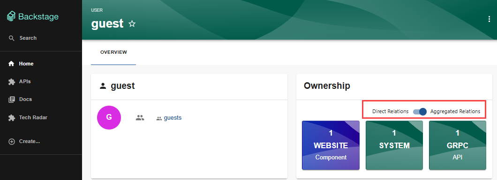

Audience: All

You can own entities either directly or through a group that you're part of.

To view the entities that you own:

1. Select `Home` in the sidebar.
2. Select `User` in the `Kind` dropdown list.
3. Select your username in the `All Users` list.

A page is displayed that shows the entities of which you have ownership, either directly, or through a group of which you are a member. You can toggle between showing:

- `Direct Relations` - entities that you directly own
- `Aggregated Relations`- entities that you own through your group

