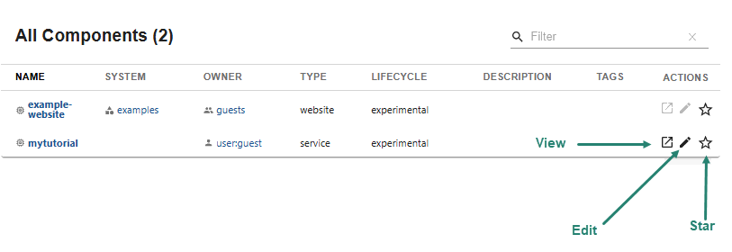

Audience: All

## Overview

When you first log into your standalone Backstage App, `Home` is selected in the sidebar, which displays the Catalog in the main panel.

The [Technical Overview](../overview/technical-overview.md#software-catalog-system-model) provides greater detail, but the catalog displays two main kinds of registered entities:

- **Core Entities**

  - `Components` - Individual pieces of software that can be tracked in source control and can implement APIs for other components to consume.
  - `APIs` - Implemented by components and form the boundaries between different components. The API can be either public, restricted, or private.
  - `Resources` - The physical or virtual infrastructure needed to operate a component.
  - `Location` - A marker that references other places to look for catalog data.
  - `Template` - Describes both the parameters that are rendered in the frontend part of the scaffolding wizard, and the steps that are executed when scaffolding that component.
  - `Systems` - A collection of resources and components that cooperate to perform a function by exposing one or several public APIs. It hides the resources and private APIs between the components from the consumer.
  - `Domains` - A collection of systems that share terminology, domain models, metrics, KPIs, business purpose, or documentation.

- **Organizational Entities**

  - `User` - A person, such as an employee, contractor, or similar.
  - `Group` - An organizational entity, such as a team, business unit, and so on.

There is an additional item that can be part of the system model:

- `Type` - It has no set meaning. You can assign your own types and use them as desired.

It should be noted that you can also [create your own kinds of entities](../features/software-catalog/extending-the-model.md#adding-a-new-kind), if you need to model something in your organization that does not map to one of the existing entity types.

Initially, the Catalog displays registered entities matching the following filter settings:

- `Kind` - Component
- `Type` - all
- `Owner` - Owned
- `Lifecycle` - list of [lifecycle](../features/software-catalog/descriptor-format.md#speclifecycle-required-1) values of entities in the Catalog
- `Processing Status` - normal
- `Namespace` - The ID of a [namespace](../features/software-catalog/descriptor-format.md#namespace-optional) to which the entity belongs

You can change the initial setting for the [Owner](../features/software-catalog/catalog-customization.md#initially-selected-filter) and [Kind](../features/software-catalog/catalog-customization.md#initially-selected-kind) filters.

## Informational columns for each entity

For each kind of entity, a set of columns display information regarding the entity. For example, the default set of information for a `Component` is:

- `Name` - the name of the component
- `System` - an optional field that references the system to which the component belongs
- `Owner` - the owner of the component
- `Type` - common types are as follows, but you can [create a new type](../features/software-catalog/extending-the-model.md#adding-a-new-type-of-an-existing-kind) to meet your organization's needs
  - `service` - a backend service, typically exposing an API
  - `website` - a website
  - `library` - a software library, such as an npm module or a Java library
- `Lifecycle`
  - `experimental` - an experiment or early, non-production component, signaling
    that users may not prefer to consume it over other more established
    components, or that there are low or no reliability guarantees
  - `production` - an established, owned, maintained component
  - `deprecated` - a component that is at the end of its lifecycle, and may
    disappear at a later point in time
- `Description` - an optional field that describes the component.
- `Tags` - an optional field that can be used for searching
- `Actions` - see [Catalog Actions](#catalog-actions)

You can modify the columns associated with each kind of entity, following the instructions in [Customize Columns](../features/software-catalog/catalog-customization.md#customize-columns).

## Catalog Actions

For each entity, there are a set of actions that are available. 

From left to right, the actions are:

- View - View the `catalog-info.yaml` file that defines the entity.
- Edit - Edit the `catalog-info.yaml` file that defines the entity. See [Updating a Component](../getting-started/update-a-component.md)
- Star - Designate the entity as a favorite. You can [filter](../getting-started/filter-catalog.md) the catalog for starred entities.

[Customize Actions](../features/software-catalog/catalog-customization.md#customize-actions) describes how you can modify the actions that are displayed.

## Viewing entity details

Selecting an entity in the main panel displays details of the entity. The type of details depends on the type of entity. For example, selecting a Component, such as `example-website`, displays the following details:

- `About` - Metadata for the entity, such as description, owner, tags, and domain.
- `Relations` - see [Viewing entity relations](../getting-started/viewing-entity-relationships.md)
- `Links` - any links associated with the entity
- `Has subcomponents` - An entity reference to another component of which the component is a part

Selecting a System, such as `examples`, displays `About`, `Relations`, and `Links` similar to a Component, but it also includes `Has components`, `APIs` and `Has Resources`.

