Audience: All

Each of the entities in the Catalog has various relationships to each other. For example, the demo data includes an API that provides data to a website. `guests` is the owner of the API and the website, and anyone signed in as part of the `guests` group can maintain them.

To see these relationships:

1. Select the name of the component in the main panel, in this example, `example-website`.

   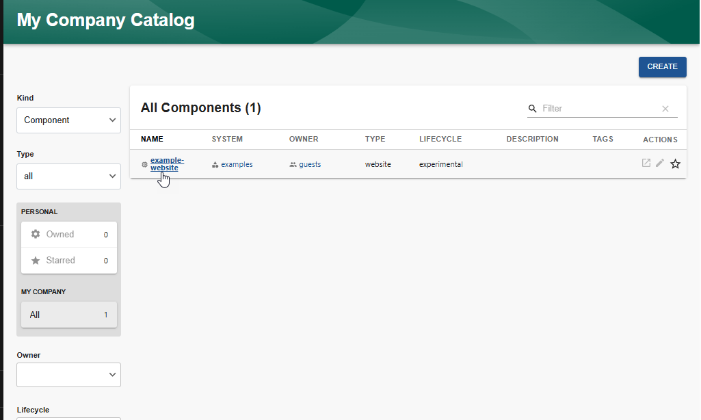

   A page is displayed that includes a `Relations` section. This section displays the selected entity and any other types of entities to which it is related. Each relationship is also designated, such as `hasPart/partOf` and `apiProvidedBy/providesApi`. [Well-known Relations between Catalog Entities](../features/software-catalog/well-known-relations.md) describes the most common relationships, but you can also [create your own relationships](../features/software-catalog/extending-the-model.md#adding-a-new-relation-type).

2. Selecting any of the related entities allows you to drill down further through the system model.

   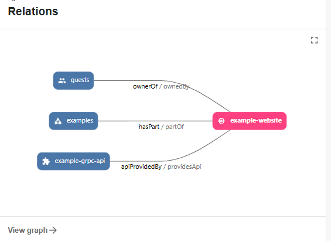

## Filtering the relationships

You can also view the relationships in the [Catalog Graph](../features/software-catalog/creating-the-catalog-graph.md). This view allows you to filter what entities and relationships to display.

To display the Catalog Graph:

1. Select the name of the component in the main panel, in this example, `example-website`.

   A page is displayed that includes a `Relations` section.

2. Select `View graph` in the `Relations` section.

   

   The `Catalog Graph` is displayed.

   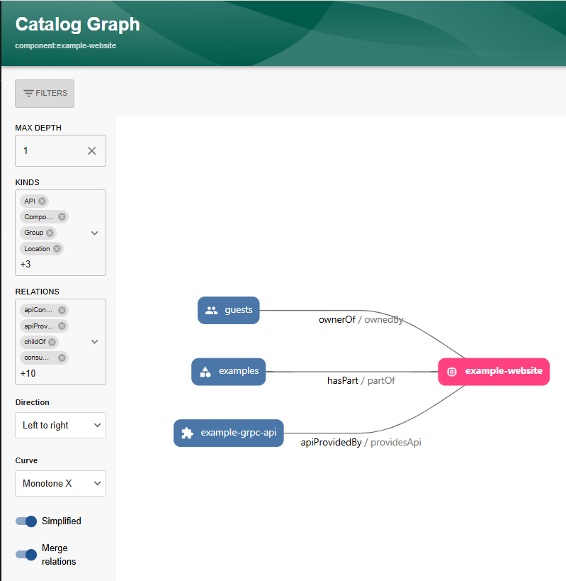

### Setting the filters

The `Catalog Graph` automatically reflects any changes you make to the filter settings. You can set the following filters:

- `MAX DEPTH`
  - `MAX DEPTH` = 1

    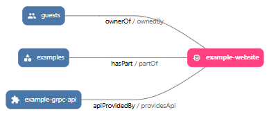

  - `MAX DEPTH` = infinite

    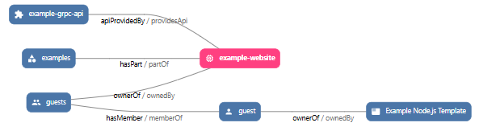

- `KINDS` - select what kinds of entities you want to view, default is all kinds
- `RELATIONS` - select which relationships you want to view, default is all relationships
- `Direction` - orientation in which you want to view the entity and its associated nodes
  - Top to bottom
  - Bottom to top
  - Left to right
  - Right to left
- `Curve`
  - `Curve` = Monotone

    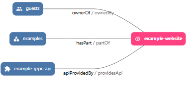

  - `Curve` = Step Before

    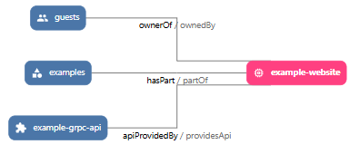

You can also toggle:

- `Simplified`
  - On = simple view
  - Off = detailed view
- `Merge relations`
  - On = You see the relationship from the selected entity to the nodes and from the nodes to the selected entity.
  - Off = You only see relations from the selected entity to its nodes.

  The following graphics illustrate the view of the nodes and relationships, based on the combination of the settings of `Simplified` and `Merge relations`.
  - `Simplified` = On and `Merge Relations` = On

    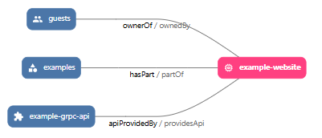

  - `Simplified` = On and `Merge Relations` = Off

    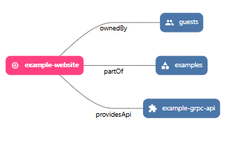

  - `Simplified` = Off and `Merge Relations` = On

    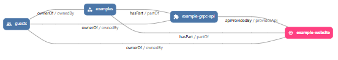

  - `Simplified` = Off and `Merge Relations` = Off

    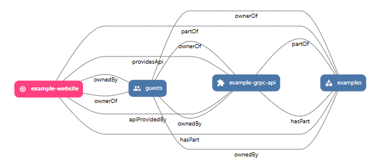
