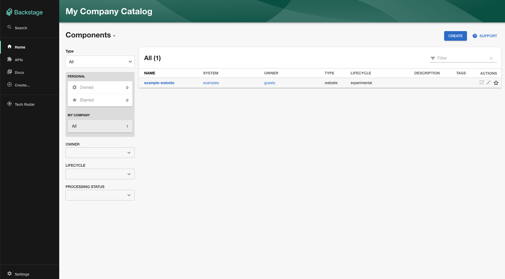

Your Backstage app is fully installed and ready to be run! Now that the installation is complete, you can go to the application directory and start the app using the `yarn start` command. The `yarn start` command will run both the frontend and backend as separate processes (named `[0]` and `[1]`) in the same window.

```bash
cd my-backstage-app # your app name
yarn start
```


Here again, there's a small wait for the frontend to start up. Once the frontend is built, your browser window should automatically open.

:::tip Browser window didn't open

When you see the message `[0] webpack compiled successfully`, you can navigate directly to `http://localhost:3000` to see your Backstage app.

:::

Once its spun up, you should see something similar to the below.



## Architecture of local development

:::note Deploy architecture

This section only touches on local development, we'll walk through what a Golden Path production architecture looks like in the `deployment` Golden Path.

:::

Now that you have that running, let's talk through what you just set up. You have 2 commands running as part of `yarn start` - the website that is stored at `packages/app` and the backend stored at `packages/backend`.

The website listens on port `3000` by default. It's a React app with some extra flavor to provide strong plugin-friendly defaults. For local development, we use `rspack` for fast compilation and near-instant feedback.

The backend listens on port `7007` by default. It is a NodeJS app that has among other things an HTTP server through `express` and talks to a database.

Locally, we use `sqlite` for the database. This is a fast in-memory database that is perfect for local development. Because of its ephemeral nature, you shouldn't rely on the database to keep data across `yarn start`s. We _do_ however, maintain the database across hot reloads.

Speaking of hot reloads, these are supported for both the frontend and backend.

In the frontend, whenever you save a file used by your React app, after a slight delay, you should see a message like

```
Rspack compiled successfully
```

In the backend, you should see a

```
Change detected, restarting the development server...
```

followed by init logs from your server.
