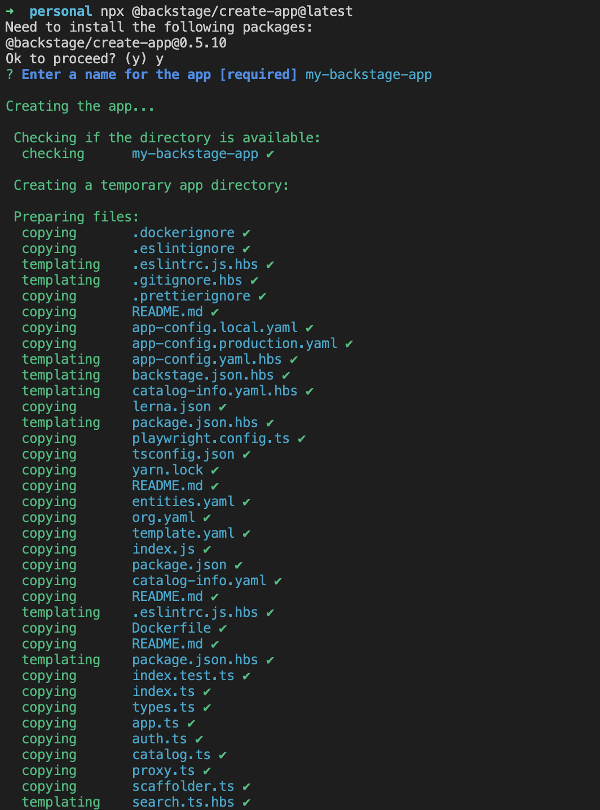

Audience: Developers and Admins

:::note Note
It is not required, although recommended to have a basic understanding of [Yarn](https://www.pluralsight.com/guides/yarn-a-package-manager-for-node-js) and [npm](https://docs.npmjs.com/about-npm) before starting this guide.
:::

## Summary

This guide walks through how to get started creating your very own Backstage customizable app. This is the first step in evaluating, developing on, or demoing Backstage.

By the end of this guide, you will have a standalone Backstage installation running locally with a `SQLite` database and demo content.

:::caution Organization customization

To be clear, this is not a production-ready installation, and it does not contain information specific to your organization. You will learn how to customize Backstage for your use case through this guide.

:::

## Prerequisites

This guide also assumes a basic understanding of working on a Linux based operating system and have some experience with the terminal, specifically, these commands: `npm`, `yarn`.

- Access to a Unix-based operating system, such as Linux, macOS or
  [Windows Subsystem for Linux](https://docs.microsoft.com/en-us/windows/wsl/)
- A GNU-like build environment available at the command line.
  For example, on Debian/Ubuntu you will want to have the `make` and `build-essential` packages installed.
  On macOS, you will want to have run `xcode-select --install` to get the XCode command line build tooling in place.
- An account with elevated rights to install the dependencies
- `curl` or `wget` installed
- Node.js [Active LTS Release](../../overview/versioning-policy.md#nodejs-releases) installed using one of these
  methods:
  - Using `nvm` (recommended)
    - [Installing nvm](https://github.com/nvm-sh/nvm#install--update-script)
    - [Install and change Node version with nvm](https://nodejs.org/en/download/package-manager/#nvm)
    - Node 20 is a good starting point, this can be installed using `nvm install lts/iron`
  - [Binary download](https://nodejs.org/en/download/)
  - [Package manager](https://nodejs.org/en/download/package-manager/)
  - [Using NodeSource packages](https://github.com/nodesource/distributions/blob/master/README.md)
- `yarn` [Installation](https://yarnpkg.com/getting-started/install)
  - Backstage currently uses Yarn 4.4.1, once you've ran `corepack enable` you'll want to then run `yarn set version 4.4.1`
- `git` [installation](https://github.com/git-guides/install-git)

## Scaffold your new Backstage app

## 1. Create your Backstage App

To scaffold your new Backstage app, we'll be running an interactive command. Before you run the command, you should open a terminal and move your current working directory somewhere you're comfortable creating a new directory.

The wizard for this command will ask what name you want to have for your new app. That name will match the folder that we create for you.

When you run the command, you'll see an output like this.



And when it finishes, you'll have a working Backstage app (with example data)!

Now, that we know what it does, let's actually scaffold some code!

```bash
npx @backstage/create-app@latest
```

This may take a few minutes to fully install everything. Don't stress if the loading seems to be spinning nonstop, there's a lot going on in the background.

:::note

If this fails on the `yarn install` step, it's likely that you will need to install some additional dependencies which are used to configure `isolated-vm`. You can find out more in their [requirements section](https://github.com/laverdet/isolated-vm#requirements), and then run `yarn install` manually again after you've completed those steps.

:::

## Structure of your app

### General folder structure

Below is a simplified layout of the files and folders generated when creating an app.

```
app
├── app-config.yaml
├── catalog-info.yaml
├── package.json
└── packages
    ├── app
    └── backend
```

- **app-config.yaml**: Main configuration file for the app. See
  [Configuration](https://backstage.io/docs/conf/) for more information.
- **catalog-info.yaml**: Catalog Entities descriptors. See
  [Descriptor Format of Catalog Entities](https://backstage.io/docs/features/software-catalog/descriptor-format)
  to get started.
- **package.json**: Root package.json for the project. _Note: Be sure that you
  don't add any npm dependencies here as they probably should be installed in
  the intended workspace rather than in the root._
- **packages/**: Lerna leaf packages or "workspaces". Everything here is going
  to be a separate package, managed by lerna.
- **packages/app/**: A fully functioning Backstage frontend app that acts as a
  good starting point for you to get to know Backstage.
- **packages/backend/**: We include a backend that helps power features such as
  [Authentication](https://backstage.io/docs/auth/),
  [Software Catalog](https://backstage.io/docs/features/software-catalog/),
  [Software Templates](https://backstage.io/docs/features/software-templates/)
  and [TechDocs](https://backstage.io/docs/features/techdocs/)
  amongst other things.

## Common Issues

- App is not running on port X: Backstage uses ports `3000` and `7007` as its default frontend and backend ports. Make sure that your commands haven't exited with errors. For remote or containerized setups, make sure those ports above are accessible.

## Next Steps

Now that you have a scaffolded app, let's learn how to start it locally for development!
