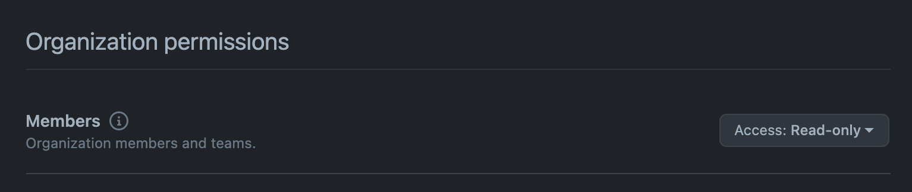
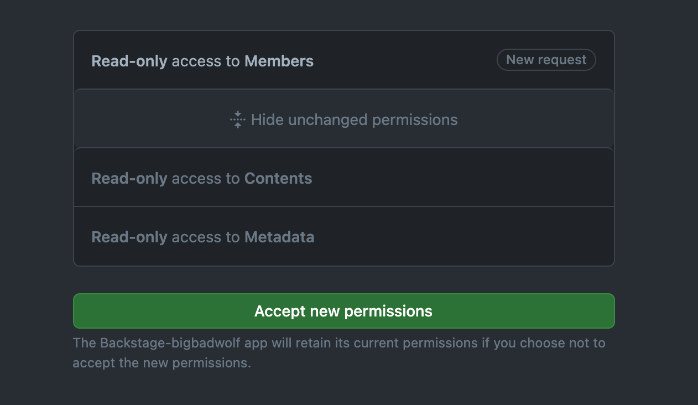

The Backstage catalog can be set up to ingest organizational data - users and
teams - directly from an organization in GitHub or GitHub Enterprise. The result
is a hierarchy of
[`User`](../../features/software-catalog/descriptor-format.md#kind-user) and
[`Group`](../../features/software-catalog/descriptor-format.md#kind-group) kind
entities that mirror your org setup.

> Note: This adds `User` and `Group` entities to the catalog, but does not
> provide authentication. See the
> [GitHub auth provider](../../auth/github/provider.md) for that.

## Installation

The processor that performs the import, `GithubOrgReaderProcessor`, comes
installed with the default setup of Backstage.

If you have _replaced_ the set of processors in your installation using
`replaceProcessors`, you can import and add it as follows:

```ts
// Typically in packages/backend/src/plugins/catalog.ts
import { GithubOrgReaderProcessor } from '@backstage/plugin-catalog-backend';

builder.replaceProcessors(
  GithubOrgReaderProcessor.fromConfig(config, { logger }),
  // ...
);
```

## Configuration

The following configuration enables an import of the teams and users under the
org `https://github.com/my-org-name` on public GitHub.

```yaml
catalog:
  locations:
    - type: github-org
      target: https://github.com/my-org-name
```

If Backstage is configured to use GitHub Apps authentication you must grant
`Read-Only` access for `Members` under `Organization` in order to ingest users
correctly. You can modify the app's permissions under the organization settings,
`https://github.com/organizations/{ORG}/settings/apps/{APP_NAME}/permissions`.


**Please note that when you change permissions, the app owner will get an email
that must be approved first before the changes are applied.**


Locations point out the specific org(s) you want to import. The `type` of these
locations must be `github-org`, and the `target` must point to the exact URL of
some organization. You can have several such location entries if needed.

The authorization for loading org information comes from a configured
[GitHub integration](locations.md#configuration). When using a personal access
token, the token needs to have at least the scopes `read:org`, `read:user`, and
`user:email` in the given `target`.
