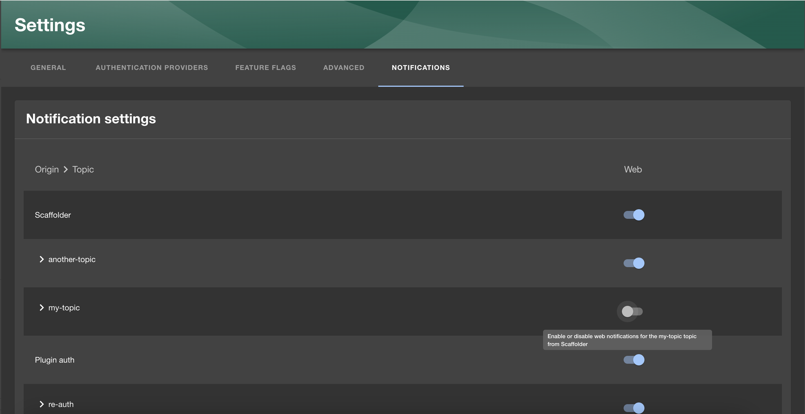

The Backstage Notifications System provides a way for plugins and external services to send notifications to Backstage users.
These notifications are displayed in the dedicated page of the Backstage frontend UI or by frontend plugins per specific scenarios.
Additionally, notifications can be sent to external channels (like email) via "processors" implemented within plugins.

Notifications can be optionally integrated with the signals (a push mechanism) to ensure users receive them immediately.

### Upgrade to the latest version of Backstage

To ensure your version of Backstage has all the latest notifications and signals related functionality, it’s important to upgrade to the latest version. The [Backstage upgrade helper](https://backstage.github.io/upgrade-helper/) is a great tool to help ensure that you’ve made all the necessary changes during the upgrade!

## About notifications

Notifications are messages sent to either individual users or groups.
They are not intended for inter-process communication of any kind.

There are two basic types of notifications:

- **Broadcast**: Messages sent to all users of Backstage.
- **Entity**: Messages delivered to specific listed entities, such as Users or Groups.

Example of use-cases:

- System-wide announcements or alerts
- Notifications for component owners: e.g., build failures, successful deployments, new vulnerabilities
- Notifications for individuals: e.g., updates you have subscribed to, new required training courses
- Notifications pertaining to a particular entity in the catalog: A notification might apply to an entity and the owning team.

## Installation in Older Environments

Newer versions of instances created by the create-app have both the notifications and signals plugins included by default; this section can be skipped right to the Configuration.

Following installation instructions are valid for enabling the plugins in older environments.

### Add Notifications Backend

```bash
yarn workspace backend add @backstage/plugin-notifications-backend
```

Add the notifications to your `backend/src/index.ts`:

```ts
const backend = createBackend();
// ...
backend.add(import('@backstage/plugin-notifications-backend'));
```

### Add Notifications Frontend

```bash
yarn workspace app add @backstage/plugin-notifications
```

To add the notifications main menu, add following to your `packages/app/src/components/Root/Root.tsx`:

```tsx
import { NotificationsSidebarItem } from '@backstage/plugin-notifications';

<SidebarPage>
  <Sidebar>
    <SidebarGroup>
      // ...
      <NotificationsSidebarItem />
    </SidebarGroup>
  </Sidebar>
</SidebarPage>;
```

Also add the route to notifications to `packages/app/src/App.tsx`:

```tsx
import { NotificationsPage } from '@backstage/plugin-notifications';

<FlatRoutes>
  // ...
  <Route path="/notifications" element={<NotificationsPage />} />
</FlatRoutes>;
```

### Optional: Add Signals Backend

Optionally add Signals to your backend by

```bash
yarn workspace backend add @backstage/plugin-signals-backend
```

Add the signals to your `backend/src/index.ts`:

```ts
const backend = createBackend();
// ...
backend.add(import('@backstage/plugin-signals-backend'));
```

### Optional: Signals Frontend

The use of signals is optional but improves user experience.

Start with:

```bash
yarn workspace app add @backstage/plugin-signals
```

To install the plugin, add the `SignalsDisplay` to your app root in `packages/app/src/App.tsx`:

```tsx
import { SignalsDisplay } from '@backstage/plugin-signals';

export default app.createRoot(
  <>
    <AlertDisplay transientTimeoutMs={2500} />
    <OAuthRequestDialog />
    {/* highlight-add-next-line */}
    <SignalsDisplay />
    <AppRouter>
      <VisitListener />
      <Root>{routes}</Root>
    </AppRouter>
  </>,
);
```

If the signals plugin is properly configured, it will be automatically discovered by the notifications plugin and used.

### User-specific notification settings

The notifications plugin provides a way for users to manage their notification settings. To enable this, you must
add the `UserNotificationSettingsCard` to your frontend.

```tsx
// App.tsx example
<Route path="/settings" element={<UserSettingsPage />}>
  <SettingsLayout.Route path="/advanced" title="Advanced">
    <AdvancedSettings />
  </SettingsLayout.Route>
  <SettingsLayout.Route path="/notifications" title="Notifications">
    <UserNotificationSettingsCard
      originNames={{ 'plugin:scaffolder': 'Scaffolder' }}
    />
  </SettingsLayout.Route>
</Route>
```



You can customize the origin names shown in the UI by passing an object where the keys are the origins and the values are the names you want to show in the UI.

Each notification processor will receive its own column in the settings page, where the user can enable or disable notifications from that processor.

## Additional info

An example of a backend plugin sending notifications can be found in https://github.com/backstage/backstage/tree/master/plugins/scaffolder-backend-module-notifications.

Sources of the notifications and signal plugins:

- https://github.com/backstage/backstage/blob/master/plugins/notifications
- https://github.com/backstage/backstage/blob/master/plugins/notifications-backend
- https://github.com/backstage/backstage/blob/master/plugins/notifications-common
- https://github.com/backstage/backstage/blob/master/plugins/notifications-node
- https://github.com/backstage/backstage/blob/master/plugins/signals-backend
- https://github.com/backstage/backstage/blob/master/plugins/signals
- https://github.com/backstage/backstage/blob/master/plugins/signals-node
- https://github.com/backstage/backstage/blob/master/plugins/signals-react
