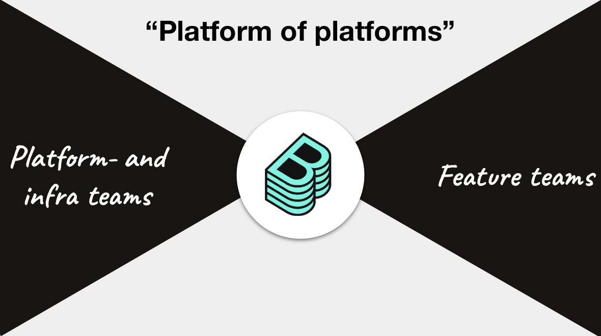

This document outlines some general best practices that have been key to
Backstage's success inside Spotify. Every organization is different and some of
these learnings will therefore not be applicable for your company. We are hoping
that this can become a living document, and strongly encourage you to contribute
back whatever learnings you gather while adopting Backstage inside your company.

## Organizational setup

The true value of Backstage is unlocked when it becomes _THE_ developer portal
at your company. As such it is important to recognize that you will need a
central team that owns your Backstage deployment and treats it like a product.

This team will have **four** primary objectives:

1. Maintain and operate your deployment of Backstage. This includes customer
   support, infrastructure, CI/CD and, as your Backstage product grows, on-call
   support.

2. Drive adoption of customers (developers at your company).

3. Work with senior tech leadership and architects to ensure your organization's
   best practices for software development are encoded into a set of
   [Software Templates](../features/software-templates/index.md).

4. Evangelize Backstage as a central platform towards other
   infrastructure/platform teams.

## Internal evangelization

The last objective deserves more attention, since it is the least obvious, but
also the most critical to successfully creating a consolidated platform. When
done right, Backstage acts as a "platform of platforms" or marketplace between
infra/platform teams and end-users:

While anyone at your company can contribute to the platform, the vast majority
of work will be done by teams that also have internal engineers as their
customers. The central team should treat these _contributing teams_ as customers
of the platform as well.

These teams should be able to autonomously deliver value directly to their
customers. This is done primarily by building [plugins](../plugins/index.md).
Contributing teams should themselves treat their plugins as, or part of, the
products they maintain.

> Case study: Inside Spotify we have a team that owns our CI platform. They not
> only maintain the pipelines and build servers, but also expose their product
> in Backstage through a plugin. Since they also
> [maintain their own API](../plugins/call-existing-api.md), they can improve
> their product by iterating on API and UI in lockstep. Because the plugin
> follows our [platform design guidelines](../dls/design.md) their customers get
> a CI experience that is consistent with other tools on the platform (and users
> don't have to become experts in Jenkins).

### Tactics

Examples of tactics we have used to evangelize Backstage internally:

- Arrange "Lunch & Learns" and seminars. Frequently offer teams interested in
  Backstage development to come to a seminar where you show, for example, how to
  build a plugin from scratch.

- Embedding. As contributing teams start development of their first plugin it is
  often very appreciated to have one person from the central team come over and
  "embed" for a Sprint or two.

- Hack days. Backstage-focused Hackathons or hack days is a fun way to get
  people into plugin development.

- Show & tell meetings. In order to build an internal community around Backstage
  we have quarterly meetings where anyone working on Backstage is invited to
  present their work. This is not only a great way to get early feedback, but
  also helps coordination between teams that are building overlapping
  experiences.

- Provide metrics. Add instrumentation to your Backstage deployment and make
  metrics available to contributing teams. At Spotify, we have even gone so far
  as to send out weekly digest emails showing how usage metrics have changed for
  individual plugins.

- Pro-actively identify new plugins. Reach out to teams that own internal UIs or
  platforms that you think would make sense to consolidate into Backstage.

## KPIs and metrics

These are some of the metrics that you can use to verify if Backstage has a
successful impact on your software development process:

- **Onboarding time** Time until new engineers are productive. At Spotify we
  measure this as the time until the employee has merged their 10th PR (this
  metric was down 55% two years after deploying Backstage). Even though you may
  not be onboarding engineers at a rapid pace, this metric is a great proxy for
  the overall complexity of your ecosystem. Reducing it will therefore benefit
  your whole engineering organization, not just new joiners.

- **Number of merges per developer/day** Less time spent jumping between
  different tools and looking for information means more time to focus on
  shipping code. A second level of bottlenecks can be identified if you
  categorize contributions by domain (services, web, data, etc).

- **Deploys to production** Cousin to the metric above: How many times does an
  engineer push changes into production.

- **MTTR** With clear ownership of all the pieces in your microservices
  ecosystem and all tools integrated into one place, Backstage makes it quicker
  for teams to find the root cause of failures, and fix them.

- **Context switching** Reducing context switching can help engineers stay in
  the "zone". We measure the number of different tools an engineer has to
  interact with in order to get a certain job done (e.g. push a change, follow
  it into production and validate it did not break anything).

- **T-shapedness** A
  [T-shaped](https://medium.com/@jchyip/why-t-shaped-people-e8706198e437)
  engineer is someone that is able to contribute to different domains of
  engineering. Teams with T-shaped people have fewer bottlenecks and can
  therefore deliver more consistently. Backstage makes it easier to be T-shaped
  since tools and infrastructure are consistent between domains, and information
  is available centrally.

- **eNPS** Surveys asking about how productive people feel, how easy it is to
  find information and overall satisfaction with internal tools.

- **Fragmentation** _(Experimental)_ Backstage
  [Software Templates](../features/software-templates/index.md) help drive
  standardization in your software ecosystem. By measuring the variance in
  technology between different software components it is possible to get a sense
  of the overall fragmentation in your ecosystem. Examples could include:
  framework versions, languages, deployment methods and various code quality
  measurements.

Additionally, these proxy metrics can be used to validate the success of
Backstage as _the_ platform:

- Nr of teams that have contributed at least one plugin (currently 63 inside
  Spotify)

- Nr of total plugins (currently 135 inside Spotify)

- % of contributions coming from outside the central Backstage team (currently
  85% inside Spotify)

- Traditional metrics such as visits (MAU, DAU, etc) and page views. Currently
  ~50% of all Spotifiers use Backstage on a monthly basis, even though the
  percentage of engineers is below 50%. Most engineers actually use Backstage on
  a daily basis.

Again, any feedback is appreciated. Please use the Edit button at the bottom of the
page to make a suggestion.

:::note Note

It might be tempting to try to optimize Backstage usage and
"engagement". Even though you want to consolidate all your tooling and technical
documentation in Backstage, it is important to remember that time spent in
Backstage is time not spent writing code 🙃

:::
