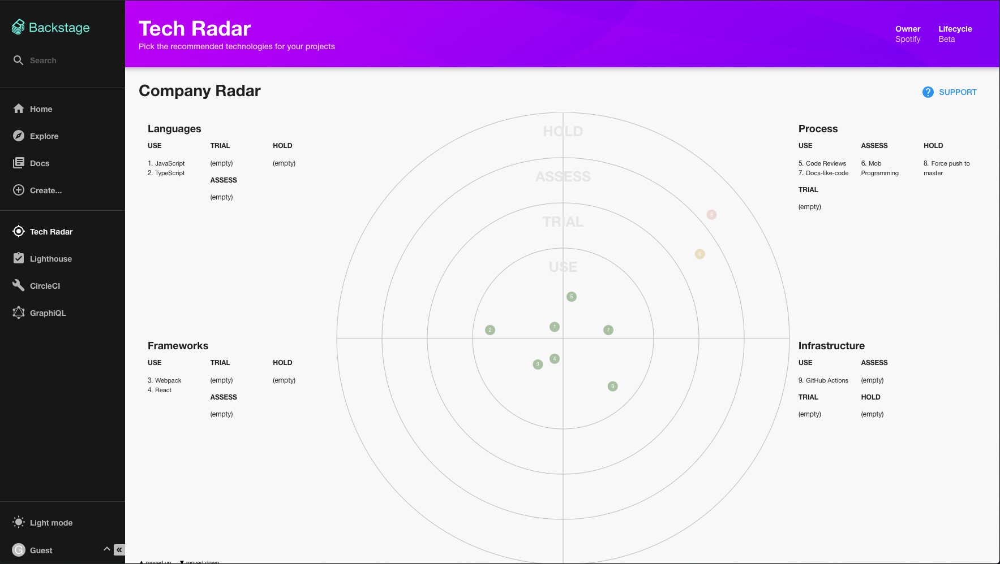

# Typical Backstage architecture

The following diagram shows how Backstage might look when deployed inside a
company which uses the Tech Radar plugin, the Lighthouse plugin, the Circle CI
plugin and the service catalog.

There are 3 main components in this architecture:

1. The core Backstage UI
2. The UI plugins and their backing services
3. Databases

Running this architecture in a real environment typically involves
containerising the components. Various commands are provided for accomplishing
this.


# The UI

The UI is a thin, client-side wrapper around a set of plugins. It provides some
core UI components and libraries for shared activities such as config
management. [[live demo](https://backstage-demo.roadie.io/)]


Each plugin typically makes itself available in the UI on a dedicated URL. For
example, the lighthouse plugin is registered with the UI on `/lighthouse`.
[[live demo](https://backstage-demo.roadie.io/lighthouse)]


The Circle CI plugin is available on `/circleci`.


# Plugins and plugin backends

Each plugin is a client side application which mounts itself on the UI. Plugins
are written in TypeScript or JavaScript. They each live in their own directory
in `backstage/plugins`. For example, the source code for the lighthouse plugin
is available at
[backstage/plugins/lighthouse](https://github.com/spotify/backstage/tree/master/plugins/lighthouse).

## Installing plugins

Plugins are typically loaded by the UI in your Backstage applications
`plugins.ts` file. For example,
[here](https://github.com/spotify/backstage/blob/master/packages/app/src/plugins.ts)
is that file in the Backstage sample app.

Plugins can be enabled, and passed configuration in `apis.ts`. For example,
[here](https://github.com/spotify/backstage/blob/master/packages/app/src/apis.ts)
is that file in the Backstage sample app.

This is how the lighthouse plugin would be enabled in a typical Backstage
application:

```tsx
import { ApiHolder, ApiRegistry } from '@backstage/core';
import {
  lighthouseApiRef,
  LighthouseRestApi,
} from '@backstage/plugin-lighthouse';

const builder = ApiRegistry.builder();

export const lighthouseApi = new LighthouseRestApi(/* URL of the lighthouse microservice! */);
builder.add(lighthouseApiRef, lighthouseApi);

export default builder.build() as ApiHolder;
```

As of this moment, there is no config based install procedure for plugins. Some
code changes are required.

## Plugin architecture

Architecturally, plugins can take three forms:

1. Standalone
2. Service backed
3. Third-party backed

### Standalone plugins

Standalone plugins run entirely in the browser.
[The tech radar plugin](https://backstage-demo.roadie.io/tech-radar), for
example, simply renders hard-coded information. It doesn't make any API requests
to other services.



The architecture of the Tech Radar installed into a Backstage app is very
simple.


### Service backed plugins

Service backed plugins make API requests to a service which is within the
purview of the organisation running Backstage.

The lighthouse plugin, for example, makes requests to the
[lighthouse-audit-service](https://github.com/spotify/lighthouse-audit-service).
The lighthouse-audit-service is a microservice which runs a copy of Google's
[Lighthouse library](https://github.com/GoogleChrome/lighthouse/) and stores the
results in a PostgreSQL database.

Its architecture looks like this:


The service catalog in Backstage is another example of a service backed plugin.
It retrieves a list of services, or "entities", from the Backstage Backend
service and renders them in a table for the user.

### Third-party backed plugins

Third-party backed plugins are similar to service backed plugins. The main
difference is that the service which backs the plugin is hosted outside of the
ecosystem of the company hosting Backstage.

The Circle CI plugin is an example of a third-party backed plugin. Circle CI is
a SaaS service which can be used without any knowledge of Backstage. It has an
API which a Backstage plugin consumes to display content.

Requests which go to Circle CI from the users browser are passed through a proxy
service that Backstage provides. Without this, the requests would be blocked by
Cross Origin Resource Sharing policies which prevent a browser page served at
[https://example.com](https://example.com) from serving resources hosted at
https://circleci.com.


# Databases

As we have seen, both the lighthouse-audit-service and catalog-backend require a
database to work with.

At the time of writing, the lighthouse-audit-service requires PostgreSQL to work
with. The service catalog backend uses an in-memory Sqlite3 instance. This is a
development oriented setup and there are plans to support other databases in the
future.

To learn more about the future of databases and Backstage, see the following two
GitHub issues.

[Knex + Plugins (Multiple vs Single Database) · Issue #1598 · spotify/backstage](https://github.com/spotify/backstage/issues/1598)

[Update migrations to support postgres by dariddler · Pull Request #1527 · spotify/backstage](https://github.com/spotify/backstage/pull/1527#discussion_r450374145)

# Containerization

The example Backstage architecture shown above would Dockerize into three
separate docker images.

1. The frontend container
2. The backend container
3. The lighthouse audit service container


The frontend container can be built with a provided command.

```bash
yarn install
yarn tsc
yarn build
yarn run docker-build
```

Running this will simply generate a Docker container containing the contents of
the UIs `dist` directory. The resulting container will be about 50MB in size.

The backend container can be built by running the following command in the
`packages/backend` directory.

```bash
yarn run build-image
```

This will create a ~500MB container called `example-backend`.

The lighthouse-audit-service container is already publicly available in Docker
Hub and can be downloaded and ran with

```bash
docker run spotify/lighthouse-audit-service:latest
```
