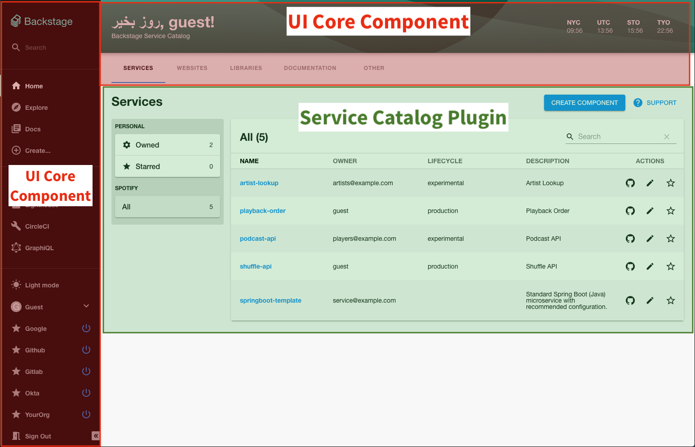
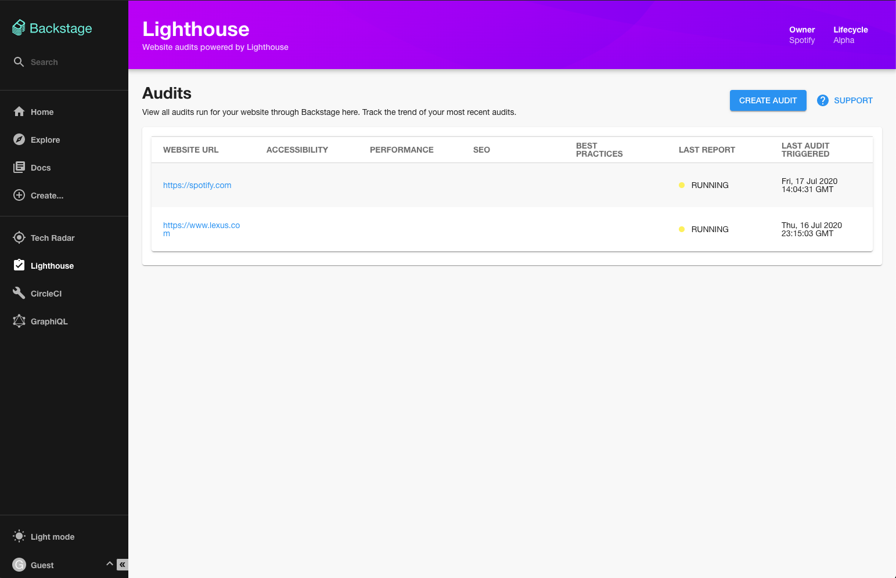
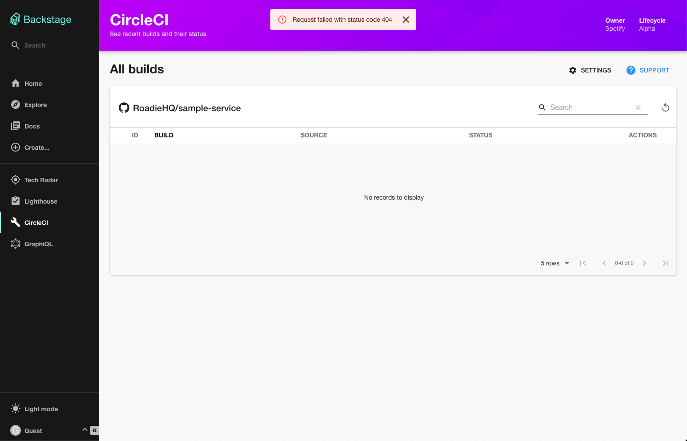
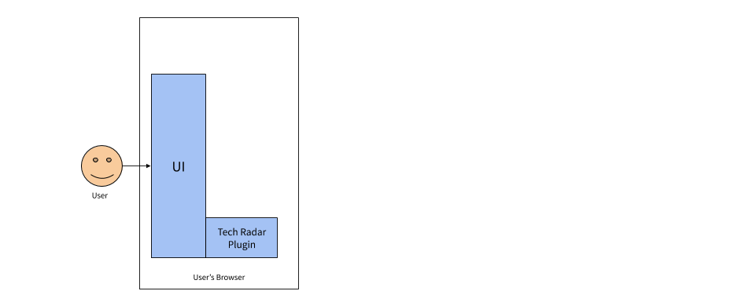
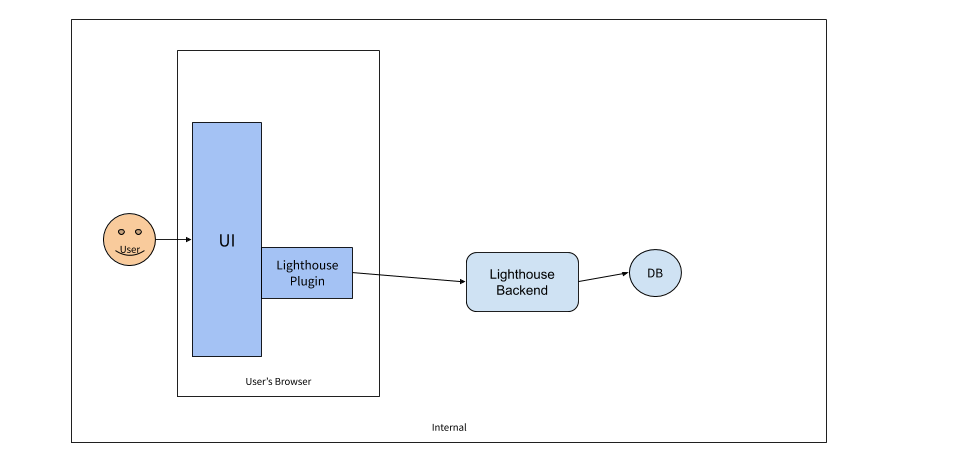
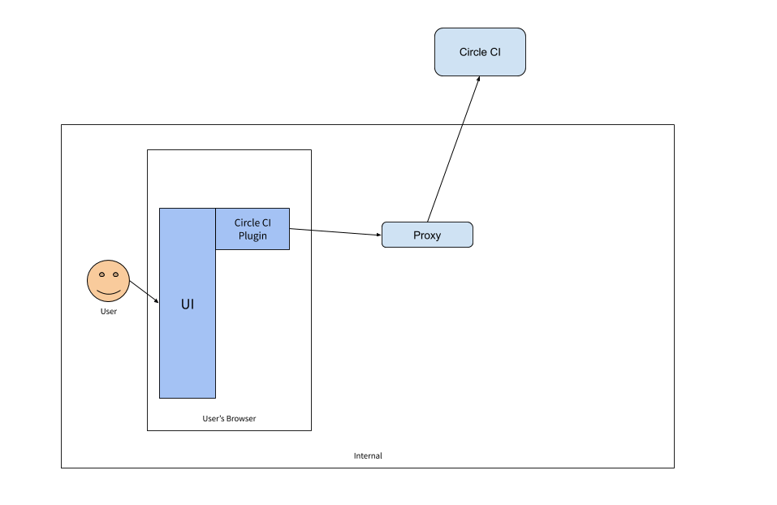
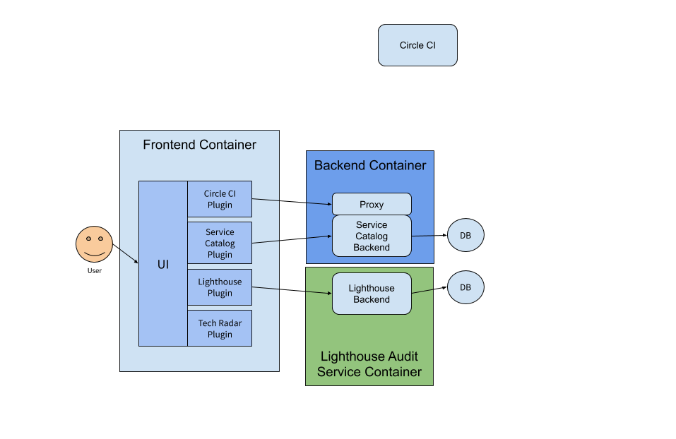

## Terminology

Backstage is constructed out of three parts. We separate Backstage in this way
because we see three groups of contributors that work with Backstage in three
different ways.

- Core - Base functionality built by core developers in the open source project.
- App - The app is an instance of a Backstage app that is deployed and tweaked.
  The app ties together core functionality with additional plugins. The app is
  built and maintained by app developers, usually a productivity team within a
  company.
- Plugins - Additional functionality to make your Backstage app useful for your
  company. Plugins can be specific to a company or open sourced and reusable. At
  Spotify we have over 100 plugins built by over 50 different teams. It has been
  very powerful to get contributions from various infrastructure teams added
  into a single unified developer experience.

## Overview

The following diagram shows how Backstage might look when deployed inside a
company which uses the Tech Radar plugin, the Lighthouse plugin, the CircleCI
plugin and the service catalog.

There are 3 main components in this architecture:

1. The core Backstage UI
2. The UI plugins and their backing services
3. Databases

Running this architecture in a real environment typically involves
containerising the components. Various commands are provided for accomplishing
this.


## User Interface

The UI is a thin, client-side wrapper around a set of plugins. It provides some
core UI components and libraries for shared activities such as config
management. [[live demo](https://demo.backstage.io/catalog)]



Each plugin typically makes itself available in the UI on a dedicated URL. For
example, the Lighthouse plugin is registered with the UI on `/lighthouse`.
[[learn more](https://backstage.io/blog/2020/04/06/lighthouse-plugin)]



The CircleCI plugin is available on `/circleci`.



## Plugins and plugin backends

Each plugin is a client side application which mounts itself on the UI. Plugins
are written in TypeScript or JavaScript. They each live in their own directory
in `backstage/plugins`. For example, the source code for the lighthouse plugin
is available at
[backstage/plugins/lighthouse](https://github.com/backstage/backstage/tree/master/plugins/lighthouse).

### Installing plugins

Plugins are typically installed as React components in your Backstage
application. For example,
[here](https://github.com/backstage/backstage/blob/master/packages/app/src/App.tsx)
is a file that imports many full-page plugins in the Backstage sample app.

An example of one of these plugin components is the `CatalogIndexPage`, which is
a full-page view that allows you to browse entities in the Backstage catalog. It
is installed in the app by importing it and adding it as an element like this:

```tsx
import { CatalogIndexPage } from '@backstage/plugin-catalog';

...

const routes = (
  <FlatRoutes>
    ...
    <Route path="/catalog" element={<CatalogIndexPage />} />
    ...
  </FlatRoutes>
);
```

Note that we use `"/catalog"` as our path to this plugin page, but we can choose
any route we want for the page, as long as it doesn't collide with the routes
that we choose for the other plugins in the app.

These components that are exported from plugins are referred to as "Plugin
Extension Components", or "Extension Components". They are regular React
components, but in addition to being able to be rendered by React, they also
contain various pieces of metadata that is used to wire together the entire app.
Extension components are created using `create*Extension` methods, which you can
read more about in the
[composability documentation](../plugins/composability.md).

As of this moment, there is no config based install procedure for plugins. Some
code changes are required.

### Plugin architecture

Architecturally, plugins can take three forms:

1. Standalone
2. Service backed
3. Third-party backed

#### Standalone plugins

Standalone plugins run entirely in the browser.
[The Tech Radar plugin](https://demo.backstage.io/tech-radar), for example,
simply renders hard-coded information. It doesn't make any API requests to other
services.


The architecture of the Tech Radar installed into a Backstage app is very
simple.



#### Service backed plugins

Service backed plugins make API requests to a service which is within the
purview of the organisation running Backstage.

The Lighthouse plugin, for example, makes requests to the
[lighthouse-audit-service](https://github.com/spotify/lighthouse-audit-service).
The `lighthouse-audit-service` is a microservice which runs a copy of Google's
[Lighthouse library](https://github.com/GoogleChrome/lighthouse/) and stores the
results in a PostgreSQL database.

Its architecture looks like this:



The service catalog in Backstage is another example of a service backed plugin.
It retrieves a list of services, or "entities", from the Backstage Backend
service and renders them in a table for the user.

### Third-party backed plugins

Third-party backed plugins are similar to service backed plugins. The main
difference is that the service which backs the plugin is hosted outside of the
ecosystem of the company hosting Backstage.

The CircleCI plugin is an example of a third-party backed plugin. CircleCI is a
SaaS service which can be used without any knowledge of Backstage. It has an API
which a Backstage plugin consumes to display content.

Requests going to CircleCI from the user's browser are passed through a proxy
service that Backstage provides. Without this, the requests would be blocked by
Cross Origin Resource Sharing policies which prevent a browser page served at
[https://example.com](https://example.com) from serving resources hosted at
https://circleci.com.



## Databases

As we have seen, both the `lighthouse-audit-service` and `catalog-backend`
require a database to work with.

The Backstage backend and its builtin plugins are based on the
[Knex](http://knexjs.org/) library, and set up a separate logical database per
plugin. This gives great isolation and lets them perform migrations and evolve
separate from each other.

The Knex library supports a multitude of databases, but Backstage is at the time
of writing tested primarily against two of them: SQLite, which is mainly used as
an in-memory mock/test database, and PostgreSQL, which is the preferred
production database. Other databases such as the MySQL variants are reported to
work but
[aren't tested as fully](https://github.com/backstage/backstage/issues/2460)
yet.

## Cache

The Backstage backend and its builtin plugins are also able to leverage cache
stores as a means of improving performance or reliability. Similar to how
databases are supported, plugins receive logically separated cache connections,
which are powered by [Keyv](https://github.com/lukechilds/keyv) under the hood.

At this time of writing, Backstage can be configured to use one of two cache
stores: memory, which is mainly used for local testing, and memcache, which is a
cache store better suited for production deployment. The right cache store for
your Backstage instance will depend on your own run-time constraints and those
required of the plugins you're running.

Contributions supporting other cache stores are welcome!

## Containerization

The example Backstage architecture shown above would Dockerize into three
separate Docker images.

1. The frontend container
2. The backend container
3. The Lighthouse audit service container



The backend container can be built by running the following command:

```bash
yarn run docker-build
```

This will create a container called `example-backend`.

The lighthouse-audit-service container is already publicly available in Docker
Hub and can be downloaded and run with

```bash
docker run spotify/lighthouse-audit-service:latest
```
