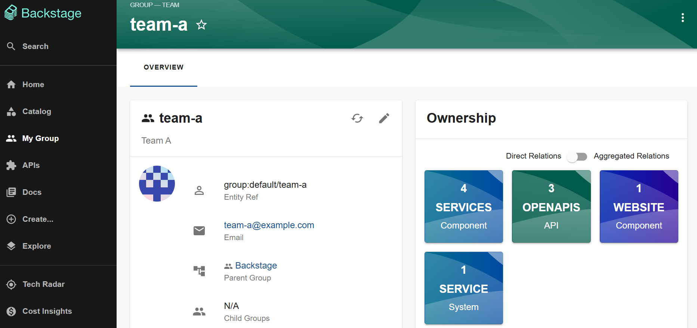

## Purpose

Backstage is an open source framework for building developer portals that was created at Spotify to simplify end-to-end software development. As Spotify grew, their infrastructure became more fragmented and teams couldn't find the APIs they were supposed to use, or who owned a service, or documentation on anything.

Backstage is powered by a centralized [software catalog](#software-catalog-system-model) and utilizes an abstraction layer that sits on top of all of your infrastructure and developer tooling, allowing you to manage all of your software, services, tooling, and testing in one place.

Backstage uses a [plugin-architecture](#plugin-architecture-overview) which allows you to customize the functionality of your Backstage application using a wide variety of available plugins or you can write your own. It also includes automated templates that your teams can use to create new microservices, helping to ensure consistency and adherence to your best practices. Backstage also provides the ability to create, maintain, and find the documentation for all of your software.

Backstage is now a [CNCF incubation project](https://backstage.io/blog/2022/03/16/backstage-turns-two#out-of-the-sandbox-and-into-incubation).

## Benefits

- For _engineering managers_, it allows you to maintain standards and best practices across the organization, and can help you manage your whole tech ecosystem, from migrations to test certification.
- For _end users_ (developers), it makes it fast and simple to build software components in a standardized way, and it provides a central place to manage all projects and documentation.
- For _platform engineers_, it enables extensibility and scalability by letting you easily integrate new tools and services (via plugins), as well as extending the functionality of existing ones.
- For _everyone_, it is a single, consistent experience that ties all of your infrastructure tooling, resources, standards, owners, contributors, and administrators together in one place.

If you have question or want support, please join our [Discord server](https://discord.gg/backstage-687207715902193673).

## Core Features

Backstage includes the following set of core features:

- [Authentication and Identity](../auth/index.md) - Sign-in and identification of users, and delegating access to third-party resources, using built-in authentication providers.
- [Kubernetes](../features/kubernetes/index.md) - A tool that allows developers to check the health of their services whether it is on a local host or in production.
- [Notifications](../notifications/index.md) - Provides a means for plugins and external services to send messages to either individual users or groups.
- [Permissions](../permissions/overview.md) - Ability to enforce rules concerning the type of access a user is given to specific data, APIs, or interface actions.
- [Search](https://backstage.io/docs/features/search/) - Search for information in the Backstage ecosystem. You can customize the look and feel of each search result and use your own search engine.
- [Software Catalog](../features/software-catalog/index.md) - A centralized system that contains metadata for all your software, such as services, websites, libraries, ML models, data pipelines, and so on. It can also contain metadata for the physical or virtual infrastructure needed to operate a piece of software. The software catalog can be viewed and searched through a UI.
- [Software Templates](../features/software-templates/index.md) - A tool to help you create components inside Backstage. A template can load skeletons of code, include some variables, and then publish the template to a location, such as GitHub.
- [TechDocs](https://backstage.io/docs/features/techdocs/) - A docs-like-code solution built into Backstage. Documentation is written in Markdown files which lives together with the code.

## Plugin Architecture Overview

Plugins are client side applications which mount themselves on the Backstage UI. They allow you to incorporate a wide variety of infrastructure and software development tools into your Backstage application. Backstage uses a [plugin-architecture](../overview/architecture-overview.md#plugin-architecture) to provide a consistent user experience, in a single UI, around all of your plugins.

The Backstage architecture supports three types of plugins:

- Standalone - runs entirely in a browser and it does not make any API requests to other services.
- Service backed - makes API requests to a service within the ecosystem of the organization running Backstage.
- Third-party backed - similar to service-backed, but the service backing the plugin is hosted outside of the ecosystem of the company hosting Backstage.

Many of the features available in Backstage are provided by plugins. For example, the Software Catalog is a service backed plugin. When you view the catalog, it retrieves a set of services ("[entities](#software-catalog-system-model)") from the Backstage Backend service and renders them in a table in the UI for you.

## Software Catalog System Model

The system model behind the software catalog is based on [_entities_](../references/glossary.md#entity) and it models two main types:

- Core Entities
- Organizational Entities

`Core Entities` include:

- `Components` - Individual pieces of software that can be tracked in source control and can implement APIs for other components to consume.
- `APIs` - Implemented by components and form the boundaries between different components. The API can be either public, restricted, or private.
- `Resources` - The physical or virtual infrastructure needed to operate a component.

`Organizational Entities` include:

- `User` - A person, such as an employee, contractor, or similar.
- `Group` - An organizational entity, such as a team, business unit, and so on.

When you have a large catalogue of components, APIs, and resources, it can be difficult to understand how they work together. Ecosystem modeling allows you to organize a large catalog of core entities into:

- Systems - A collection of resources and components that cooperate to perform a function by exposing one or several public APIs. It hides the resources and private APIs between the components from the consumer.
- Domains - A collection of systems that share terminology, domain models, metrics, KPIs, business purpose, or documentation.

There are three additional items that can be part of the system model:

- `Location` - A marker that references other places to look for catalog data.
- `Type` - It has no set meaning. You can assign your own types and use them as desired.
- `Template` - Describes both the parameters that are rendered in the frontend part of the scaffolding wizard, and the steps that are executed when scaffolding that component.

The following diagram illustrates an example of ecosystem modeling, and provides sample relationships between a domain, system, core entities, and organization entities.

The following shows an example of viewing all of the components, APIs, and resources that are managed by your group after setting up the relationships to create a group organizational entity.

