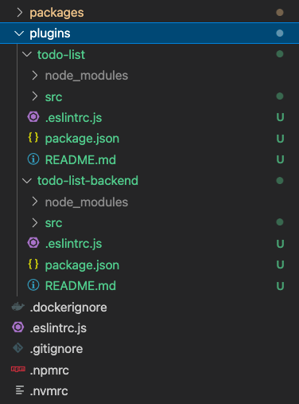

The following tutorial is designed to help plugin authors add support for permissions to their plugins. We'll add support for permissions to example `todo-list` and `todo-list-backend` plugins, but the process should be similar for other plugins!

The rest of this page is focused on adding the `todo-list` and `todo-list-backend` plugins to your Backstage instance. If you want to add support for permissions to your own plugin instead, feel free to skip to the [next section](./02-adding-a-basic-permission-check.md).

## Setup for the Tutorial

We will use a "Todo list" feature, composed of the `todo-list` and `todo-list-backend` plugins.

The source code is available here:

- [todo-list](https://github.com/backstage/backstage/blob/master/contrib/plugins/todo-list)
- [todo-list-backend](https://github.com/backstage/backstage/blob/master/contrib/plugins/todo-list-backend)

1.  Copy-paste the two folders into the plugins folder of your backstage application repository or run the following script from the root of your backstage application:

    ```bash
    $ curl https://codeload.github.com/backstage/backstage/zip/refs/heads/master | \
        tar -C plugins --strip-components=1 -xv \
        backstage-master/contrib/plugins/todo-list \
        backstage-master/contrib/plugins/todo-list-backend
    ```

    Your application structure should look something like this:

    

2.  add the frontend and backend plugins as dependencies of your Backstage app and backend respectively:

    ```
    $ yarn workspace backend add @internal/plugin-todo-list-backend@^1.0.0
    $ yarn workspace app add @internal/plugin-todo-list@^1.0.0
    ```

3.  Include the backend and frontend plugin in your application:

    Create a new `packages/backend/src/plugins/todolist.ts` with the following content:

    ```javascript
    import { IdentityClient } from '@backstage/plugin-auth-node';
    import { createRouter } from '@internal/plugin-todo-list-backend';
    import { Router } from 'express';
    import { PluginEnvironment } from '../types';

    export default async function createPlugin({
      logger,
      discovery,
    }: PluginEnvironment): Promise<Router> {
      return await createRouter({
        logger,
        identity: IdentityClient.create({
          discovery,
          issuer: await discovery.getExternalBaseUrl('auth'),
        }),
      });
    }
    ```

    Apply the following changes to `packages/backend/src/index.ts`:

    ```diff
      import techdocs from './plugins/techdocs';
    + import todoList from './plugins/todolist';
      import search from './plugins/search';

      ...

      const searchEnv = useHotMemoize(module, () => createEnv('search'));
      const appEnv = useHotMemoize(module, () => createEnv('app'));
    + const todoListEnv = useHotMemoize(module, () => createEnv('todolist'));

      ...

      apiRouter.use('/proxy', await proxy(proxyEnv));
      apiRouter.use('/search', await search(searchEnv));
      apiRouter.use('/permission', await permission(permissionEnv));
    + apiRouter.use('/todolist', await todoList(todoListEnv));
      // Add backends ABOVE this line; this 404 handler is the catch-all fallback
      apiRouter.use(notFoundHandler());
    ```

    Apply the following changes to `packages/app/src/App.tsx`:

    ```diff
    + import { TodoListPage } from '@internal/plugin-todo-list';

    ...

        <Route path="/search" element={<SearchPage />}>
          {searchPage}
        </Route>
        <Route path="/settings" element={<UserSettingsPage />} />
    +   <Route path="/todo-list" element={<TodoListPage />} />
      </FlatRoutes>
    ```

Now if you start your application you should be able to reach the `/todo-list` page:


---

// TODO(vinzscam): split the tutorial in two parts:
// - plugins relying on external entities
// - plugins owning their own entities

## Integrate the new plugin

If you play with the UI, you will notice that it is possible to perform a few actions:

- create a new todo item (`POST /todos`)
- view todo items (`GET /todos`)
- edit an existing todo item (`PUT /todos`)

Let's try to bring authorization on top of each one of them.
