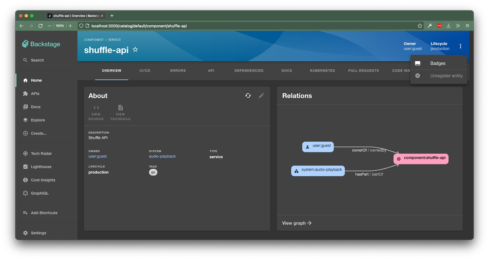

If you prefer to watch a video instead, you can start with this video introduction:

<iframe width="560" height="315" src="https://www.youtube.com/embed/EQr9tFClgG0" title="YouTube video player" frameborder="0" allow="accelerometer; autoplay; clipboard-write; encrypted-media; gyroscope; picture-in-picture" allowfullscreen></iframe>

> Note: This video was recorded in the January 2022 Contributors Session using `@backstage/create-app@0.4.14`. Some aspects of the demo may have changed in later releases.

Backstage integrators control permissions by writing a policy. In general terms, a policy is simply an async function which receives a request to authorize a specific action for a user and (optional) resource, and returns a decision on whether to authorize that permission. Integrators can implement their own policies from scratch, or adopt reusable policies written by others.

## Prerequisites

The permissions framework depends on a few other Backstage systems, which must be set up before we can dive into writing a policy.

### Upgrade to the latest version of Backstage

The permissions framework itself is new to Backstage and still evolving quickly. To ensure your version of Backstage has all the latest permission-related functionality, it’s important to upgrade to the latest version. The [Backstage upgrade helper](https://backstage.github.io/upgrade-helper/) is a great tool to help ensure that you’ve made all the necessary changes during the upgrade!

### Enable backend-to-backend authentication

Backend-to-backend authentication allows Backstage backend code to verify that a given request originates from elsewhere in the Backstage backend. This is useful for tasks like collation of catalog entities in the search index. This type of request shouldn’t be permissioned, so it’s important to configure this feature before trying to use the permissions framework.

To set up backend-to-backend authentication, follow the [backend-to-backend authentication docs](../tutorials/backend-to-backend-auth.md).

### Supply an identity resolver to populate group membership on sign in

**Note**: If you are working off of an existing Backstage instance, you likely already have some form of an identity resolver set up.

Like many other parts of Backstage, the permissions framework relies on information about group membership. This simplifies authoring policies through the use of groups, rather than requiring each user to be listed in the configuration. Group membership is also often useful for conditional permissions, for example allowing permissions to act on an entity to be granted when a user is a member of a group that owns that entity.

[The IdentityResolver docs](../auth/identity-resolver.md) describe the process for resolving group membership on sign in.

## Optionally add cookie-based authentication

Asset requests initiated by the browser will not include a token in the `Authorization` header. If these requests check authorization through the permission framework, as done in plugins like TechDocs, then you'll need to set up cookie-based authentication. Refer to the ["Authenticate API requests"](https://github.com/backstage/backstage/blob/master/contrib/docs/tutorials/authenticate-api-requests.md) tutorial for a demonstration on how to implement this behavior.

## Integrating the permission framework with your Backstage instance

### 1. Set up the permission backend

The permissions framework uses a new `permission-backend` plugin to accept authorization requests from other plugins across your Backstage instance. The Backstage backend does not include this permission backend by default, so you will need to add it:

1. Add `@backstage/plugin-permission-backend` as a dependency of your Backstage backend:

```bash
$ yarn workspace backend add @backstage/plugin-permission-backend
```

2. Add the following to a new file, `packages/backend/src/plugins/permission.ts`. This adds the permission-backend router, and configures it with a policy which allows everything.

```typescript
import { IdentityClient } from '@backstage/plugin-auth-node';
import { createRouter } from '@backstage/plugin-permission-backend';
import {
  AuthorizeResult,
  PolicyDecision,
} from '@backstage/plugin-permission-common';
import { PermissionPolicy } from '@backstage/plugin-permission-node';
import { Router } from 'express';
import { PluginEnvironment } from '../types';

class TestPermissionPolicy implements PermissionPolicy {
  async handle(): Promise<PolicyDecision> {
    return { result: AuthorizeResult.ALLOW };
  }
}

export default async function createPlugin(
  env: PluginEnvironment,
): Promise<Router> {
  return await createRouter({
    config: env.config,
    logger: env.logger,
    discovery: env.discovery,
    policy: new TestPermissionPolicy(),
    identity: IdentityClient.create({
      discovery: env.discovery,
      issuer: await env.discovery.getExternalBaseUrl('auth'),
    }),
  });
}
```

3. Wire up the permission policy in `packages/backend/src/index.ts`. [The index in the example backend](https://github.com/backstage/backstage/blob/master/packages/backend/src/index.ts) shows how to do this. You’ll need to import the module from the previous step, create a plugin environment, and add the router to the express app:

```diff
  import proxy from './plugins/proxy';
  import techdocs from './plugins/techdocs';
  import search from './plugins/search';
+ import permission from './plugins/permission';

  ...

  const techdocsEnv = useHotMemoize(module, () => createEnv('techdocs'));
  const searchEnv = useHotMemoize(module, () => createEnv('search'));
  const appEnv = useHotMemoize(module, () => createEnv('app'));
+ const permissionEnv = useHotMemoize(module, () => createEnv('permission'));

  ...

  apiRouter.use('/techdocs', await techdocs(techdocsEnv));
  apiRouter.use('/proxy', await proxy(proxyEnv));
  apiRouter.use('/search', await search(searchEnv));
+ apiRouter.use('/permission', await permission(permissionEnv));
```

### 2. Enable and test the permissions system

Now that the permission backend is running, it’s time to enable the permissions framework and make sure it’s working properly.

1. Set the property `permission.enabled` to `true` in `app-config.yaml`.

```yaml
permission:
  enabled: true
```

2. Update the PermissionPolicy in `packages/backend/src/plugins/permission.ts` to disable a permission that’s easy for us to test. This policy rejects any attempt to delete a catalog entity:

```diff
  import { IdentityClient } from '@backstage/plugin-auth-node';
  import { createRouter } from '@backstage/plugin-permission-backend';
  import {
    AuthorizeResult,
    PolicyDecision,
  } from '@backstage/plugin-permission-common';
-  import { PermissionPolicy } from '@backstage/plugin-permission-node';
+ import {
+   PermissionPolicy,
+   PolicyQuery,
+ } from '@backstage/plugin-permission-node';
  import { Router } from 'express';
  import { PluginEnvironment } from '../types';

  class TestPermissionPolicy implements PermissionPolicy {
-   async handle(): Promise<PolicyDecision> {
+   async handle(request: PolicyQuery): Promise<PolicyDecision> {
+     if (request.permission.name === 'catalog.entity.delete') {
+       return {
+         result: AuthorizeResult.DENY,
+       };
+     }
+
      return { result: AuthorizeResult.ALLOW };
    }
  }
```

3. Now that you’ve made this change, you should find that the unregister entity menu option on the catalog entity page is disabled.



Now that the framework is fully configured, you can craft a permission policy that works best for your organization by utilizing a provided authorization method or by [writing your own policy](./writing-a-policy.md)!
