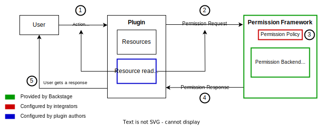

[The previous section](../auth/index.md) covered the various _authentication_ methods of Backstage, but Backstage can also _authorize_ specific data, APIs, or interface actions - meaning that Backstage has the ability to enforce rules about what type of access is allowed for a given user of a system.

By default, Backstage endpoints are not protected, and all actions are available to anyone. However, configuring which users can access which resources and actions is a common need for many organizations. The permission framework allows integrators to achieve this through the use of granular permissioning for those resources and actions.

The permission framework was designed with a few key properties in mind:

- Flexibility: the framework allows integrators to configure many different authorization methods. This could include implementations like role-based access control (RBAC), attribute-based access control (ABAC), bespoke logic expressed in code, or integrations with external authorization providers.

- Usability: the permission framework allows integrators to focus on configuring what they care about (the permission policy) by providing all of its moving parts out of the box. It also allows plugin authors to integrate support for permissions in their plugins without having to make any changes in Backstage core.

## How does it work?

- **Plugin authors** can add permission support in their plugins by declaring which resources from their plugins can be placed behind authorization and what types of actions users may take upon those resources.

- **Contributors** can implement and share authorization methods (such as RBAC).

- **Integrators** can author or configure policies that define which users can take certain actions upon which resources.

1. The user triggers a request to perform some action. The request specifies the authorization details using the permission specified by the plugin (in this case, a resource read action).

   - The action may be triggered by a user interacting with the UI, but it can also be a direct request to the plugin's backend.

2. The plugin backend sends a request to the permission framework's backend with the authorization details.

3. The permission framework's backend delegates the authorization decision to the permission policy, which is specified by the integrator using code, a provided authorization method (such as RBAC), or integrations with external authorization providers.

4. An authorization decision is sent to the plugin from the permission backend.

## How do I get started?

See the "[getting started](./getting-started.md)" permission documentation for Backstage integrators.

If you are a plugin author, see the permission [documentation for plugin authors](plugin-authors/01-setup.md) on how to integrate permissions into your plugin.
