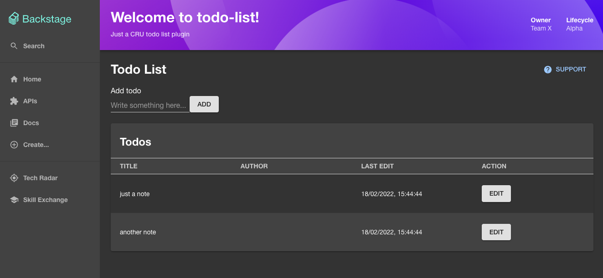

The following tutorial is designed to help plugin authors add support for permissions to their plugins. We'll add support for permissions to example `todo-list` and `todo-list-backend` plugins, but the process should be similar for other plugins!

The rest of this page is focused on adding the `todo-list` and `todo-list-backend` plugins to your Backstage instance. If you want to add support for permissions to your own plugin instead, feel free to skip to the [next section](./02-adding-a-basic-permission-check.md).

## Setup for the Tutorial

We will use a "Todo list" feature, composed of the `todo-list` and `todo-list-backend` plugins, as well as their dependency, `todo-list-common`.

The source code is available here:

- [todo-list](https://github.com/backstage/backstage/blob/master/plugins/example-todo-list)
- [todo-list-backend](https://github.com/backstage/backstage/blob/master/plugins/example-todo-list-backend)
- [todo-list-common](https://github.com/backstage/backstage/blob/master/plugins/example-todo-list-common)

1. Copy-paste the three folders into the plugins folder of your backstage application repository (removing the `example-` prefix from each folder) or run the following script from the root of your backstage application:

   ```bash
   $ cd $(mktemp -d)
     git clone --depth 1 --quiet --no-checkout --filter=blob:none https://github.com/backstage/backstage.git .
     git checkout master -- plugins/example-todo-list/
     git checkout master -- plugins/example-todo-list-backend/
     git checkout master -- plugins/example-todo-list-common/
     sed -i '' 's/workspace:\^/\*/g' plugins/example-todo-list/package.json
     sed -i '' 's/workspace:\^/\*/g' plugins/example-todo-list-backend/package.json
     sed -i '' 's/workspace:\^/\*/g' plugins/example-todo-list-common/package.json
     for file in plugins/*; do mv "$file" "$OLDPWD/${file/example-todo/todo}"; done
     cd -
   ```

   The `plugins` directory of your project should now include `todo-list`, `todo-list-backend`, and `todo-list-common`.

   **Important**: if you are on **Windows**, make sure you have WSL and git installed on your machine before executing the script above.

2. Add these packages as dependencies for your Backstage app:

   ```sh
   # From your Backstage root directory
   yarn --cwd packages/backend add @internal/plugin-todo-list-backend @internal/plugin-todo-list-common
   yarn --cwd packages/app add @internal/plugin-todo-list
   ```

3. Include the backend and frontend plugin in your application:

   Create a new `packages/backend/src/plugins/todolist.ts` with the following content:

   ```typescript title="packages/backend/src/plugins/todolist.ts"
   import { DefaultIdentityClient } from '@backstage/plugin-auth-node';
   import { createRouter } from '@internal/plugin-todo-list-backend';
   import { Router } from 'express';
   import { PluginEnvironment } from '../types';

   export default async function createPlugin({
     logger,
     discovery,
   }: PluginEnvironment): Promise<Router> {
     return await createRouter({
       logger,
       identity: DefaultIdentityClient.create({
         discovery,
         issuer: await discovery.getExternalBaseUrl('auth'),
       }),
     });
   }
   ```

   Apply the following changes to `packages/backend/src/index.ts`:

   ```ts title="packages/backend/src/index.ts"
   import techdocs from './plugins/techdocs';
   /* highlight-add-next-line */
   import todoList from './plugins/todolist';
   import search from './plugins/search';

   async function main() {
     const searchEnv = useHotMemoize(module, () => createEnv('search'));
     const appEnv = useHotMemoize(module, () => createEnv('app'));
     /* highlight-add-next-line */
     const todoListEnv = useHotMemoize(module, () => createEnv('todolist'));
     // ..

     apiRouter.use('/proxy', await proxy(proxyEnv));
     apiRouter.use('/search', await search(searchEnv));
     apiRouter.use('/permission', await permission(permissionEnv));
     /* highlight-add-next-line */
     apiRouter.use('/todolist', await todoList(todoListEnv));
     // Add backends ABOVE this line; this 404 handler is the catch-all fallback
     apiRouter.use(notFoundHandler());
     // ..
   }
   ```

   Apply the following changes to `packages/app/src/App.tsx`:

   ```tsx title="packages/app/src/App.tsx"
   /* highlight-add-next-line */
   import { TodoListPage } from '@internal/plugin-todo-list';

   const routes = (
     <FlatRoutes>
       <Route path="/search" element={<SearchPage />}>
         {searchPage}
       </Route>
       <Route path="/settings" element={<UserSettingsPage />} />
       {/* highlight-add-next-line */}
       <Route path="/todo-list" element={<TodoListPage />} />
       {/* ... */}
     </FlatRoutes>
   );
   ```

Now if you start your application you should be able to reach the `/todo-list` page:



---

## Integrate the new plugin

If you play with the UI, you will notice that it is possible to perform a few actions:

- create a new todo item (`POST /todos`)
- view todo items (`GET /todos`)
- edit an existing todo item (`PUT /todos`)

Let's try to bring authorization on top of each one of them.
