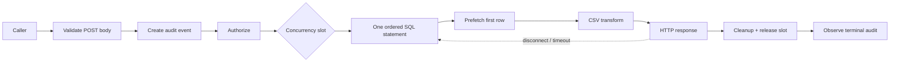

# Usage Analytics CSV Export - Plan

## Goal Capsule

Deliver one authenticated backend endpoint that exports raw activity or
page-usage summaries through a stable CSV pipeline. A person must be able to
open the page export and see the most-used pages first, while a future analytics
skill must be able to consume both datasets without guessing field semantics or
guessing how spreadsheet-safe strings were encoded.

The production path uses one database statement per export and streams its
result through CSV serialization into the HTTP response. PostgreSQL receives
the bounded-memory guarantee. SQLite remains behaviorally compatible for local
development and tests, but may materialize the statement result because of its
Knex driver.

The implementation must stop for clarification if it requires a database
migration, a new permission, an asynchronous job system, or a public common
package API. The execution tail owns focused tests, documentation, formatting,
type checking, linting, API reports, and the backend-package changeset. It does
not own a frontend download control or the future analytics skill.

## Product Contract

### Summary

Add `POST /v1/export` to the usage analytics backend. A required `dataset`
parameter selects one fixed CSV contract:

- `activity` exports event-level rows in journey order.
- `pages` exports one aggregate row per page, ordered by popularity.

The endpoint accepts the established report filters, returns the complete
result of one database statement, and exposes neither pagination nor
client-controlled sorting.

### Problem Frame

The JSON reports are intentionally paginated for frontend tables. Treating them
as an export source forces callers to coordinate pages and ordering, and makes
large analyses easy to truncate accidentally. A dedicated export must produce
one deterministic artifact without loading the production result into
application memory or repeatedly recalculating aggregates.

### Actors

- A1. Aggregate analytics reader: may export page summaries that do not select
  an individual user.
- A2. Detailed analytics reader: may export event-level activity and page
  summaries filtered to an individual user.
- A3. Future analytics skill: consumes the documented wire contract without
  depending on frontend code.

### Requirements

#### Endpoint and filters

- R1. `POST /v1/export` accepts a strictly validated JSON body and requires
  `dataset` to be exactly `activity` or `pages`. Missing, case-mismatched, or
  unsupported values return `400` before CSV headers are committed.
- R2. Both datasets accept `from`, `to`, `userEntityRef`, `path`, and
  `pluginId` in the JSON body, using the existing default range, 365-day
  maximum, inclusive `from`, exclusive `to`, and exact-match filter semantics.
- R3. `activity` additionally accepts any `action`. `pages` accepts an omitted
  action or `action=navigate`; every other action returns `400` rather than a
  misleading empty export.
- R4. The strict body schema rejects `limit`, `offset`, `orderField`,
  `orderDirection`, and every unknown field. Export always returns its full
  statement result in canonical order.

#### Authorization, privacy, and audit

- R5. `activity` always requires `usage-analytics.details.read`.
- R6. `pages` requires `usage-analytics.aggregates.read`, except that
  `userEntityRef` raises the requirement to
  `usage-analytics.details.read`, matching the existing report boundary.
- R7. Body validation, audit-event creation, authorization, database stream
  acquisition, and the first iterator read complete before CSV headers or bytes
  are written.
- R8. Every successful export sets `Cache-Control: no-store` and does not set
  `Content-Length`.
- R9. Every valid export attempt creates a Backstage `AuditorService` event
  named `export`. The native event receives the original POST request so it can
  resolve the actor; `originalUrl` contains no filters because filters live in
  the body. Failure to create the initiated event aborts before authorization,
  stream acquisition, and response headers. Success is recorded only after the
  pipeline completes; denial, failure, timeout, and cancellation schedule one
  failed terminal outcome. Terminal auditing is observed but never retains an
  export slot or delays the already-determined HTTP outcome.
- R10. Audit metadata contains only dataset, normalized range, names of applied
  filters, outcome, and emitted row count. It never contains request-body
  values or CSV cells. Terminal failures use controlled errors such as
  `export-denied`, `export-timeout`, `export-cancelled`, or `export-failed`,
  never raw database or serialization errors. If terminal audit persistence
  fails, the response lifecycle is not rewritten; a sanitized operational
  error is logged and the initiated event remains evidence of an incomplete
  audit lifecycle. This privacy guarantee covers plugin-supplied metadata and
  controlled errors; a custom `AuditorService` implementation remains
  responsible for not serializing arbitrary request bodies.

#### Stable CSV contract

- R11. `activity` uses this exact header order:
  `eventId,occurredAt,userEntityRef,sessionId,action,subject,value,pluginId,extensionId,currentPath,previousPath`.
- R12. `pages` uses this exact header order:
  `path,pageViews,uniqueUsers,estimatedDurationSeconds,lastViewedAt`.
- R13. Optional `null`, `undefined`, and empty-string values are semantically
  absent and serialize as empty cells; the export intentionally does not
  distinguish those representations. Non-empty strings remain reversible.
  Timestamps use UTC ISO 8601. Counts use base-10 integers. Duration and event
  `value` remain unlocalized numbers.
- R14. CSV uses UTF-8 without a BOM, comma delimiters, LF (`\n`) record
  delimiters, and `text/csv; charset=utf-8`. The serializer owns quoting for
  commas, quotes, CR, and LF.
- R15. Spreadsheet neutralization is injective and reversible. Before CSV
  serialization, prefix one apostrophe to a string when it begins with an
  apostrophe, tab (U+0009), CR (U+000D), or LF (U+000A), or when zero or more
  leading characters from tab, CR, LF, and ASCII space (U+0020) are followed
  by `=`, `+`, `-`, or `@`. A machine consumer decodes only values whose suffix
  after the first apostrophe matches the same predicate, removing exactly that
  one prefix.
- R16. A zero-row result returns `200` and the selected dataset's header row.
- R17. `Content-Disposition` uses a server-generated filename containing only
  dataset and normalized UTC range dates. Request-body values never enter the
  filename.
- R18. `activity` is ordered by `occurredAt ASC, eventId ASC`.
  `pages` is ordered by `pageViews DESC`, then by path using the same binary
  UTF-8 byte order in both engines (`COLLATE "C"` in PostgreSQL and
  `COLLATE BINARY` in SQLite).
- R19. Page metrics retain the existing `getPages` semantics. Dwell seconds
  come from a following navigation event's `value` and are attributed to
  `previousPath`.

#### Streaming and resource behavior

- R20. Each dataset executes as one SQL statement. `activity` directly selects
  events; `pages` performs its page and dwell aggregation once. Export does not
  run total-count queries, continuation queries, temporary tables, or
  application-side sorting.
- R21. PostgreSQL streams the statement through Knex and
  `pg-query-stream`, bounding application memory by database and HTTP stream
  buffers. SQLite executes the same logical statement and order but may
  materialize the result in memory; this limitation is documented as
  development/test-only.
- R22. Node's stream pipeline propagates backpressure. After authorization and
  slot acquisition, the router installs one cancellation controller before
  stream acquisition. A deadline timer aborts it; request `aborted` and response
  `close` abort it only when the response has not completed. Request `close` is
  not used because normal POST-body completion may emit it. Stream acquisition,
  first-row prefetch, and pipeline consumption race cancellation. A stream
  arriving after cancellation is destroyed immediately. Cleanup is idempotent
  and releases listeners, timer, stream/connection, response, and slot before
  terminal auditing is scheduled. PostgreSQL cursor work is interrupted.
  SQLite delivery is cancelled and cleaned up after its driver returns, but an
  already executing materializing query is not promised to be interruptible.
- R23. A failure before headers are committed uses the normal JSON error path.
  In particular, timeout before headers returns `504`; invalid input,
  authorization, concurrency, and internal failures retain their normal
  `400`/`403`/`429`/`500` status mapping. A failure after streaming begins
  terminates the partial response and never appends a CSV or JSON error record.
- R24. Export allows at most two active requests per backend instance by
  default and times each request out after five minutes by default. Both values
  are configurable as positive integers under `usageAnalytics.export`.
  Requests beyond the concurrency limit return `429` before headers and do not
  wait in an in-process queue.
- R25. Each export observes the statement-level database snapshot established
  by its single query. Events committed after that snapshot are intentionally
  outside the artifact; no cross-query pagination consistency caveat applies.

### API Flow

1. Validate the strict dataset-specific request body and freeze the normalized
   range.
2. Create a native audit event containing only safe metadata.
3. Authorize the dataset and filter sensitivity.
4. Acquire a concurrency slot, install disconnect listeners, and start the
   timeout controller.
5. Race cancellation against single-stream acquisition and first-row prefetch;
   destroy any stream that resolves after cancellation.
6. Commit download headers and pipeline the first row plus remaining iterator
   through the CSV transform to the response.
7. Determine success only after clean pipeline completion; otherwise determine
   the precise failure outcome.
8. Release timeout, stream, database connection, listeners, response, and
   concurrency slot in one idempotent cleanup path, then schedule the terminal
   audit attempt with rejection logging independent of request completion.

### Acceptance Examples

- AE1. An aggregate reader exports `pages`; the first data rows are the pages
  with the highest view count.
- AE2. The same reader exports `activity`; authorization returns `403`, no CSV
  headers are written, and the denied attempt is audited without sensitive
  filter values.
- AE3. A detailed reader exports
  a pages body containing `userEntityRef: "user:default/alice"`; only Alice's
  events contribute to the aggregate and detailed permission is required.
- AE4. A pages body with `action: "navigate"` is valid; `action: "click"`
  returns `400`.
- AE5. A non-empty path contains commas, quotes, newlines, a formula prefix, or
  begins with an apostrophe. The CSV remains safe for spreadsheets and decoding
  restores the exact original value without collisions. Optional null and empty
  strings both decode as the documented absent value.
- AE6. More than 100 matching activity events are returned from one ordered
  statement, proving the export did not inherit report pagination.
- AE7. No rows match; the response contains exactly the stable header record.
- AE8. Two configured long-running exports occupy both instance slots; a third
  valid and authorized request receives `429`. Cancelling either request frees
  a slot.
- AE9. A database error during first-row prefetch returns the normal JSON error.
  An error after headers closes the partial response and records a failed audit
  event.

### Success Criteria

- `pages` can be inspected directly for the most-used pages without client-side
  sorting.
- A future skill can decode every non-empty string, treat empty optional cells
  as absent, and reconstruct ordered activity from a fixed schema.
- PostgreSQL export memory remains bounded and page aggregation runs once.
- SQLite produces the same values and ordering for supported test fixtures.
- Permissions, the native audit lifecycle, concurrency, timeout, and
  cancellation protect detailed data and backend capacity.

### Scope Boundaries

In scope:

- backend POST route, strict body validation, native audit integration, minimal
  instance-local concurrency accounting, timeout/cancellation, single-query
  database streams, CSV serialization, configuration, tests, documentation,
  dependencies, and changeset wording.

Deferred:

- frontend download controls and progress UI;
- the analytics skill that interprets exported files;
- per-user or distributed rate limiting;
- asynchronous jobs, ZIP archives, object storage, schedules, and export
  history;
- migrations or indexes without measured query-plan evidence;
- datasets beyond `activity` and `pages`.

### Sources

- Existing route, filters, and permission boundary:
  `plugins/usage-analytics-backend/src/router.ts`
- Existing page aggregation, activity mapping, and database portability tests:
  `plugins/usage-analytics-backend/src/DatabaseAnalyticsStore.ts`,
  `plugins/usage-analytics-backend/src/DatabaseAnalyticsStore.test.ts`
- Native auditor contract and mock:
  `packages/backend-plugin-api/src/services/definitions/AuditorService.ts`,
  `packages/backend-test-utils/src/services/mockServices.ts`
- Existing auditor usage around HTTP operations:
  `plugins/catalog-backend/src/service/createRouter.ts`
- Existing CSV spreadsheet-cell convention:
  `plugins/catalog/src/components/CatalogExportButton/file-download/serializeEntities.ts`
- [OWASP CSV Injection](https://owasp.org/www-community/attacks/CSV_Injection)
- [Node.js stream pipeline](https://nodejs.org/api/stream.html#streampipelinestreams-options)

## Planning Contract

### Current State

- F1. `AnalyticsService` already owns range parsing and configuration-backed
  retention behavior; report ranges default to 30 days and cap at 365 days.
- F2. `getActivity` and `getPages` share the required data semantics but add UI
  pagination and total-count queries.
- F3. `getPages` calculates page views, unique users, last use, and dwell
  attributed through `previous_path`.
- F4. PostgreSQL 14 and SQLite 3 are exercised through `TestDatabases`, while
  the README already recommends PostgreSQL for production.
- F5. Knex's PostgreSQL stream path requires `pg-query-stream`; the plugin does
  not currently declare it. Knex's SQLite stream path materializes rows before
  emitting them.
- F6. The monorepo already uses `csv-stringify`, but the backend package must
  declare it directly before importing it.
- F7. `coreServices.auditor` and `mockServices.auditor()` provide the native
  audit lifecycle required by R9 and R10.
- F8. The plugin has no endpoint-specific distributed rate limiter. A minimal
  router-local counter can bound concurrent work per instance without adding a
  queue or abstraction.

### Key Technical Decisions

- KTD1. One endpoint exposes two dataset contracts.
  (session-settled: user-approved — chosen over separate endpoints or a single
  limited export: one endpoint gives people and downstream analysis one stable
  entry point.) Governs R1-R4.
- KTD2. Use one ordered SQL statement per export and stream it in PostgreSQL.
  (session-settled: user-approved — chosen over keyset batches and temporary
  materialization: one statement avoids mutable aggregate cursors, repeated
  aggregation, and cleanup infrastructure.) Governs R18 and R20-R25.
- KTD3. Reuse the existing report query construction and row mapping while
  separating data selection from paginated JSON presentation. Governs R2, R3,
  R13, and R19.
- KTD4. Use direct runtime dependencies on `pg-query-stream` and
  `csv-stringify`, then connect the database iterator, serializer, and Express
  response with Node `pipeline`. This delegates database cursor behavior, CSV
  quoting, and backpressure to focused standard components. Governs R14 and
  R20-R23.
- KTD5. Make spreadsheet protection reversible by escaping the escape prefix
  itself.
  (session-settled: user-approved — chosen over one-way apostrophe prefixing:
  the future analytics skill must recover exact non-empty values without
  collisions.) Governs R15.
- KTD6. Treat headers, order, null representation, numeric semantics, and the
  escape/decode rule as the versioned `/v1` contract. Incompatible changes
  require a versioned endpoint. Governs R11-R19.
- KTD7. Bound synchronous work with a configurable instance-local counter and
  timeout.
  (session-settled: user-approved — chosen over an in-process queue or
  asynchronous export system: immediate `429` and cancellation protect the
  database without introducing job lifecycle state.) Governs R22 and R24.
- KTD8. Use `AuditorService` rather than custom logs.
  (session-settled: user-approved — chosen over bespoke audit storage or logger
  calls: the native service already owns request identity and audit lifecycle.)
  Governs R7, R9, and R10.
- KTD9. Carry filters in a strict POST body rather than a GET query string. The
  native auditor can retain the original request and actor while access logs,
  browser history, and `request.originalUrl` contain no user or path filters.
  Audit failures receive controlled errors rather than raw infrastructure
  errors. Governs R1-R4, R9, and R10.
- KTD10. Canonicalize optional null and empty strings as one absent value at the
  export projection boundary. Analytics does not benefit from distinguishing
  two forms of missing metadata, and a public sentinel would complicate every
  consumer. Non-empty string escaping remains injective. Governs R13 and R15.
- KTD11. Make deterministic page ordering independent of installation collation
  through explicit binary collation in each supported SQL dialect. Governs R18
  and R21.
- KTD12. Separate request-resource cleanup from terminal audit persistence.
  Cleanup and slot release are synchronous/idempotent at pipeline settlement;
  the terminal audit promise is rejection-observed but not awaited by the HTTP
  or limiter lifecycle. Governs R9, R10, R22, and R24.

### High-Level Technical Design

The store exposes internal async iterables backed by Knex query streams.
Activity selects and orders event columns directly. Pages extracts the existing
page and dwell subqueries into a reusable aggregate builder, joins them once,
and applies the canonical aggregate order. Neither export path calls the
paginated report method or calculates totals.

The router remains orchestration-only. It owns strict body validation,
permission choice, the two-value instance counter, timeout and disconnect
signals, first-row prefetch, response headers, pipeline lifecycle, sanitized
logging, and audit outcome. Dataset column projection, reversible cell
escaping, and CSV configuration live in a small backend-internal `CsvExport`
module that knows neither Express nor Knex.

### Constraints and Sequencing

- Preserve every existing JSON endpoint and metric definition.
- Keep export types and helpers internal to the backend package.
- Add no database migration or public common-package type.
- Do not add a generic limiter, export framework, repository abstraction, or
  custom error hierarchy.
- Validate configuration once during plugin initialization; invalid non-positive
  values fail plugin startup rather than changing behavior at request time.
- Acquire the concurrency slot only after authorization and always release it
  through one idempotent cleanup function before terminal auditing.
- Bind request `aborted` and response `close` only after slot acquisition and
  before database stream acquisition. Never treat normal request-body
  completion as cancellation.
- Prefetch exactly one iterator result before headers, then yield it back into
  the same iterator so the database statement is not restarted.
- Implement settings and store/CSV primitives before route orchestration.

### Risks and Mitigations

- PostgreSQL needs a new direct cursor dependency. Package tests and API reports
  must verify it is present in the published backend package.
- SQLite cannot honor the production memory guarantee. Tests prove semantic
  parity, and README documentation prevents production operators from assuming
  otherwise.
- A mid-stream failure leaves a partial download. The connection is terminated,
  a failed audit outcome is attempted, and documentation states that only clean
  completion is valid.
- An instance-local counter does not coordinate multiple replicas. It still
  protects each connection pool without distributed state; distributed
  limiting is deferred until deployment evidence requires it.
- A five-minute timeout may be too short for some installations. Configuration
  permits an explicit increase, while the default prevents unlimited
  synchronous work. The two-slot/five-minute defaults are conservative starting
  points, not measured capacity targets; operators tune them to their database
  pool and observed export duration.
- Detailed CSV files leave server-side access control after download. The
  README must label them sensitive behavioral data and place storage/sharing
  policy on the operator.

## Implementation Units

### U1. Add validated export settings

**Goal:** Resolve resource limits once and expose them to route orchestration.

**Requirements:** R2, R24

**Files:**

- `plugins/usage-analytics-backend/config.d.ts`
- `plugins/usage-analytics-backend/src/AnalyticsService.ts`
- `plugins/usage-analytics-backend/src/AnalyticsService.test.ts`

**Approach:**

- Add optional positive-integer `maxConcurrent` and `timeoutSeconds` settings
  under `usageAnalytics.export`.
- Default to two active exports and five minutes.
- Keep the existing report range parser and maximum unchanged.
- Fail initialization for zero, negative, fractional, or non-finite values.

**Test Scenarios:**

- Defaults resolve when the export block is absent.
- Valid overrides are returned unchanged.
- Every invalid numeric shape is rejected during service construction.
- Existing retention and report-range behavior remains unchanged.

**Verification:** Run the focused `AnalyticsService` tests.

### U2. Add single-statement export streams

**Goal:** Produce deterministic datasets without report pagination, repeat
aggregation, or application-side sorting.

**Requirements:** R2, R3, R13, R18-R21, R25

**Files:**

- `plugins/usage-analytics-backend/src/DatabaseAnalyticsStore.ts`
- `plugins/usage-analytics-backend/src/types.ts`
- `plugins/usage-analytics-backend/src/DatabaseAnalyticsStore.test.ts`
- `plugins/usage-analytics-backend/package.json`
- `yarn.lock`

**Approach:**

- Extract reusable activity selection/mapping and page aggregate construction
  from the paginated report methods.
- Expose backend-internal async iterables backed by one Knex stream per export.
- Apply activity ordering and dialect-specific binary page tie-breaking inside
  SQL.
- Omit count queries and reuse the existing filters and page semantics.
- Declare `pg-query-stream` directly for the PostgreSQL cursor path.
- Ensure iterator return/destroy releases the database connection.

**Test Scenarios:**

- PostgreSQL and SQLite return identical values and canonical order, including
  tied page paths containing ASCII case differences and non-ASCII characters.
- More than 100 activity rows prove there is no inherited report limit.
- Tied timestamps and page counts use their required tie-breakers.
- Page dwell attribution and every supported filter match existing reports.
- Instrumented queries prove one data statement and no count statement per
  dataset.
- Early iterator return releases the connection and permits a subsequent query.
- Empty results complete normally.

**Verification:** Run `DatabaseAnalyticsStore.test.ts` against both supported
database IDs.

### U3. Add the stable and reversible CSV transform

**Goal:** Serialize both datasets safely with exact non-empty strings and the
documented absent-value normalization.

**Requirements:** R11-R16

**Files:**

- `plugins/usage-analytics-backend/src/CsvExport.ts`
- `plugins/usage-analytics-backend/src/CsvExport.test.ts`
- `plugins/usage-analytics-backend/package.json`
- `yarn.lock`

**Approach:**

- Declare `csv-stringify` as a direct runtime dependency.
- Centralize fixed columns and row projection for both datasets.
- Implement only R15's encoder in production. Keep a test-local inverse to prove
  that the documented decoding rule is collision-free; the future skill owns
  its decoder at its own boundary.
- Let the serializer own RFC-style quoting and header generation.
- Accept an async iterable and expose a stream suitable for Node `pipeline`.

**Test Scenarios:**

- Exact header names, order, UTF-8 behavior, line endings, empty cells,
  timestamps, integers, and decimals.
- Null, undefined, and empty optional strings produce the same documented
  absent cell; non-empty sentinel-like and escaped values remain distinct.
- Comma, quote, CR/LF, Unicode, and each dangerous spreadsheet prefix.
- Leading whitespace followed by each formula trigger.
- Original values beginning with one or multiple apostrophes round-trip without
  collision.
- A test-local inverse restores every encoded fixture to the exact original
  string.
- Empty input emits only the header; source failure propagates as an error.

**Verification:** Run the focused `CsvExport` tests.

### U4. Add the authorized, limited, audited HTTP pipeline

**Goal:** Orchestrate download lifecycle without moving SQL or CSV policy into
the router.

**Requirements:** R1-R10, R16-R17, R22-R24

**Files:**

- `plugins/usage-analytics-backend/src/plugin.ts`
- `plugins/usage-analytics-backend/src/plugin.test.ts`
- `plugins/usage-analytics-backend/src/router.ts`
- `plugins/usage-analytics-backend/src/router.test.ts`

**Approach:**

- Inject `coreServices.auditor` through plugin initialization.
- Pass the existing plugin logger to the router for sanitized audit-persistence
  failures.
- Add a strict dataset-specific JSON body schema and reuse existing range/filter
  parsing.
- Create the audit event with the POST request before permission evaluation and
  record only R10 metadata.
- Keep a router-local active-export count with no waiting queue.
- After acquiring a slot, bind request `aborted` and response `close` with a
  clean-completion guard, immediately inspect their current state, start one
  timeout controller, and race it against stream acquisition, first-row
  prefetch, and the stream pipeline.
- If cancellation wins before acquisition resolves, attach cleanup to the late
  result and destroy the stream immediately when it arrives.
- Destroy the active stream from the router timer; do not rely on Knex query
  timeout behavior for a streamed PostgreSQL query.
- Track emitted rows and derive exactly one terminal audit outcome with a
  controlled error category.
- Centralize listener, timeout, stream, slot, and response settlement in one
  idempotent function: return a controlled JSON error before headers, or destroy
  an incomplete response after headers/disconnect. Invoke cleanup before
  scheduling the rejection-observed, non-blocking terminal audit call.

**Test Scenarios:**

- Complete invalid-body and permission matrices, including unknown fields and
  user-filtered pages.
- Filters and normalized range reach the selected store iterator.
- The request passed to the auditor has a path-only `originalUrl`; filter values
  exist only in the parsed body and never enter audit metadata.
- Exact content headers, safe filename, absent content length, and header-only
  empty response.
- Audit-event creation failure prevents permission/store work and returns the
  normal JSON error.
- A first-read failure returns JSON and a failed audit event.
- A later source failure closes the partial response and audits failure.
- Success audits final row count without filter values or CSV content.
- Denial, timeout, and disconnect each produce the correct failure outcome.
  PostgreSQL tests prove active cursor destruction; SQLite tests assert cleanup
  after driver completion without claiming native query interruption.
- Timeout and disconnect are covered independently during delayed stream/pool
  acquisition, first-row prefetch, and writable backpressure. A normal completed
  POST body does not trigger cancellation; an already-aborted request is
  detected immediately after listener registration.
- Raw database/serializer errors never reach `AuditorService.fail`.
- Terminal audit-write failure logs a sanitized operational message, preserves
  the already-determined HTTP outcome, and releases the slot.
- A terminal auditor promise that never settles does not delay the response,
  retain listeners, or occupy an export slot.
- Two active exports cause a third to receive `429`; completion, failure,
  timeout, and disconnect each release the slot.
- A slow writable proves backpressure rather than eager iteration.
- Plugin integration proves the native auditor dependency is wired.

**Verification:** Run focused router and plugin tests.

### U5. Document and publish the contract

**Goal:** Let operators and the future skill use the export without reading
implementation code.

**Requirements:** R1-R25

**Files:**

- `plugins/usage-analytics-backend/README.md`
- `.changeset/bright-pages-report.md`

**Approach:**

- Document POST body examples, permissions, filters, columns, ordering,
  null/numeric semantics, the exact future-consumer decoding algorithm, audit
  behavior, resource defaults, configuration, cancellation, and statement
  snapshot.
- State that empty optional cells mean absent, binary page tie-breaking is part
  of `/v1`, custom auditor implementations must not persist arbitrary request
  bodies, and resource defaults must be tuned to database-pool capacity and
  observed export duration.
- State that PostgreSQL provides production streaming while SQLite may
  materialize results and is intended for local development/tests.
- Mark downloaded activity as sensitive behavioral data.
- Update the existing changeset in adopter-facing language.

**Test Scenarios:**

- README examples form valid requests for both datasets.
- Documented headers and escape/decode rules match unit-test fixtures exactly.
- Configuration defaults and limitations match implementation tests.
- Changeset describes user-visible capability without internal symbols.

**Verification:** Review documentation against R1-R25 and format both markdown
files explicitly.

## Verification Contract

Run from the repository root after dependencies are installed:

1. `CI=1 yarn test plugins/usage-analytics-backend/src/AnalyticsService.test.ts`
2. `CI=1 yarn test plugins/usage-analytics-backend/src/DatabaseAnalyticsStore.test.ts`
3. `CI=1 yarn test plugins/usage-analytics-backend/src/CsvExport.test.ts`
4. `CI=1 yarn test plugins/usage-analytics-backend/src/router.test.ts`
5. `CI=1 yarn test plugins/usage-analytics-backend/src/plugin.test.ts`
6. Run Prettier only on the files listed by U1-U5.
7. `yarn tsc`
8. `yarn lint --fix`
9. `yarn build:api-reports`

Behavioral gates:

- PostgreSQL and SQLite prove identical values and ordering.
- PostgreSQL uses one streamed statement per dataset; pages aggregate once.
- More than 100 exported events prove pagination is absent.
- First-read and mid-stream failures take different, correct response paths.
- Backpressure, timeout, disconnect, and every terminal path release resources.
- Audit metadata contains no CSV values or filter values.
- Concurrency rejection is deterministic and does not queue.

Do not run the full repository test suite, `yarn build`, changeset versioning, or
a release command.

## Definition of Done

- U1 is done when valid settings resolve once and invalid values fail startup.
- U2 is done when both database engines prove one-statement semantic parity,
  canonical order, no pagination/count query, and safe connection release.
- U3 is done when the CSV contract round-trips hostile and apostrophe-prefixed
  values exactly and emits stable headers.
- U4 is done when validation, permissions, audit, prefetch, headers,
  backpressure, cancellation, timeout, concurrency, and cleanup satisfy R1-R10,
  R16-R17, and R22-R24.
- U5 is done when operators and the future analytics skill can rely on the
  documented wire and operational contract.
- All Verification Contract gates pass, or unrelated pre-existing failures are
  recorded with evidence.
- The final diff contains no frontend/common-package changes, migration,
  temporary-table logic, keyset/offset export pagination, job queue,
  duplicated report semantics, generic export framework, debug code, or
  abandoned experimental implementation.
