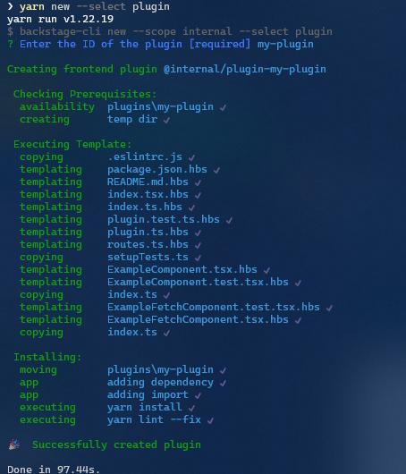

A Backstage Plugin adds functionality to Backstage.

## Create a Plugin

To create a new plugin, make sure you've run `yarn install` and installed
dependencies, then run the following on your command line (a shortcut to
invoking the
[`backstage-cli create-plugin`](../local-dev/cli-commands.md#create-plugin))
from the root of your project.

```bash
yarn create-plugin
```



This will create a new Backstage Plugin based on the ID that was provided. It
will be built and added to the Backstage App automatically.

> If the Backstage App is already running (with `yarn start` or `yarn dev`) you
> should be able to see the default page for your new plugin directly by
> navigating to `http://localhost:3000/my-plugin`.


You can also serve the plugin in isolation by running `yarn start` in the plugin
directory. Or by using the yarn workspace command, for example:

```bash
yarn workspace @backstage/my-plugin start # Also supports --check
```

This method of serving the plugin provides quicker iteration speed and a faster
startup and hot reloads. It is only meant for local development, and the setup
for it can be found inside the plugin's `dev/` directory.
