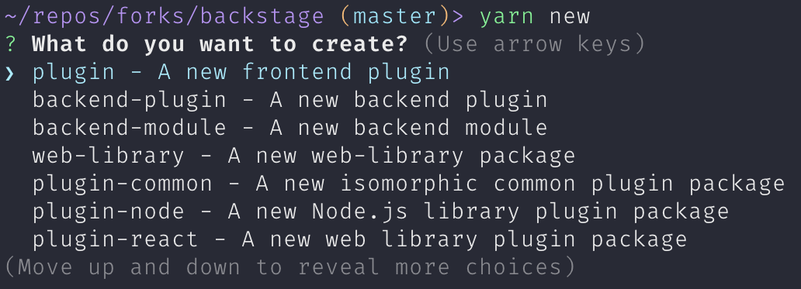

A Backstage Frontend Plugin adds functionality, via extensions, to the Backstage frontend web application.

:::info
To create a Backend Plugin, please see [Creating a Backend Plugin](./backend-plugin.md#creating-a-backend-plugin).
:::

## Create a Frontend Plugin

To create a new frontend plugin from our predefined template, first make sure you've run `yarn install`, then run the
following on your command line (a shortcut to invoking the [`backstage-cli new --select plugin`](../tooling/cli/03-commands.md#new))
from the root of your project.


This will template out the files for a new Frontend Plugin into a folder based on the plugin ID that was provided.

The `App.tsx` file will also be updated to include a route to the new generated demo page, like so:

```tsx title=packages/app/src/App.tsx
<FlatRoutes>
  ...
  <Route path="/my-plugin" element={<MyPluginPage />} />
  ...
</FlatRoutes>
```

:::info
Note on plugin registration!

By default, placing `<MyPluginPage />` into the application is what registers everything in your plugin with the Backstage
application. This is because plugins are discovered when the Backstage `AppManager` traverses the React node tree when
React starts up. When it finds a plugin extension in the visible React tree, it then "registers" the associated plugin
and makes its apis available to `useApi()`.

If you have no need for a root page, you can add your plugin via the `createApp({ plugins: [...] })` field. You can see
an example in the demo [Badges plugin here](https://github.com/backstage/demo/blob/5c31c970ce7e3aae4756b54eb7ad0bb5ebf10c03/packages/app/src/App.tsx#L63).
:::

> If the Backstage App is already running (with `yarn start` or `yarn dev`) you
> should be able to see the default page for your new plugin directly by
> navigating to `http://localhost:3000/my-plugin`.


You can also serve the plugin in isolation by running `yarn start` in the plugin
directory. Or by using the yarn workspace command, for example:

```bash
yarn workspace @backstage/plugin-my-plugin start # Also supports --check
```

This method of serving the plugin provides quicker iteration speed and a faster
startup and hot reloads. It is only meant for local development, and the setup
for it can be found inside the plugin's `dev/` directory.

### Other Plugin Library Package Types

There are other plugin library package types that you can chose from. To be able to
select the type when you create a new plugin just run: `yarn new`. You'll then be asked
what type of plugin you wish to create like this:


