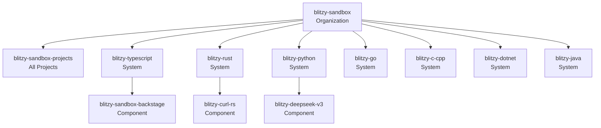

# Project Catalog

## Organization

All projects in the Blitzy Sandbox are organized into **Systems** by primary programming language:

| System              | Language              | Example Projects                                                      |
| ------------------- | --------------------- | --------------------------------------------------------------------- |
| `blitzy-typescript` | TypeScript/JavaScript | Web apps, frontend frameworks, Node.js services                       |
| `blitzy-rust`       | Rust                  | C-to-Rust rewrites (curl, zlib, BlueZ, Exim), C11 compiler            |
| `blitzy-python`     | Python                | ML infrastructure (DeepSeek-V3, vLLM, XLA), ERP (Odoo), coding agents |
| `blitzy-go`         | Go                    | Cloud-native infra (Kubernetes, Grafana, RudderStack)                 |
| `blitzy-c-cpp`      | C/C++                 | Systems programming (Linux kernel, nginx, Redis, OpenSSL)             |
| `blitzy-dotnet`     | .NET/C#               | Enterprise CRM/ERP modernization                                      |
| `blitzy-java`       | Java                  | Jenkins CI/CD, COBOL-to-Java migration                                |

## How Projects Are Discovered

Projects are automatically discovered from the [Blitzy-Sandbox GitHub organization](https://github.com/Blitzy-Sandbox) using the GitHub Entity Provider. Any repository matching the pattern `blitzy-*` that contains a `catalog-info.yaml` is automatically registered.

## Entity Hierarchy

Each component belongs to a system and is owned by the `blitzy-sandbox` group.
