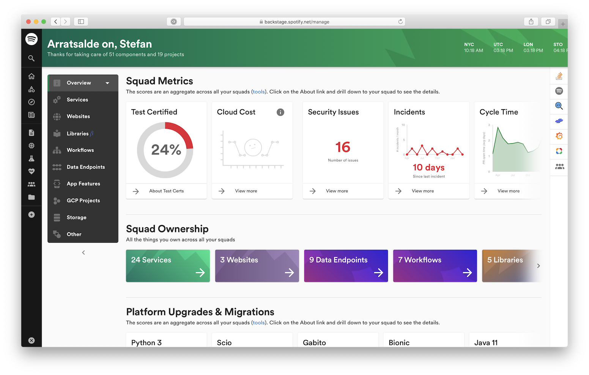
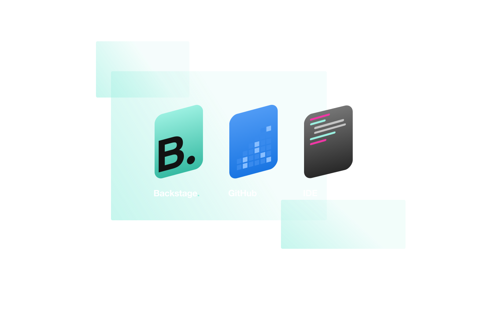

## What is Backstage?

Backstage is Spotify's open source platform for building developer portals.

It’s the first open source infrastructure platform by Spotify that allows you to focus on building your application instead of reinventing the button. With an elegant and unified, yet opinionated UI/UX for all your tooling and infrastructure, Backstage enables engineers to get up and running faster, which ultimately makes their lives easier and more productive.

<!--truncate-->

## As simple as writing a plugin.

Backstage makes it easy to unify all of your infrastructure tooling, services, and documentation under a single, easy-to-use interface. So your engineers will always know where to find the right tool for the job. And engineers will already know how to use each tool — because everything uses the same, familiar UI.

The number of open source infrastructure projects and tools [landscape](https://landscape.cncf.io/) is exploding. As the sheer volume of projects increases, companies and their engineers find it increasingly difficult to keep track and adopt all of the tooling fast enough to keep pace. Most of the tools were built by a different individual, team, or company, which means that there is no single UI/UX, and simply getting the tool installed and started can be a painful challenge- let alone wrangling each tool to work with one another within your existing ecosystem. Due to varying qualities and the varying UI/UX of each open source project, we'd like to introduce Backstage as a best-of-breed platform for developers to use... all in service of ensuring a flawless, consistent user experience.

## The Spotify story

A best-in-class developer portal — from a music company? Since the very beginning, Spotify has been known for its agile, autonomous engineering culture. More than music, we’re a tech company that has always put engineers first, empowering our developers with the ability to innovate quickly and at scale. Backstage is the natural result of that focus.

Since adopting Backstage internally at Spotify, we’ve seen a 55% decrease in onboarding time for our engineers (as measured by time until 10th pull request). Over 280 engineering teams inside Spotify are using Backstage to manage 2,000+ backend services, 300+ websites, 4,000+ data pipelines, and 200+ mobile features.

## Project roadmap

We created Backstage about 4 years ago, and today, we’ve decided to share the goodness with the greater engineering community. While our version of Backstage has had the benefit of time to mature and evolve, the first iteration of our open source version is still nascent. I wanted to take a moment to share with you what our vision for Backstage OSS is so that 1. users and our community gain a better understanding of where we’re envisioning the product to go and more importantly, 2. you can provide input and feedback so that together, we can create a better infrastructure experience for developers everywhere.

We are envisioning three phases of the project and we have already begun work on various aspects of these phases:

- **Phase 1:** Extensible frontend platform (now) - You will be able to easily create a single consistent UI layer for your internal infrastructure and tools. A set of reusable UX patterns and components help ensure a consistent experience between tools.

- **Phase 2:** Manage your stuff (next 2-3 months) - Manage anything from microservices to software components to infrastructure and your service catalog. Regardless of whether you want to create a new library, view service deployment status in Kubernetes, or check the test coverage for a website -- Backstage will provide all of those tools - and many more - in a single developer portal.

- **Phase 3:** Ecosystem (later) - Everyone's infrastructure stack is different. By fostering a vibrant community of contributors we hope to provide an ecosystem of Open Source plugins/integrations that allows you to pick the tools that match your stack.

Our vision for Backstage is for it to become the trusted standard toolbox (read: UI layer) for the open source infrastructure landscape. Think of it like Kubernetes for developer experience. We realize this is an ambitious goal. We can’t do it alone. If this sounds interesting or you'd like to help us shape our product vision, we'd love to talk. You can email us directly: [backstage-interest@spotify.com](mailto:backstage-interest@spotify.com).
