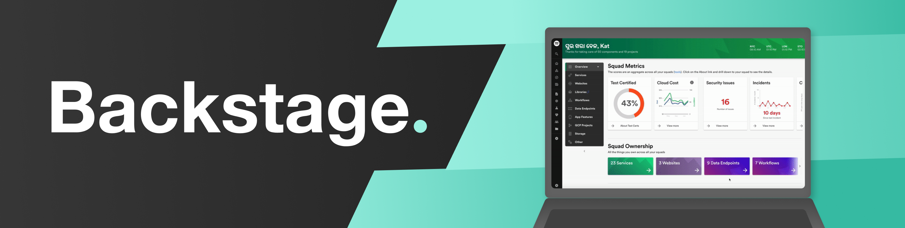
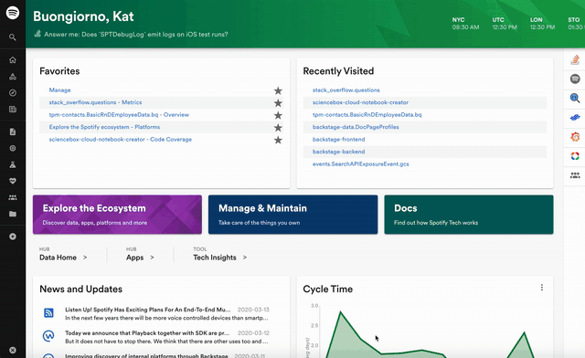
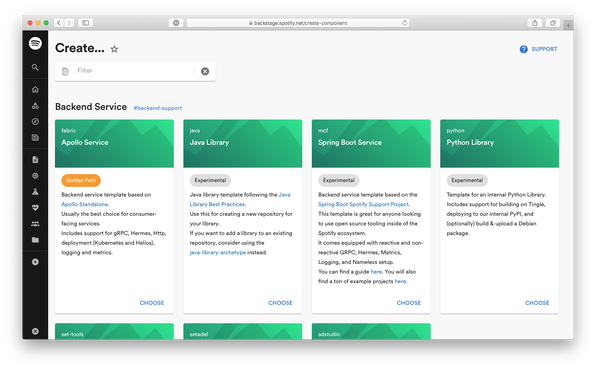
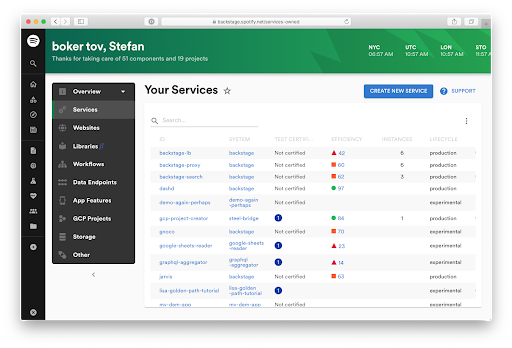
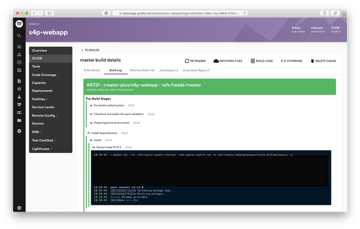
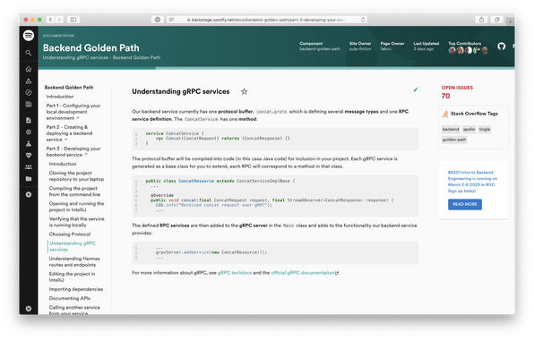
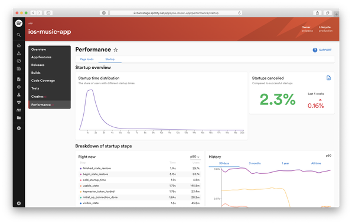

Two days ago, we released the open source version of [Backstage](https://backstage.io/), our homegrown developer portal. And we learned a thing or two via the feedback we received. So, I wanted to take this opportunity to further explain what we’re trying to do with Backstage — and more importantly, what we want to give to the greater engineering community beyond Spotify.

<!--truncate-->

## What’s the big infrastructure problem?

As companies grow, their infrastructure systems get messier. Consider a team that wants to deploy something to the cloud. While Spotify has many awesome engineers, not every engineer is well-versed in our chosen cloud-provider tooling. Yet everyone is required to know and understand Terraform, GCP/AWS/Azure CLIs, GitLab CI, Prometheus, Kubernetes, Docker, various monitoring and alerting tools, and much, much more. Once other resources come into play (databases, queueing, etc.), each engineer requires even more tools and domain-specific knowledge (or “disciplines”), from backend to machine learning, to mobile and data.

## What’s the fix?

Backstage unifies all your infrastructure tooling, services, and documentation with a single, consistent UI. All of it! Imagine if all your tools — GCP, Bigtable, CI pipelines, TensorFlow Extended, and whatever else is hiding in your stack — all had the same, easy-to-use interface. That’s Backstage. One front end for all your infrastructure.

Backstage gives developers a uniform overview of all their resources, regardless of how and where they are running, as well as an easy way to onboard and start using those tools. It also allows the creation of new resources, such as backend services running in Kubernetes, with a few clicks of a button — all without having to leave the same, familiar interface of Backstage.

## Why did we build it?

To some observers, it may seem odd that a music company is launching a best-in-class developer portal. But if you [dig deeper](https://backstage.io/background), you’ll find that since the very beginning, Spotify has been known for its agile, autonomous engineering culture. More than music, we’re a tech company that has always put engineers first, empowering our developers with the ability to innovate quickly and at scale. Backstage is the natural result of that focus.

## What are examples of how Backstage is used at Spotify?

Our internal installation of Backstage has over 100 different integrations — we call them “plugins”. Since the open-source version currently does not have any end-to-end use cases, it can be challenging to understand what problems Backstage can solve for you. To make things more tangible, let’s have a look at four of the common use-cases:

1. Creating a new microservice
2. Following a pull request from review to production
3. Centralised technical documentation
4. Review performance of your team’s mobile features

These are just a few examples. Expect us to continue providing examples of how Backstage is used inside Spotify while we build out more end-2-end use-cases in the open.

### 1. Creating a new microservice

Creating any new software component at Spotify, such as a new microservice, is done with a few clicks in Backstage. Developers choose between a number of standard templates — all with best-practices built in.

After inputting some metadata about your service, a new repository is created with a “hello world” service that automatically builds and deploys in production on Kubernetes ([GKE](https://cloud.google.com/kubernetes-engine)). Ownership information is automatically captured in our service/software catalog and users can see a list of all the services they own.

### 2. Following a pull request from review to production

As soon as you submit a pull request to Spotify’s GitHub Enterprise, our CI system automatically posts a link to the CI/CD view in Backstage. The view provides you with all the information you need: build progress, test coverage changes, a re-trigger button, etc., so that you don’t have to look for this information across different systems.

Our homegrown CI system uses Jenkins under the hood, but Spotify engineers don’t need to know that. They interact directly with GitHub Enterprise and Backstage.

### 3. Centralised technical documentation

Spotify uses a [docs-like-code](https://www.youtube.com/watch?v=uFGCaZmA6d4) approach. Engineers write technical documentation in Markdown files that live together with the code. During CI, a beautiful-looking documentation site is created using [MkDocs](https://www.mkdocs.org/), and all sites are rendered centrally in a Backstage plugin.

On top of the static documentation we also incorporate additional metadata about the documentation site — such as owner, open issue and related Stack Overflow tags.

### 4. Review performance of your team’s mobile features

Our mobile apps are developed by many different teams. The codebase is divided up into different features, each owned and maintained by a separate team. If an app developer on one team wants to understand how their feature is affecting overall app performance, there’s a plugin for that:

_Figures above for illustrative purposes only._

Developers can also look at crashes, releases, test coverage over time and many more tools in the same location.

## Why did we make Backstage open source?

When discussing infrastructure challenges with peer companies, it’s clear that we are not alone in struggling with fragmentation across our developer ecosystem. As companies adopt more open-source tooling, and build more infrastructure internally, the complexity grows. It gets harder for individual engineers to find and use all these distinct tools.

Similar to how Backstage ties together all of Spotify’s infrastructure, our ambition is to make the open-source version of Backstage the standard UX layer across the broader infrastructure landscape. We decided to release Backstage early so we could collaborate more closely with companies that have a similar problem — and that want to provide a better developer experience to their teams.

## What’s next?

We are envisioning [three phases](https://github.com/backstage/backstage/milestones) of the project (so far), and we have already begun work on various aspects of these phases. The best way to track the work and see where you can jump in and help out is:

https://github.com/backstage/backstage/milestones

Want to discuss the project or need support? Join us on [Discord](https://discord.gg/MUpMjP2) or reach out on [backstage-interest@spotify.com](mailto:backstage-interest@spotify.com).
