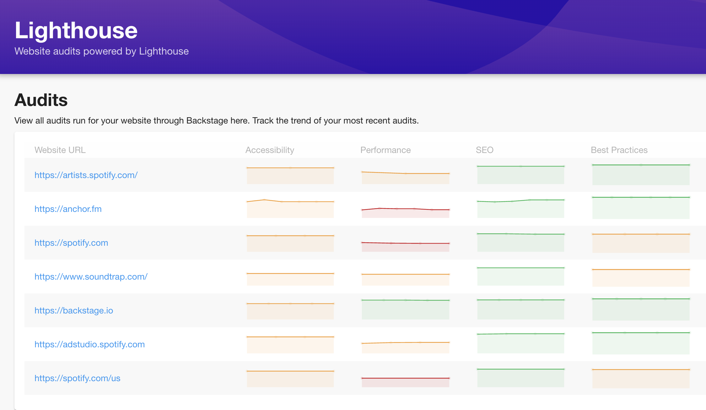
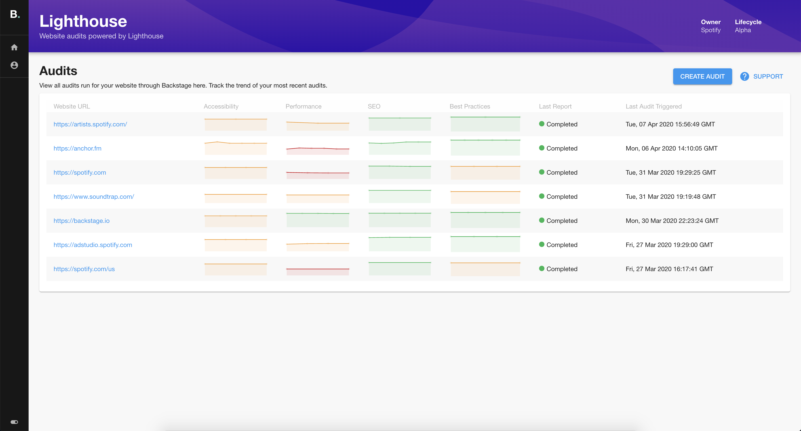
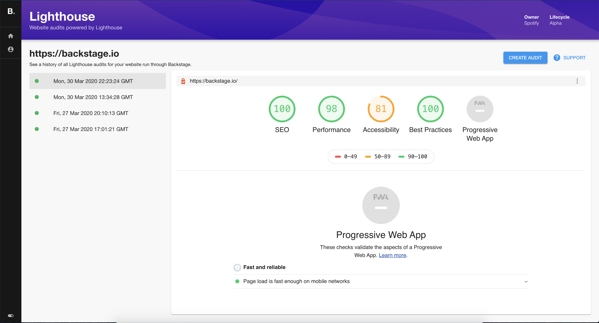
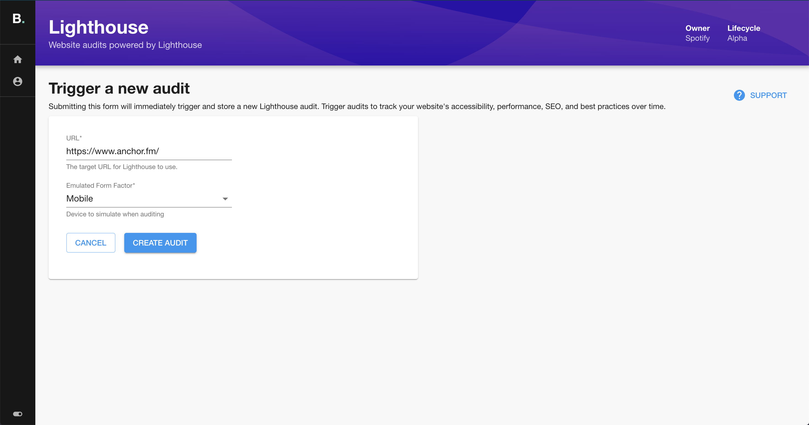

We’re proud to announce that our first internal plugin at Spotify has been open-sourced as part of Backstage. This plugin works with the newly open-sourced [lighthouse-audit-service](https://github.com/spotify/lighthouse-audit-service) to run and track Lighthouse audits for your websites.

<!--truncate-->

## What is Lighthouse?

Google's [Lighthouse](https://developers.google.com/web/tools/lighthouse) auditing tool for websites is a great open-source resource for benchmarking and improving the accessibility, performance, SEO, and best practices of your site.

At Spotify, we keep track of Lighthouse audit scores over time to look at trends and areas for investment. We particularly look to Lighthouse to give us [accessibility recommendations](https://developers.google.com/web/tools/lighthouse/v3/scoring#a11y); in the next few months, we plan to roll out Lighthouse accessibility category scores as a benchmark metric for all websites at Spotify.

## Lighthouse, tracked over time

What makes the plugin unique is that we can track a website's audit performance over time using the main metrics that Lighthouse outputs, rather than simply running reports. The sparklines show, at a glance, how all of your websites are holding up over recent builds.

Lighthouse reports can be viewed directly in Backstage, with the ability to travel back and forth through your audit history, so you can quickly diagnose which release caused a performance or SEO regression.

Trigger an audit directly from Backstage, or trigger audits programmatically with your new lighthouse-audit-service instance. Schedule them after builds as a sort of smoke test, or trigger them on a schedule (as we do at Spotify) to get a daily snapshot of your website.

## Using Lighthouse in Backstage

To learn how you can enable Lighthouse auditing within Backstage, head over to the [README](https://github.com/backstage/backstage/tree/master/plugins/lighthouse) for the plugin to get started.

## A personal note

I want to thank the folks on the Backstage team for approaching me to open-source this plugin. I have found working on Backstage to be a really rewarding and fun time, and I'm so glad that the core team members have put in the effort to make Backstage something that anyone in the industry can use. I can't wait to play with all the plugins the community is going to create. I am hopeful that this plugin can help illustrate just a sliver of what we use Backstage for at Spotify.
