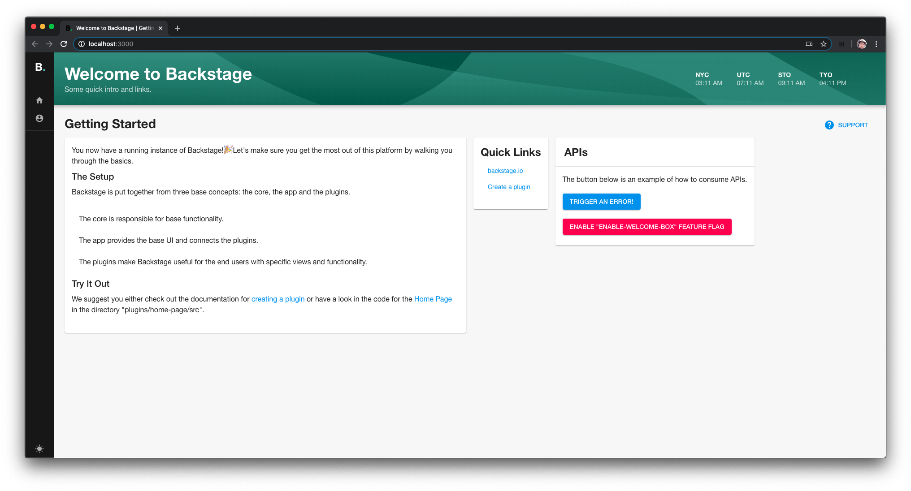
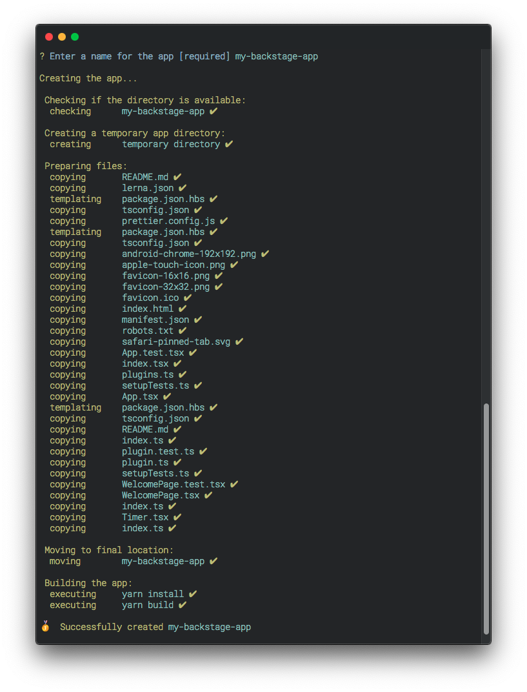

We wanted to make getting started with Backstage as easy as possible. Even though Backstage is still in the early phases of its development, we believe it is important for our users to get a feel for what Backstage really is.

We want users to be able to create their own version of Backstage quickly and easily, so that they can take advantage of all the infrastructure that we’ve built into it — and start exploring.

In this blog post we’ll look at what a Backstage app is and how to create one using our [CLI](https://www.npmjs.com/package/@backstage/cli).

<!--truncate-->

## What is a Backstage app?



A Backstage app is a modern monorepo web project that is built using Backstage packages. It includes all the configuration and architecture you need to run Backstage so that you don’t have to worry about setting everything up by yourself.

More specifically, a Backstage app includes the core packages and APIs that provide base functionality to the app. The actual UX is provided by plugins. As an example, when you first load the `/` page of the app, the content is provided by the `welcome` plugin.

Plugins are the essential building blocks of Backstage and extend the platform by providing additional features and functionality. Read more about [Backstage plugins](/docs/getting-started) on GitHub.

## A personalized platform

When you create a Backstage _app_, you are creating your own installation of Backstage, an application that is built on top of the Backstage _platform_.

You get to take full advantage of a platform that we at Spotify have been using internally for years. But you also get to make it your own — starting with its name. You can rename the Backstage app anything you want, so that you can call it something that best fits your organization. Be creative!

## How do I create an app?

Just run the backstage-cli:

```bash
npx @backstage/create-app
```

Name your app, and we will create everything you need:



The only thing you need to do is to start the app:

```bash
cd my-app
yarn start
```

And you are good to go! 👍

Read the full documentation on how to [create an app](/docs/getting-started/create-an-app) on GitHub.

## What do I get? (Let's get technical...)

We’ve been using Backstage internally for years, and we’ve spent a lot of time adding to and tweaking the infrastructure so that it fits our needs. After all that testing and trial and error, we think it will fit your needs, too!

### 1. Lerna setup to manage multi-packages

The monorepo and its packages are managed by [Lerna](https://lerna.js.org/). It lets you work with individual packages in a controlled way.

### 2. Fast builds

Behind the scenes we use [Rollup](https://rollupjs.org/) to build the modules.

Each package is built individually. With the `--watch` flag you will be able to detect changes per package and therefore speed up the local development process.

To further speed things up, we have also included our own caching system to avoid rebuilding unchanged packages.

Our hope is that there will be thousands of Backstage plugins in the future, so we need a fast and stable build process.

### 3. Full TypeScript support

Most of the codebase is written in [TypeScript](https://www.typescriptlang.org/), and we aim for all of the core packages to be in TypeScript in the future.

All the knobs and handles needed for a stable and functioning TypeScript project are included.

Take a look at `@backstage/cli/config/tsconfig.json` for more details.

### 4. Tests and coverage out of the box

We include testing, linting, and end-to-end tests for your convenience.

```bash
yarn lint:all
yarn test:all
yarn test:e2e
```

## Extend the app with plugins

At Spotify, the main factor behind Backstage’s success has been our large and diverse collection of plugins — the result of contributions from various teams over the years. Internally, we have more than a hundred different plugins.

There are two ways to add plugins to your Backstage app: use a publicly available plugin or create your own.

### Using a public plugin

We provide a collection of public Backstage plugins (look for packages with the `plugin-` prefix under the `@backstage` namespace on [npm](https://www.npmjs.com/) that you can start using immediately.

Install in your app’s package folder (`<root>/packages/app`) with:

```bash
yarn add @backstage/plugin-<plugin-name>
```

Then add it to your app's `plugin.ts` file to import and register it:

`<root>/packages/app/src/plugin.ts`:

```js
export { plugin as PluginName } from '@backstage/plugin-<plugin-name>';
```

A plugin registers its own `route` in the app — read the documentation for the specific plugin you are installing for more information on that.

### Creating an internal plugin

We also know that each organization has different needs and will create their own plugins for internal purposes. To create an internal plugin, you can use our CLI again.

In the root of your app directory (`<root>`) run:

```bash
yarn create-plugin
```

This command will create a new plugin in `<root>/plugins/` and register it to your app automatically.

### Sharing is caring 🤗

If you are developing a plugin that might be useful for others, consider releasing it publicly. A large, diverse ecosystem of Backstage plugins benefits the whole community

## Ready to get started?

Head over to GitHub and check out the [project](https://github.com/backstage/backstage) or download our [CLI](https://www.npmjs.com/package/@backstage/cli). If you have more questions, join us on [Discord](https://discord.gg/MUpMjP2) or [create an issue](https://github.com/backstage/backstage/issues/new/choose).
