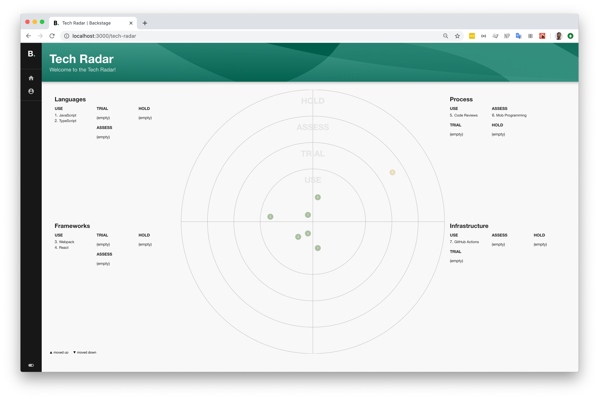

Just a few weeks ago, we released our internal plugin for [Lighthouse website audits] as our first open source plugin, so the whole community could use it. Today, we’re excited to add a new plugin to that list — say hello to the [Tech Radar plugin]!

<!--truncate-->

## What is Tech Radar?

The Technology Radar is a concept created by [ThoughtWorks] which allows you to visualize the official guidelines of software languages, processes, infrastructure, and platforms at that particular company. The particular visualization above was created by [Zalando].

At Spotify, our central committee of technical architects own the Tech Radar with the input of engineers across the company. Anyone can and is encouraged to give recommendations. We segment entries in our Tech Radar by languages, frameworks, processes, and infrastructure, although you should pick whatever works best for your organization. Each entry in the Tech Radar can have one of the following lifecycle values: Use, Trial, Assess, and Hold.

We also assign clear definitions for each lifecycle:

- **Use:** This technology is recommended for use by the majority of teams with a specific use case.
- **Trial:** This technology has been evaluated for specific use cases and has showed clear benefits. Some teams adopt it in production, although it should be limited to low-impact projects as it might incur a higher risk.
- **Assess:** This technology has the potential to be beneficial for the company. Some teams are evaluating it and using it in experimental projects. Using it in production comes with a high cost and risk due to lack of in-house knowledge, maintenance, and support.
- **Hold:** We don’t want to further invest in this technology or we evaluated it and we don’t see it as beneficial for the company. Teams should not use it in new projects and should plan on migrating to a supported alternative if they use it for historical reasons. For broadly adopted technologies, the Radar should refer to a migration path to a supported alternative.

Since rolling out the Tech Radar, it has become the source of truth when creating, maintaining, or evolving our software ecosystem. Spotify has dozens of entries in our Radar and it can scale quite well whilst being easy for our engineers and engineering managers to consume.

## Using the Tech Radar in Backstage

To learn about how you can bring the Tech Radar to your Backstage installation, check out [the plugin README on GitHub][tech radar plugin].

## A personal note

I want to thank both the Backstage team and Spotify. Firstly, I’ve been working with our internal version of Backstage for over a year, and the developer experience since open sourcing has been even more of a joy to work with. Secondly, the 10% hack time that Spotify generously provides to all engineers enabled me to open source the Tech Radar plugin.

Since open sourcing it, the community has shown great interest in yet another powerful use case of Backstage. There was also an enthusiastic open source contributor who volunteered to migrate the plugin to TypeScript and React Hooks [in just 29 minutes](https://github.com/backstage/backstage/issues/661) of opening the issue!

I can’t wait to see how others benefit from the Tech Radar in their organizations!

[lighthouse website audits]: https://backstage.io/blog/2020/04/06/lighthouse-plugin
[tech radar plugin]: https://github.com/backstage/backstage/tree/master/plugins/tech-radar
[thoughtworks]: https://www.thoughtworks.com/radar
[zalando]: https://opensource.zalando.com/tech-radar/
