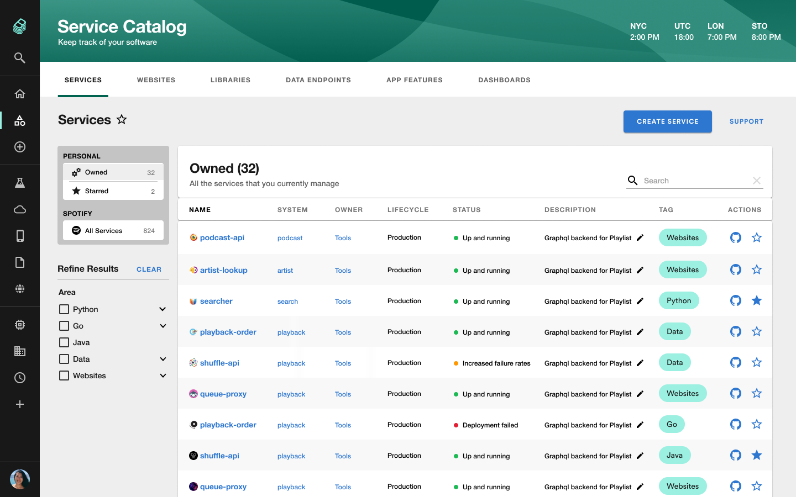
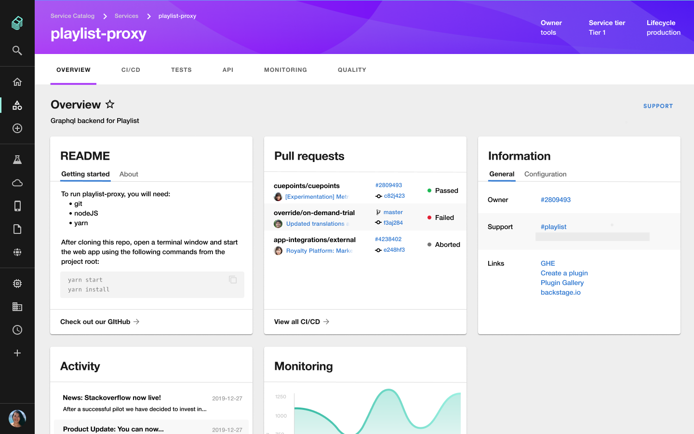
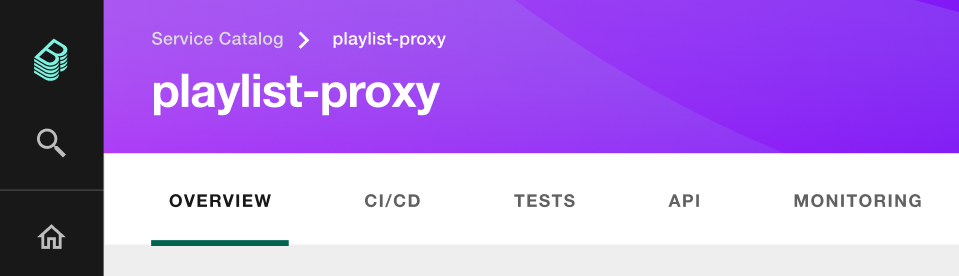

**TL;DR** Thanks to the help from the Backstage community, we’ve made excellent progress and are now moving into Phase 2 of Backstage — building out a Service Catalog and the surrounding systems that will help unify the tools you use to manage your software.

We released the open source version of Backstage a little less than two months ago, and have been thrilled to see so many people jumping in and contributing to the project in its early stages. We’re excited to see what the community can build together as we progress through [each phase of Backstage](https://github.com/backstage/backstage#project-roadmap).

<!--truncate-->

## Progress so far

Phase 1 was all about building an extensible frontend platform, enabling teams to start creating a single, consistent UI layer for your internal infrastructure and tools in the form of [plugins](https://github.com/backstage/backstage/labels/plugin). In fact, thanks to our amazing (30+) [contributors](https://github.com/backstage/backstage/graphs/contributors), we were able to complete most of Phase 1 earlier than expected. 🎉

Today, we are happy to announce that we are shifting our focus to Phase 2!

## So what is Phase 2?

> _The core of building Platforms rests in versatile entity management. Entities represent the nouns or the "truths" of our world._

Quote from [Platform Nuts & Bolts: Extendable Data Models](https://www.kislayverma.com/post/platform-nuts-bolts-extendable-data-models)

Entities, or what we refer to as “components” in Backstage, represent all software, including services, websites, libraries, data pipelines, and so forth. The focus of Phase 2 will be on adding an entity model in Backstage that makes it easy for engineers to create and manage the software components they own.

With the ability to create a plethora of components in Backstage, how does one keep track of all the software in the ecosystem? Therein lies the highlight feature of Phase 2: the [Service Catalog](https://github.com/backstage/backstage/milestone/4). The service catalog — or software catalog — is a centralized system that keeps track of ownership and metadata about all software in your ecosystem. The catalog is built around the concept of [metadata yaml files](/docs/architecture-decisions/adrs-adr002) stored together with the code, which are then harvested and visualized in Backstage.

With a single catalog, Backstage makes it easy for a team to manage ten services — and makes it possible for your company to manage thousands of them. Because the system is practically self-organizing, it requires hardly any oversight from a governing or centralized team. Developers can get a uniform overview of all their software and related resources (such as server utilisation, data pipelines, pull request status), regardless of how and where they are running, as well as an easy way to onboard and manage those resources.

On top of that, we have found that the service catalog is a great way to organise the infrastructure tools you use to manage the software as well. This is how Backstage creates one developer portal for all your tools. Rather than asking teams to jump between different infrastructure UI’s (and incurring additional cognitive overhead each time they make a context switch), most of these tools can be organised around the entities in the catalog:

More concretely, having this structure in place will allow plugins such as [CircleCI](https://github.com/backstage/backstage/tree/master/plugins/circleci) to show only the builds for the specific service you are viewing, or a [Spinnaker](https://github.com/backstage/backstage/issues/631) plugin to show running deployments, or an Open API plugin to [show documentation](https://github.com/backstage/backstage/issues/627) for endpoints exposed by the service, or the [Lighthouse](https://github.com/backstage/backstage/tree/master/plugins/lighthouse) plugin to show audit reports for your website. You get the point.

## Timeline

Our estimated timeline has us delivering these pieces in increments leading up to June 22. But with the support of the community we wouldn’t be surprised if things land earlier than that. 🙏

If you are interested in joining us, check out our [Milestones](https://github.com/backstage/backstage/milestones) and connected Issues.

## Long-term vision

Our vision for Backstage is for it to become the trusted, standard toolbox (read: UX layer) for the open source infrastructure landscape. Imagine a future where regardless of what infrastructure you use inside your company, there is an open source plugin available that you can pick up and add to your deployment of Backstage.

Spotify will continue to release more of our [internal](https://backstage.io/blog/2020/04/06/lighthouse-plugin) [plugins](https://backstage.io/blog/2020/05/14/tech-radar-plugin), but participation from developers and companies can help us build a healthy community. We are excited to see how Backstage has helped many of you, and look forward to seeing all the new plugins you and your teams will build!
