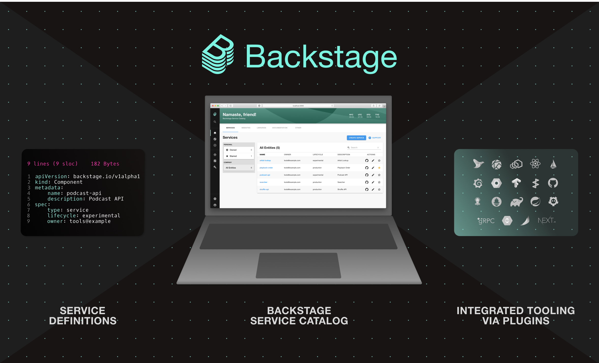

**TL;DR** Today we are announcing the availability of the Backstage Service Catalog in alpha. This has been the community’s most requested feature. Even if the catalog is not ready for production yet, we think this release already demonstrates how Backstage can provide value for your company right out of the box. With your early input and feedback, we hope to create a stronger generally available product.

<!--truncate-->

## You asked, we listened

When we [released](https://backstage.io/blog/2020/03/16/announcing-backstage) Backstage as an open source project back in March, it didn’t have all of the features that our internal version of Backstage has today. One of the main reasons we pushed to release it, despite it being in such a nascent stage, was so that we could start building the next phase of Backstage around the community’s needs. We’ve had hours of conversations with so many of you — thank you to everyone who has jumped on a video call, attended one of our working sessions, or watched our [demo videos](https://backstage.io/demos) and provided feedback via [Discord](https://discord.com/invite/MUpMjP2).

Today, we wanted to share what we’ve learned from talking with many of you at companies that have shown interest in adopting Backstage. Here it is in short:

- The problem of scaling autonomous engineering organisations without creating too much complexity is not a unique problem to Spotify.
- The "extensible frontend platform" that we focused on in the first phase of the project is not the only thing you are looking for.

With these insights we decided to re-focus our efforts towards the most requested feature: the Backstage Service Catalog.

## What is the service catalog?

The Backstage Service Catalog — actually, a software catalog, since it includes more than just services — is a centralized system that keeps track of ownership and metadata for all the software in your ecosystem (services, websites, libraries, data pipelines, etc). The catalog is built around the concept of [metadata yaml files](/docs/architecture-decisions/adrs-adr002) stored together with the code, which are then harvested and visualized in Backstage.

This was our pitch for the virtues of a service catalog when we first [announced](https://backstage.io/blog/2020/05/22/phase-2-service-catalog) it as part of Phase 2:

> With a single catalog, Backstage makes it easy for a team to manage ten services — and makes it possible for your company to manage thousands of them. Because the system is practically self-organizing, it requires hardly any oversight from a governing or centralized team. Developers can get a uniform overview of all their software and related resources (such as server utilisation, data pipelines, pull request status), regardless of how and where they are running, as well as an easy way to onboard and manage those resources.

> On top of that, we have found that the service catalog is a great way to organise the infrastructure tools you use to manage the software as well. This is how Backstage creates one developer portal for all your tools. Rather than asking teams to jump between different infrastructure UI’s (and incurring additional cognitive overhead each time they make a context switch), most of these tools can be organised around the entities in the catalog:

You’ll be able to see many of these virtues in action with this alpha release — though, with some caveats, of course, since it is, after all, an alpha.

## What does alpha mean?

Alpha is our shorthand for "we don’t yet think Backstage is ready for production, but we’d love for you to test it and provide us with feedback". However, you should be able to try out the functionality of the service catalog:

1. Register software components ([examples](https://github.com/backstage/backstage/tree/master/packages/catalog-model/examples))
2. See all components represented in the catalog
3. Search across all components
4. Get an overview of the metadata of the components
5. Click through and get more information about a specific component (service, website, etc)
6. See example tooling (plugins) that helps you manage the component

As with most alpha releases, you should expect things to change quite a lot until we reach the beta stage (we’re targeting the end of summer). There are obviously many things missing as well, but we wanted to start collecting feedback early and make it easier to see the end-to-end flow.

If you have feedback or questions, please open a [GitHub issue](https://github.com/backstage/backstage/issues), ping us on [Discord chat](https://discord.gg/EBHEGzX) or send us an email at [backstage-interest@spotify.com](mailto:backstage-interest@spotify.com) 🙏

To get regular product updates and news about the Backstage community, sign up for the [Backstage newsletter](https://mailchi.mp/spotify/backstage-community).
