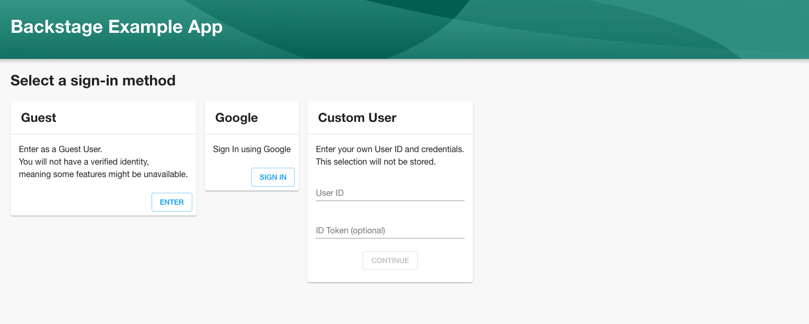
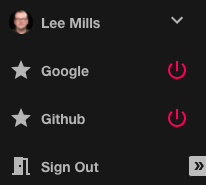

Getting authentication right is important. It helps keep your platform safe, it’s one of the first things users will interact with, and there are many different authentication providers to support. To this end, we chose to use [Passport](http://www.passportjs.org/) to provide an easy-to-use, out-of-the-box experience that can be extended to your own, pre-existing authentication providers (known as strategies). The Auth APIs in Backstage serve two purposes: identify the user and provide a way for plugins to request access to third-party services on behalf of the user. We’ve already implemented Google and GitHub authentication to provide examples and to get you started.

<!--truncate-->

## What is Passport?

[Passport](http://www.passportjs.org/) is Express-compatible authentication middleware for Node.js that provides access to over 500 authentication providers, covering everything from Google, Facebook, and Twitter to generic OAuth, SAML, and local. Check out all of the currently available [strategies listed on the Passport site](http://www.passportjs.org/).

Passport has allowed us to leverage an existing open-source authentication framework that will, in turn, give users the freedom to add and extend alternative authentication strategies to their instance of Backstage.

## Using authentication in Backstage



First, check out the provided Google and GitHub implementations! [Spin up a local copy of Backstage](https://backstage.io/blog/2020/04/30/how-to-quickly-set-up-backstage) along with our example-backend. You can find more documentation on setting up the example backend [here](https://github.com/backstage/backstage/tree/master/packages/backend), but be sure to include the relevant client IDs and secrets when running `yarn start`:

```
AUTH_GOOGLE_CLIENT_ID=x AUTH_GOOGLE_CLIENT_SECRET=x AUTH_GITHUB_CLIENT_ID=x AUTH_GITHUB_CLIENT_SECRET=x SENTRY_TOKEN=x LOG_LEVEL=debug yarn start
```

You can find the implementation for these strategies along with a lightweight proof-of-concept implementation for SAML authentication at `<root>/plugins/auth-backend/src/providers`.

## Ready to get started by adding your chosen provider and implementation?

Getting started is really straightforward, and can be broadly broken down into five steps:

1. Install the [Passport-based provider package that best suits your needs](http://www.passportjs.org/).
2. Add a new provider to `plugins/auth-backend/src/providers/`
3. Implement the provider, extending the suitable framework, if needed.
4. Add the provider to the backend.
5. Add a frontend Auth Utility API.

For full details, take a look at our [“Adding authentication providers” documentation](/docs/auth/add-auth-provider) and at the [excellent documentation](http://www.passportjs.org/docs/) provided by Passport.

## Interested in contributing to the next steps for authentication?

We’ve already seen both GitLab and Okta contributions from the community — and we’re thinking about a few more providers we’d like to add to Backstage, too. You can find those, and other authentication-related issues, in our repository by filtering with the [auth label](https://github.com/backstage/backstage/issues?q=is%3Aissue+is%3Aopen+label%3Aauth).
