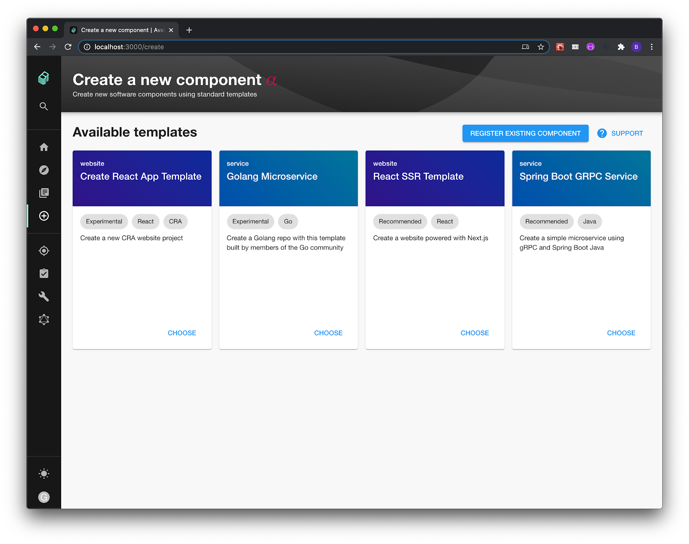
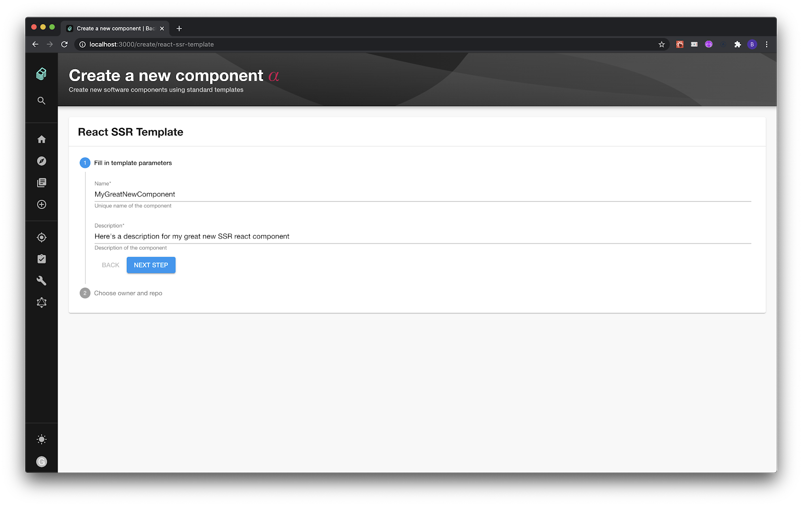
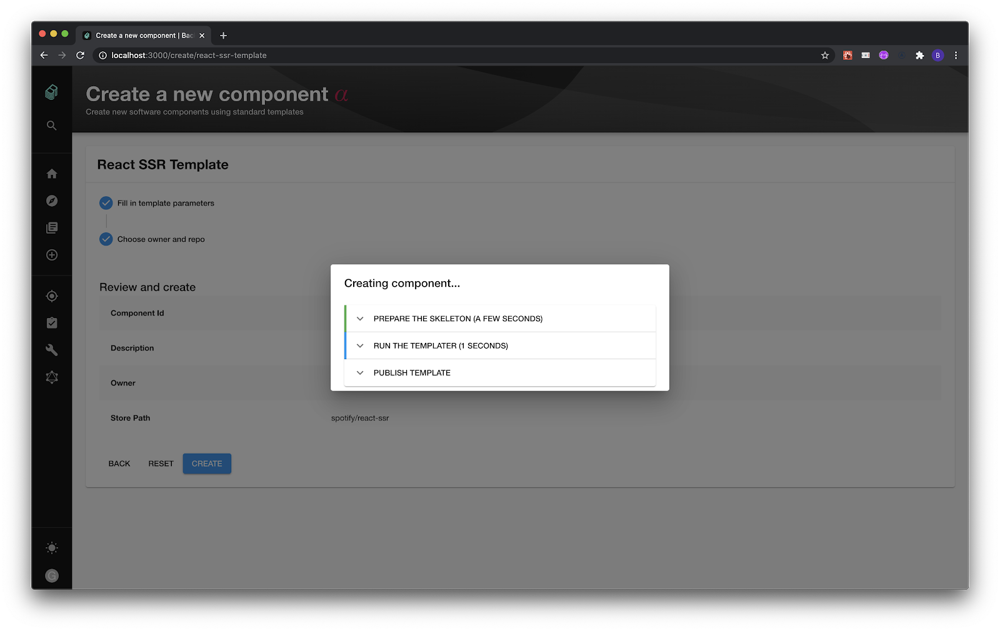
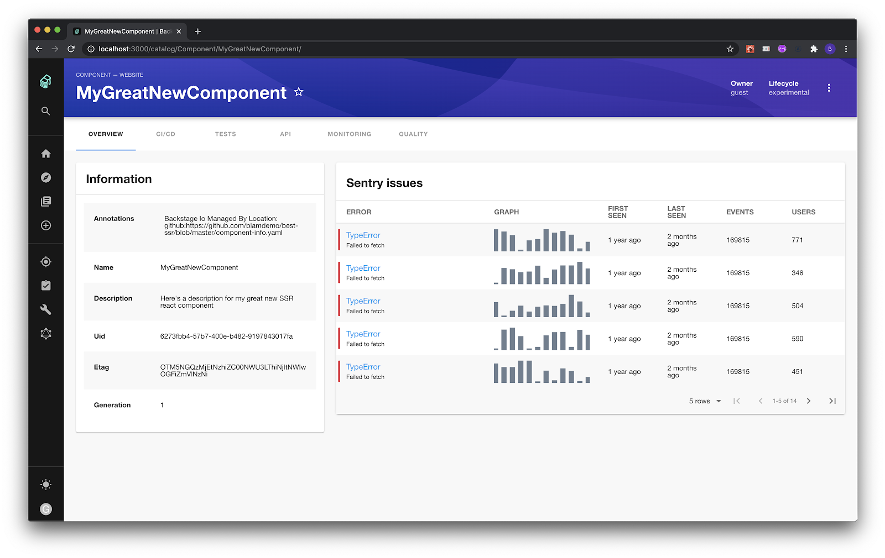

**TL;DR** Today we are announcing a new Backstage feature: Software Templates. Simplify setup, standardize tooling, and deploy with the click of a button. Using automated templates, your engineers can spin up a new microservice, website, or other software component with your organization’s best practices built-in, right from the start.

<video width="100%" height="100%" controls>
  <source src="/blog/assets/2020-08-05/feature.mp4" type="video/mp4">
</video>

<!--truncate-->

## Balancing autonomy and standardization

At Spotify, we’ve always believed in the speed and ingenuity that comes from having autonomous development teams. But as we learned firsthand, the faster you grow, the more fragmented and complex your software ecosystem becomes. And then everything slows down again.

By centralizing services and standardizing your tooling, Backstage streamlines your development environment from end to end. Instead of restricting autonomy, standardization frees your engineers from infrastructure complexity. So you can return to building and scaling, quickly and safely.

Today we are releasing one of the key features that helps balance autonomy and standardization: templates for creating software.

## Backstage Software Templates: Push-button deployment

Backstage Software Templates automate and standardize the process of creating software components. To show you how they work, we created four sample templates to get you started — just configure them to fit your tooling and off you go:

- **Create React App Template** — create a new CRA website project
- **Golang Microservice** — create a Golang repo with this template built by members of the Go community
- **React SSR Template** — create a website powered with Next.js
- **Spring Boot GRPC** — create a simple microservice using gRPC and Spring Boot Java

### The getting started guide gets automated

Since the templates can be customized to integrate with your existing infrastructure, it’s easy to start a new project without ever having to leave Backstage. Let’s say you’re building a microservice. With three clicks in Backstage, you’ll have a new Spring Boot project with your repo automatically configured on GitHub and your CI already running the first build.

### Golden Paths pave the way

You can customize Backstage Software Templates to fit your organization’s standards. Using Go instead of Java? CircleCI instead of Jenkins? Serverless instead of Kubernetes? GCP instead of AWS? [Make your own recipes for any software component](https://backstage.io/docs/features/software-templates/adding-templates) and your best practices will be baked right in.

## Getting started

The sample Software Templates are available under `/create`. If you're setting up Backstage for the first time, follow [Getting Started with Backstage](https://backstage.io/docs/getting-started/) and go to `http://localhost:3000/create`.

### Step 1: Choose a template

When you select a template that you want to create, you can ask for different input variables. These are then passed to the templater internally.

After filling in these variables, additional fields will appear so Backstage can be used. You’ll specify the owner, which is a `user` in the Backstage system, and the `Location`, which must be a GitHub organization and a non-existing GitHub repository name, formatted as `organization/reponame`.

### Step 2: Run!

Once you've entered values and confirmed, you'll then get a modal with live progress of what is currently happening with the creation of your template.

It shouldn't take too long before you see a success screen. At this point, a piece of “Hello World” software has been created in your repo, and the CI automatically picks it up and starts building the code.

Your engineers don’t have to bother with setting up underlying infrastructure, it’s all built into the template. They can start focusing on delivering business value.

### View new components in the Service Catalog

New components, of course, get added automatically to the Backstage Service Catalog. After creation, you'll see the `View in Catalog` button, which will take you to the registered component in the catalog:

## Define your standards

Backstage ships with four example templates, but since these are likely not the (only) ones you want to promote inside your company, the next step is to add [your own templates](https://backstage.io/docs/features/software-templates/software-templates-index). Using Backstage’s Software Templates feature, it’s easy to help your engineers get started building software with your organization’s best practices built-in.

We have learned that one of the keys to getting these standards adopted is to keep an open process. Templates are code. By making it clear to your engineers that you are open to pull requests, and that teams with different needs can add their own templates, you are on the path of striking a good balance between autonomy and standardization.

If you have feedback or questions, please open a [GitHub issue](https://github.com/backstage/backstage/issues), ping us on [Discord chat](https://discord.gg/EBHEGzX) or send us an email at [backstage-interest@spotify.com](mailto:backstage-interest@spotify.com) 🙏

To get regular product updates and news about the Backstage community, sign up for the [Backstage newsletter](https://mailchi.mp/spotify/backstage-community).
