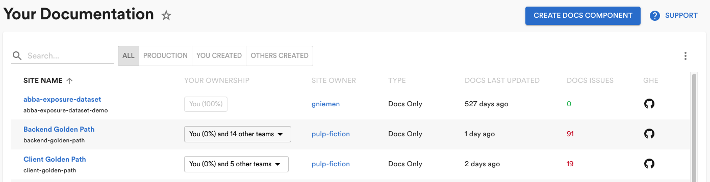
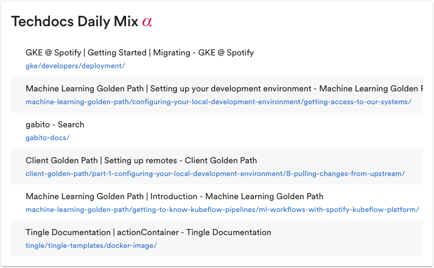

Since we [open sourced Backstage](https://backstage.io/blog/2020/03/16/announcing-backstage), one of the most requested features has been for a technical documentation plugin. Well, good news. The first open source version of TechDocs is here. Now let’s start collaborating and making it better, together.

<iframe width="780" height="440" src="https://www.youtube.com/embed/mOLCgdPw1iA" frameBorder="0" allow="accelerometer; autoplay; encrypted-media; gyroscope; picture-in-picture" allowFullScreen>
</iframe>

<!--truncate-->

Internally, we call it TechDocs. It’s the most used plugin at Spotify by far — accounting for about 20% of our Backstage traffic (even though it is just one of 130+ plugins). Its popularity is evidence of something simple: We made documentation so easy to create, find, and use — people actually use it.

We are quite sure the main reason for the success of TechDocs is our docs-like-code approach — engineers write their technical documentation in Markdown files that live together with the code. During CI, a documentation site is created using MkDocs, and all sites are rendered centrally in a Backstage plugin. On top of the static documentation, we incorporate additional metadata about the documentation site — such as owner, open GitHub Issues, Slack support channel, and Stack Overflow Enterprise tags.

But this is just one way to do it. Today we’re most excited for what the open version of TechDocs can become.

## Okay, let’s start collaborating

If you go to [GitHub](https://github.com/backstage/backstage/tree/master/plugins) now, you’ll find everything you need to start collaborating with us to build out the docs-like-code Backstage plugin — we’ll call it TechDocs in the open as well.

You’ll find the code in [techdocs](https://github.com/backstage/backstage/tree/master/plugins/techdocs) (frontend) and [techdocs-backend](https://github.com/backstage/backstage/tree/master/plugins/techdocs-backend). (There are also two separate packages [techdocs-cli](https://github.com/backstage/techdocs-cli) and [techdocs-container](https://github.com/backstage/techdocs-container).)

You’ll find issues to work on in the [issues queue](https://github.com/backstage/backstage/issues?q=is%3Aissue+is%3Aopen+label%3A%22docs-like-code%22+label%3A%22help+wanted%22), typically starting with TechDocs: and labeled with docs-like-code, some labeled good first issue. Feel free to add your own issues, of course.

What we have on GitHub so far is a first iteration of TechDocs that you can use end-to-end — in other words, from docs written in Markdown in GitHub to a published site on Backstage.

More specifically, with this first iteration, you can:

- Run TechDocs locally and read documentation.
- Configure your entity (e.g. service, website) so that Backstage builds your documentation and serves it in TechDocs. Documentation is displayed on the Docs tab in the Service Catalog and on its own page.
- Get documentation set up for free in your project when you create a new component out of one of the non-experimental templates (labeled with recommended). If you are looking for a standalone documentation project, use the docs-template.
- Choose your own storage solution for the documentation.
- Define your own API to interface with your documentation solution.

For a full overview, including getting started instructions, check out our [TechDocs Documentation](https://backstage.io/docs/features/techdocs/techdocs-overview).

But before you go there, let me tell you a bit about the TechDocs story — and why we believe TechDocs is such a powerful yet simple solution for great documentation.

## The TechDocs story

Here is the TechDocs story. It’s not an uncommon one (we have learned from many other companies).

About a year and a half ago, we conducted a company-wide productivity survey. The third largest problem according to all our engineers? Not being able to find the technical information they needed to do their work. And it’s not surprising. There was no standard way to produce and consume technical documentation, so teams were going their own way — using Confluence, Google Docs, README files, custom built websites, GitHub Pages, and so on and on. And those searching for information were left to hunt for it in all those different places until they found what they were looking for (if they ever did). Worse, if you did happen to find the documentation that you needed, there was no way to know whether the information was up-to-date or correct. In other words, there was no way to know whether you could trust what you found. We did have technical writers at the company, but they were mostly scattered across the company solving documentation problems within their own particular domain.

So this is the fertile soil on which TechDocs was built.

After a Hack Week implementation attracted interest from high up in the company, we formed a cross-functional team made up of technical writers and engineers with the mission to solve internal technical documentation at Spotify. And we started to build TechDocs. We went for a docs-like-code approach, fiercely optimizing for engineers and engineering workflows. We also went for an opinionated approach, telling everybody: This is the standard way to do technical documentation at Spotify. The sense was that engineers appreciated a documentation solution that was in line with their workflow and, after all the frustration of multiple tools, were relieved to be told “this is the way to do it”.

For more information about this journey, take a look at my 20-minute talk from DevRelCon London from last December: [The Hero’s Journey: How we are solving internal technical documentation at Spotify](https://www.linkedin.com/posts/garyniemen_how-we-are-solving-internal-technical-documentation-activity-6646078605594030080-4L31).

## Key problem areas that we are solving

We have come a long way, fast — both in our implementation and in our thinking. Here are some of the key problem areas that we are addressing. Note that they are in various stages of implementation, and we won’t be able to release everything within our minimum plugin. In fact, see this as an appetite taster. What we hope is that we can build together.

### Stuck to unstuck

Very early on, we decided that the main problem we were trying to solve was to help engineers (when using technical documentation) go from stuck to unstuck, and fast. This became our guiding principle. Is what we are building helping engineers get unstuck faster? From this, it follows that we need to promote quality documentation on the one hand, and provide a high level of discoverability on the other. One without the other is not going to cut it.

### Feedback loops

What we want to build is a thriving community of technical documentation creators, contributors, and readers. We want this because, we believe, this is the way to drive up the quality of the documentation. More readers, more feedback, more doc updates. And driving up the quality of the corpus of technical documentation leads to trust which in turn leads to more engagement and, hence, more of a thriving community.

To get this working, we recognised that we need to remove ‘friction from the system’ — we need to build in efficient feedback loops. For example, help engineers get their doc site up by providing documentation improvement hints and build information as close as possible to where they are already working. And for readers, make it easy to give feedback. And then for doc site owners, ensure that they are notified when there is feedback and incentivised to make the fix.

### Trust

How do I know whether to trust this piece of documentation? This is a question we want to be able to answer for those using technical documentation in Backstage. It’s not an easy nut to crack. It is almost, one could say, the hard problem of technical documentation. For example, some might say ‘last updated’ is a key factor. But what about stable, good quality documentation that has no need to be updated? What about page views? Yes, this is a good sign that the documentation is being found and viewed, but it doesn’t say anything about whether the documentation can be trusted. How about a button: Did this documentation help? This is good, but will people use it? Will we get enough data to show trust? We have lofty ambitions of one day providing a trust score on the doc site informed by a super-intelligent algorithm. But we are not there yet. For now, we have landed on surfacing when the documentation was last updated, top five contributors, the support channel, owning team, and number of open GitHub Issues. But going forward we are definitely up for solving the hard problem. We think there’s much more work to be done here and look forward to seeing ideas from the community.

### Discoverability and search

How to find stuff? That is another big question. As mentioned above, it’s all well and good having quality documentation, but it’s no use whatsoever if you can’t find it. If you know what you are looking for, then you can use a search engine. If you don’t know what you are looking for, then you are going to need more — like a well designed information architecture, a user friendly browse experience, and even intelligent suggestions based on your role and what you have searched for previously.

In this problem area, we made use of Elasticsearch, the open source search engine that was already being used in Backstage, to implement documentation search across all documentation sites and per documentation site. In terms of discoverability, we implemented a documentation home page in Backstage that surfaces Spotify’s most important documents and uses metrics to list the company’s most used doc sites as well as the documentation equivalent of a “your daily mix” playlist.

There is much more to do in the area of discoverability and search.

### Use case variations

The standard use case for TechDocs is: One component in Backstage equals one GitHub repository, equals one doc site. This use case comes in two flavours: the repository is a code repository with docs or a docs-only repository. Then, to meet the needs of one large part of the Spotify engineering organisation that uses monorepos (multi-component repositories), we added a third use case. We built an MkDocs plugin that enabled doc site creators to include documentation from doc folders in other parts of the repository. So this use case is: One main component in Backstage equals a monorepo with distributed documentation, equals one doc site.

These three use cases satisfy most of the needs, but we have had plenty of requests for additional use cases, for example, the ability to create multiple doc sites from a multi-component repository and the ability to create one doc site from documentation in multiple repositories.

### Metrics

There are many good arguments for standardizing the way that technical documentation is produced and consumed. One of them is metrics. If we have one way of producing technical documentation (in our case, GitHub Enterprise) and one place where it shows up (in our case, Backstage), we are in a strong position to build up metrics that help all the various stakeholders — for example, us building TechDocs, teams creating documentation sites, and engineers trying to get unstuck. Just imagine how much harder this would be if technical documentation was produced and consumed in a plethora of places, such as Confluence, Google Docs, README files, custom web sites, and GitHub Pages.

One thing we have recently completed is a Manage page in Backstage for doc site owners. Here teams can see all the documentation that they own, the number of GitHub Issues per doc site or page, and last updated. We have also built a large dashboard using the open source analytics software Redash to inform our own product development process.

Again, there is a lot more that can be done in the area of metrics. Did I mention the trust score?

### Code-like-docs

Code-like-docs, what? Okay, it’s just my little play on words. This is what I mean. One request that we keep getting is to be able to have code in the documentation fetched from and in sync with code in GitHub. In this way, you can avoid code in the documentation going stale. MkDocs does have an extension for this — but it has some limitations. For example, the code has to be in the /docs folder with the Markdown files. We are working on developing a wider and more flexible solution.

### Golden Paths

At Spotify, we have the concept of [Golden Paths](https://engineering.atspotify.com/2020/08/17/how-we-use-golden-paths-to-solve-fragmentation-in-our-software-ecosystem/) — one for each engineering discipline. My favourite definition of Golden Path is that it is the “opinionated and supported path”. Each Golden Path has an accompanying Golden Path tutorial that walks you through the opinionated and supported path.

The Golden Path tutorials are Spotify’s most used and important documents and have shown themselves to be the most challenging to manage within a docs-like-code environment. One reason for this is that they are long, divided into many parts, and ownership is typically spread among many different teams. We have had to make use of GitHub codeowners to handle ownership and had to create datasets and data pipelines to be able to attach GitHub Issues to the specific parts or files that a team owns. Another challenge of the Golden Path tutorials is that parts are often dependent on other parts. We are just starting to look into how we can solve these dependency challenges in order to remove friction for engineers writing tutorial documentation.

---

So that’s it for now. As you can see, we have come a long way AND there is much more to do. We are looking forward to continuing our docs-like-code journey out in the open with new, enthusiastic technical documentation friends.
