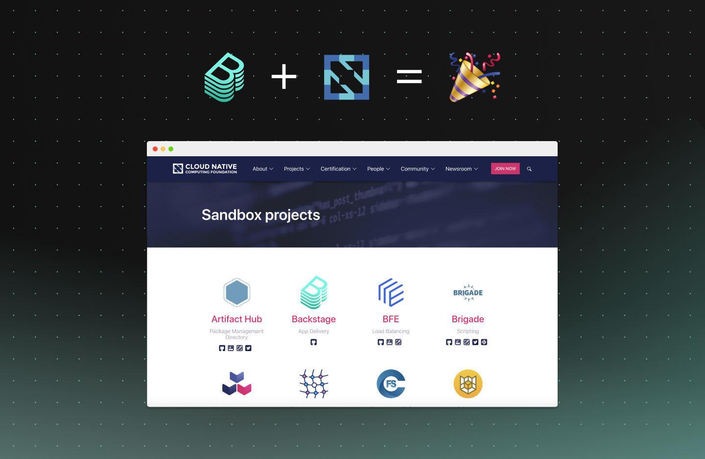

**TL;DR** The Cloud Native Computing Foundation (CNCF) announced that Backstage can begin incubating as an early stage project in the [CNCF Sandbox](https://www.cncf.io/sandbox-projects/). Released open source in March, the platform is built around an advanced service catalog and is designed to streamline software development from end to end.

<!--truncate-->

Backstage garnered quite a bit of interest from developers and organizations when it was first announced, and community interest continues to grow as plugins and new features are added with the open source community. We released the open source version of Backstage ‘early’. That was intentional. Because even though we’ve been using Backstage internally for years, we wanted the open source version to be developed with input and contributions from the community. And that’s exactly the product that’s going into the [CNCF Sandbox](https://www.cncf.io/sandbox-projects/) today.

Backstage’s ability to simplify tooling and standardize engineering practices has attracted interest from other major tech companies, as well as airlines, auto manufacturers, investment firms, and global retailers. We know that Backstage solves a problem — infrastructure complexity — that’s common to a lot of large and growing companies today. But different companies work differently, use particular toolsets, and have unique use cases. By making Backstage open source, we can build it with people working inside a variety of engineering organizations all over the world. It makes for a better product that serves a wider group of users (beyond that of Spotify’s) and their needs.

The Backstage community is healthy and growing quickly. Over [130 people](https://github.com/backstage/backstage/graphs/contributors) have contributed to the project, and roughly 40% of pull requests are now coming from external, non-Spotify, contributors. With companies now deciding to [adopt Backstage](https://github.com/backstage/backstage/blob/master/ADOPTERS.md) we are also seeing a shift in the kinds of contributions we are getting from the community. It is truly amazing to see contributions to core parts of the platform as well as significant functionality additions through working [plugins](https://backstage.io/plugins).

We’re excited to embark on this journey with the CNCF community. There’s so much great tech being built here, and it’s about time we share it to build even greater products, together. Entering into the CNCF Sandbox is just the first step. We are committed to working with the community to bring Backstage through the Incubation step, and finally all the way to becoming a Graduated, top-level project.

Thanks to everyone for your support so far. We hope you [join us](https://mailchi.mp/spotify/backstage-community) in this next chapter of Backstage's journey. If you have questions or feedback, feel free to [email](mailto:backstage-interest@spotify.com) me directly.
